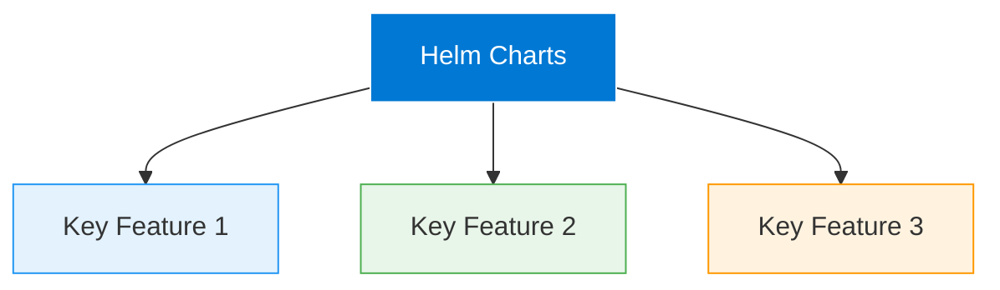

# Overview

```mermaid
graph TB
    Topic[Helm Charts] --> Feature1[Key Feature 1]
    Topic --> Feature2[Key Feature 2]
    Topic --> Feature3[Key Feature 3]

    style Topic fill:#0078d4,stroke:#fff,color:#fff
    style Feature1 fill:#e3f2fd,stroke:#2196f3
    style Feature2 fill:#e8f5e9,stroke:#4caf50
    style Feature3 fill:#fff3e0,stroke:#ff9800
```

  
Package Manager

