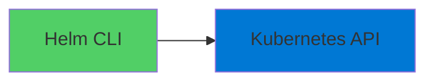
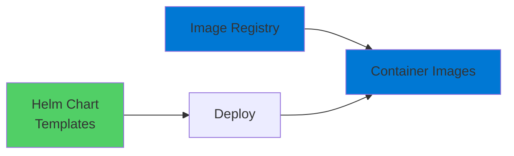
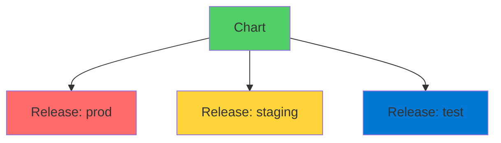

# Helm Package Manager

The App Store for Kubernetes

<div class="abs-bottom-10 left-10">
  <carbon-package class="text-8xl text-blue-400 opacity-80" />
</div>

---
layout: center
---

# Welcome

<!--
METADATA:
sentence: At its core, Helm is a package manager for Kubernetes applications.
search_anchor: its core, Helm is a
-->
<v-click>

<div class="text-xl mt-8">
Explore Helm for Kubernetes<br/>Simplify application management
</div>

</v-click>

---
layout: section
---

# What is Helm?

---

# Package Manager for Kubernetes

<v-click>

<div class="mt-4">
  <carbon-package class="text-6xl text-green-400" />
</div>

</v-click>

<!--
METADATA:
sentence: Just like how you use apt or yum for Linux packages, or npm for JavaScript, Helm manages Kubernetes applications.
search_anchor: Just like how you use
-->
<v-click>

<div class="mt-8 text-xl text-center">
Like apt, yum, or npm
</div>

</v-click>

<!--
METADATA:
sentence: Just like how you use apt or yum for Linux packages, or npm for JavaScript, Helm manages Kubernetes applications.
search_anchor: Just like how you use
-->
<v-click>

<div class="mt-12 flex justify-center gap-12">
  <div class="text-center">
    <carbon-logo-linux class="text-6xl text-orange-400" />
    <div class="text-sm mt-3">apt / yum</div>
    <div class="text-xs mt-2 opacity-70">For Linux</div>
  </div>
  <div class="text-center">
    <carbon-logo-nodejs class="text-6xl text-green-400" />
    <div class="text-sm mt-3">npm</div>
    <div class="text-xs mt-2 opacity-70">For JavaScript</div>
  </div>
  <div class="text-center">
    <carbon-kubernetes class="text-6xl text-blue-400" />
    <div class="text-sm mt-3">Helm</div>
    <div class="text-xs mt-2 opacity-70">For Kubernetes</div>
  </div>
</div>

</v-click>

---

# More Than Packaging

<v-click>

<div class="mt-4">
  <carbon-template class="text-6xl text-purple-400" />
</div>

</v-click>

<!--
METADATA:
sentence: But Helm does more than just package management - it adds a powerful templating layer on top of standard Kubernetes YAML.
search_anchor: But Helm does more than
-->
<v-click>

<div class="mt-8 text-xl text-center text-green-400">
Adds powerful templating layer
</div>

</v-click>

<!--
METADATA:
sentence: But Helm does more than just package management - it adds a powerful templating layer on top of standard Kubernetes YAML.
search_anchor: But Helm does more than
-->
<v-click>

<div class="mt-12 text-center text-lg">
On top of standard Kubernetes YAML
</div>

</v-click>

<!--
METADATA:
sentence: This means you can use variables, functions, and logic to create flexible, reusable application definitions.
search_anchor: This means you can use
-->
<v-click>

<div class="mt-12 flex justify-center gap-12">
  <div class="text-center">
    <carbon-variable class="text-5xl text-blue-400" />
    <div class="text-sm mt-3">Variables</div>
  </div>
  <div class="text-center">
    <carbon-function class="text-5xl text-green-400" />
    <div class="text-sm mt-3">Functions</div>
  </div>
  <div class="text-center">
    <carbon-flow class="text-5xl text-purple-400" />
    <div class="text-sm mt-3">Logic</div>
  </div>
</div>

</v-click>

<!--
METADATA:
sentence: This means you can use variables, functions, and logic to create flexible, reusable application definitions.
search_anchor: This means you can use
-->
<v-click>

<div class="mt-12 text-center text-xl">
Flexible, reusable application definitions
</div>

</v-click>

---

# Client-Side Only

<!--
METADATA:
sentence: From version 3 onwards, Helm is purely a client-side tool.
search_anchor: From version 3 onwards, Helm
-->
<v-click>

<div class="mt-8 text-center text-xl">
From Helm v3 onwards
</div>

</v-click>

<!--
METADATA:
sentence: From version 3 onwards, Helm is purely a client-side tool.
search_anchor: From version 3 onwards, Helm
-->
<v-click>

<div class="mt-12 text-center text-2xl text-green-400">
Purely client-side tool
</div>

</v-click>

<v-click>

<div class="mt-12">



</div>

</v-click>

<!--
METADATA:
sentence: You just install the CLI, and you're ready to go - no server components needed in your cluster.
search_anchor: You just install the CLI
-->
<v-click>

<div class="mt-12 text-center text-xl">
Just install CLI and go
</div>

</v-click>

<!--
METADATA:
sentence: You just install the CLI, and you're ready to go - no server components needed in your cluster.
search_anchor: You just install the CLI
-->
<v-click>

<div class="mt-4 text-center text-lg opacity-70">
No server components in cluster
</div>

</v-click>

---
layout: section
---

# Helm Charts

---

# Application Packages

<v-click>

<div class="mt-4">
  <carbon-document-multiple class="text-6xl text-blue-400" />
</div>

</v-click>

<!--
METADATA:
sentence: --- Slide 2: Helm Charts (30 seconds) [SCREEN: Show chart structure diagram] In Helm, application packages are called "charts." A chart is basically a collection of files that describe a set of Kubernetes resources.
search_anchor: --- Slide 2: Helm Charts
-->
<v-click>

<div class="mt-8 text-xl text-center">
Charts: collection of files describing Kubernetes resources
</div>

</v-click>

<!--
METADATA:
sentence: Organizations also create private repositories for their own applications.
search_anchor: Organizations also create private repositories
-->
<v-click>

<div class="mt-12 flex items-start gap-4">
  <carbon-document class="text-4xl text-blue-400 mt-1" />
  <div>
    <div class="text-lg font-bold">Chart.yaml</div>
    <div class="text-sm mt-2 opacity-70">Describes the application</div>
  </div>
</div>

</v-click>

<!--
METADATA:
sentence: From version 3 onwards, Helm is purely a client-side tool.
search_anchor: From version 3 onwards, Helm
-->
<v-click>

<div class="mt-6 flex items-start gap-4">
  <carbon-settings class="text-4xl text-green-400 mt-1" />
  <div>
    <div class="text-lg font-bold">values.yaml</div>
    <div class="text-sm mt-2 opacity-70">Customizable settings</div>
  </div>
</div>

</v-click>

<!--
METADATA:
sentence: Think of Helm as the App Store for Kubernetes - it makes deploying and managing applications much simpler.
search_anchor: Think of Helm as the
-->
<v-click>

<div class="mt-6 flex items-start gap-4">
  <carbon-template class="text-4xl text-purple-400 mt-1" />
  <div>
    <div class="text-lg font-bold">Templates/</div>
    <div class="text-sm mt-2 opacity-70">Kubernetes objects with variables</div>
  </div>
</div>

</v-click>

---

# Small Downloads

<!--
METADATA:
sentence: From version 3 onwards, Helm is purely a client-side tool.
search_anchor: From version 3 onwards, Helm
-->
<v-click>

<div class="mt-12 text-center text-xl">
Charts only contain YAML templates
</div>

</v-click>

<v-click>

<div class="mt-12">



</div>

</v-click>

<!--
METADATA:
sentence: The actual container images still get pulled from your regular image registry.
search_anchor: actual container images still get
-->
<v-click>

<div class="mt-12 text-center text-xl text-green-400">
Container images pulled from registry as usual
</div>

</v-click>

---
layout: section
---

# Releases

---

# Installing Charts

<!--
METADATA:
sentence: At its core, Helm is a package manager for Kubernetes applications.
search_anchor: its core, Helm is a
-->
<v-click>

<div class="mt-8 text-center text-xl">
Install a chart creates a "release"
</div>

</v-click>

<v-click>

<div class="mt-12">



</div>

</v-click>

<!--
METADATA:
sentence: At its core, Helm is a package manager for Kubernetes applications.
search_anchor: its core, Helm is a
-->
<v-click>

<div class="mt-12 text-center text-xl">
Each release has unique name
</div>

</v-click>

<!--
METADATA:
sentence: At its core, Helm is a package manager for Kubernetes applications.
search_anchor: its core, Helm is a
-->
<v-click>

<div class="mt-4 text-center text-lg opacity-70">
Becomes part of Kubernetes object names
</div>

</v-click>

---

# Multiple Installations

<!--
METADATA:
sentence: This is powerful because you can install the same application multiple times in the same cluster with different configurations.
search_anchor: This is powerful because you
-->
<v-click>

<div class="mt-8 text-center text-xl text-green-400">
Install same application multiple times
</div>

</v-click>

<!--
METADATA:
sentence: This is powerful because you can install the same application multiple times in the same cluster with different configurations.
search_anchor: This is powerful because you
-->
<v-click>

<div class="mt-12 text-center text-lg">
In same cluster with different configurations
</div>

</v-click>

<!--
METADATA:
sentence: For example, you might deploy different versions for testing, staging, and production - all from the same chart.
search_anchor: example, you might deploy different
-->
<v-click>

<div class="mt-12 flex justify-center gap-12">
  <div class="text-center">
    <carbon-test-tool class="text-6xl text-blue-400" />
    <div class="text-sm mt-3">Testing</div>
  </div>
  <div class="text-center">
    <carbon-ibm-cloud-pak-integration class="text-6xl text-orange-400" />
    <div class="text-sm mt-3">Staging</div>
  </div>
  <div class="text-center">
    <carbon-network-4 class="text-6xl text-red-400" />
    <div class="text-sm mt-3">Production</div>
  </div>
</div>

</v-click>

<!--
METADATA:
sentence: For example, you might deploy different versions for testing, staging, and production - all from the same chart.
search_anchor: example, you might deploy different
-->
<v-click>

<div class="mt-12 text-center text-xl">
All from same chart
</div>

</v-click>

---
layout: section
---

# Helm Repositories

---

# Chart Storage

<v-click>

<div class="mt-4">
  <carbon-cloud-registry class="text-6xl text-green-400" />
</div>

</v-click>

<!--
METADATA:
sentence: --- Slide 4: Helm Repositories (25 seconds) [SCREEN: Show repository concept diagram] Charts can be stored in repositories - think of these like Docker Hub, but for Helm charts.
search_anchor: --- Slide 4: Helm Repositories
-->
<v-click>

<div class="mt-8 text-xl text-center">
Think Docker Hub, but for Helm charts
</div>

</v-click>

<!--
METADATA:
sentence: Organizations also create private repositories for their own applications.
search_anchor: Organizations also create private repositories
-->
<v-click>

<div class="mt-12 flex justify-center gap-16">
  <div class="text-center">
    <carbon-earth class="text-6xl text-blue-400" />
    <div class="text-sm mt-3">Public Repositories</div>
    <div class="text-xs mt-2 opacity-70">Community charts</div>
  </div>
  <div class="text-center">
    <carbon-locked class="text-6xl text-purple-400" />
    <div class="text-sm mt-3">Private Repositories</div>
    <div class="text-xs mt-2 opacity-70">Organization charts</div>
  </div>
</div>

</v-click>

---

# Popular Charts

<!--
METADATA:
sentence: You can use public repositories to access community-maintained charts for popular applications like Nginx, Prometheus, or MongoDB.
search_anchor: You can use public repositories
-->
<v-click>

<div class="mt-8 grid grid-cols-3 gap-8">
  <div class="text-center">
    <carbon-network-3 class="text-5xl text-green-400" />
    <div class="text-sm mt-3">Nginx</div>
  </div>
  <div class="text-center">
    <carbon-chart-line class="text-5xl text-orange-400" />
    <div class="text-sm mt-3">Prometheus</div>
  </div>
  <div class="text-center">
    <carbon-data-base class="text-5xl text-blue-400" />
    <div class="text-sm mt-3">MongoDB</div>
  </div>
</div>

</v-click>

<!--
METADATA:
sentence: Adding a repository is simple - just one command, and you can search and install charts from it.
search_anchor: Adding a repository is simple
-->
<v-click>

<div class="mt-12 text-center text-xl">
Adding repository: one command
</div>

</v-click>

<v-click>

<div class="mt-8">

```bash
helm repo add stable https://charts.helm.sh/stable
```

</div>

</v-click>

<!--
METADATA:
sentence: Adding a repository is simple - just one command, and you can search and install charts from it.
search_anchor: Adding a repository is simple
-->
<v-click>

<div class="mt-8 text-center text-xl text-green-400">
Search and install charts from it
</div>

</v-click>

---
layout: section
---

# AZ-204 Relevance

---

# Key Exam Areas

<!--
METADATA:
sentence: At its core, Helm is a package manager for Kubernetes applications.
search_anchor: its core, Helm is a
-->
<v-click>

<div class="mt-6 flex items-center gap-4">
  <carbon-package class="text-4xl text-blue-400" />
  <span class="text-lg">Package applications for deployment</span>
</div>

</v-click>

<!--
METADATA:
sentence: For example, you might deploy different versions for testing, staging, and production - all from the same chart.
search_anchor: example, you might deploy different
-->
<v-click>

<div class="mt-6 flex items-center gap-4">
  <carbon-template class="text-4xl text-green-400" />
  <span class="text-lg">Templating for different environments</span>
</div>

</v-click>

<!--
METADATA:
sentence: From version 3 onwards, Helm is purely a client-side tool.
search_anchor: From version 3 onwards, Helm
-->
<v-click>

<div class="mt-6 flex items-center gap-4">
  <carbon-deployment-pattern class="text-4xl text-purple-400" />
  <span class="text-lg">Automate deployments</span>
</div>

</v-click>

<!--
METADATA:
sentence: (30 seconds) [SCREEN: Show Helm logo and basic definition] So what exactly is Helm?
search_anchor: (30 seconds) [SCREEN: Show Helm
-->
<v-click>

<div class="mt-6 flex items-center gap-4">
  <carbon-renew class="text-4xl text-orange-400" />
  <span class="text-lg">Upgrade and rollback features</span>
</div>

</v-click>

---

# DevOps Practices

<!--
METADATA:
sentence: Helm demonstrates important DevOps practices like infrastructure as code and deployment automation - concepts that appear throughout the exam.
search_anchor: Helm demonstrates important DevOps practices
-->
<v-click>

<div class="mt-12 flex justify-center gap-12">
  <div class="text-center">
    <carbon-document-tasks class="text-6xl text-blue-400" />
    <div class="text-sm mt-3">Infrastructure as Code</div>
  </div>
  <div class="text-center">
    <carbon-deployment-pattern class="text-6xl text-green-400" />
    <div class="text-sm mt-3">Deployment Automation</div>
  </div>
</div>

</v-click>

<!--
METADATA:
sentence: Helm demonstrates important DevOps practices like infrastructure as code and deployment automation - concepts that appear throughout the exam.
search_anchor: Helm demonstrates important DevOps practices
-->
<v-click>

<div class="mt-12 text-center text-xl text-green-400">
Important concepts throughout the exam
</div>

</v-click>

---
layout: section
---

# What's Next

---

# Hands-On Exercises

<!--
METADATA:
sentence: Organizations also create private repositories for their own applications.
search_anchor: Organizations also create private repositories
-->
<v-click>

<div class="mt-8 flex items-center gap-4">
  <carbon-download class="text-4xl text-blue-400" />
  <span class="text-lg">Install charts from repositories</span>
</div>

</v-click>

<!--
METADATA:
sentence: --- Slide 1: What is Helm?
search_anchor: --- Slide 1: What is
-->
<v-click>

<div class="mt-6 flex items-center gap-4">
  <carbon-settings class="text-4xl text-green-400" />
  <span class="text-lg">Customize values</span>
</div>

</v-click>

<!--
METADATA:
sentence: At its core, Helm is a package manager for Kubernetes applications.
search_anchor: its core, Helm is a
-->
<v-click>

<div class="mt-6 flex items-center gap-4">
  <carbon-renew class="text-4xl text-purple-400" />
  <span class="text-lg">Manage releases</span>
</div>

</v-click>

<!--
METADATA:
sentence: --- Slide 1: What is Helm?
search_anchor: --- Slide 1: What is
-->
<v-click>

<div class="mt-12 text-center text-xl text-green-400">
Work with Helm directly
</div>

</v-click>

---
layout: center
class: text-center
---

<div>

<v-click>

<carbon-play-outline class="text-8xl text-green-400 inline-block" />

</v-click>

<!--
METADATA:
sentence: --- Slide 1: What is Helm?
search_anchor: --- Slide 1: What is
-->
<v-click>

<div class="text-4xl mt-8 font-bold">
Let's Dive In!
</div>

</v-click>

<!--
METADATA:
sentence: At its core, Helm is a package manager for Kubernetes applications.
search_anchor: its core, Helm is a
-->
<v-click>

<div class="text-xl mt-6 opacity-70">
Simplify Kubernetes application management
</div>

</v-click>

</div>
