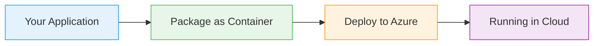

# Helm Package Manager

  <iconify-icon icon="vscode-icons:file-type-azure" style="font-size: 4rem;" />

---

---
layout: center
---

# Helm Package Manager - Introduction Video Script

**Duration:** 2-3 minutes
**Tone:** Conversational, friendly, educational

---

---
layout: center
class: text-center
---

# Welcome

Welcome

  <iconify-icon icon="carbon:rocket" style="font-size: 3rem; color: #0078d4;" />

---

---
layout: center
---

# Slide 1: What is Helm? (30 seconds)

**[SCREEN: Show Helm logo and basic definition]**...

---

---
layout: center
---

# Slide 2: Helm Charts (30 seconds)

**[SCREEN: Show chart structure diagram]**

---

---
layout: center
---

# Slide 3: Releases (25 seconds)

**[SCREEN: Show deployment diagram with multiple releases]**

---

---
layout: center
---

# Slide 4: Helm Repositories (25 seconds)

**[SCREEN: Show repository concept diagram]**

---

---
layout: center
---

# Slide 5: AZ-204 Relevance (25 seconds)

**[SCREEN: Show AZ-204 exam topics]**

---

---
layout: center
---

# Closing (10 seconds)

**[SCREEN: Return to main title]**

