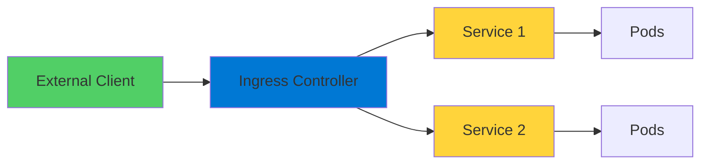
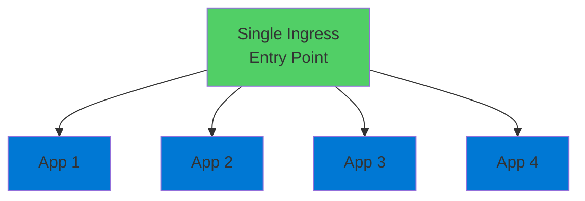

# Kubernetes Ingress

Managing External Access to Applications

<div class="abs-bottom-10 left-10">
  <carbon-network-3 class="text-8xl text-blue-400 opacity-80" />
</div>

---
layout: center
---

# Welcome

<v-click>

<div class="text-xl mt-8">
Explore Kubernetes Ingress<br/>Critical for the AZ-204 certification
</div>

</v-click>

---
layout: section
---

# What is Kubernetes Ingress?

---

# The Front Door

<v-click>

<div class="mt-4">
  <carbon-login class="text-6xl text-green-400" />
</div>

</v-click>

<v-click>

<div class="mt-8 text-xl text-center text-green-400">
Front door to your Kubernetes applications
</div>

</v-click>

<v-click>

<div class="mt-12">



</div>

</v-click>

---

# Two Main Parts

<v-click>

<div class="mt-8 flex items-start gap-4">
  <div class="text-3xl text-blue-400 mt-1">1</div>
  <div>
    <carbon-server-proxy class="text-3xl inline-block" />
    <span class="ml-3 text-lg font-bold">Ingress Controller</span>
    <div class="text-sm mt-2 opacity-70">Reverse proxy receiving all traffic</div>
    <div class="text-sm opacity-70">Popular: Nginx, Traefik, Contour</div>
  </div>
</div>

</v-click>

<v-click>

<div class="mt-10 flex items-start gap-4">
  <div class="text-3xl text-green-400 mt-1">2</div>
  <div>
    <carbon-rule class="text-3xl inline-block" />
    <span class="ml-3 text-lg font-bold">Ingress Objects</span>
    <div class="text-sm mt-2 opacity-70">Kubernetes resources defining routing rules</div>
    <div class="text-sm opacity-70">Tell controller where to send traffic</div>
  </div>
</div>

</v-click>

---
layout: section
---

# Why Use Ingress?

---

# The LoadBalancer Problem

<v-click>

<div class="mt-8">

```mermaid
graph TB
    App1[App 1] --> LB1[LoadBalancer 1<br/>💰]
    App2[App 2] --> LB2[LoadBalancer 2<br/>💰]
    App3[App 3] --> LB3[LoadBalancer 3<br/>💰]
    App4[App 4] --> LB4[LoadBalancer 4<br/>💰]
    style LB1 fill:#ff6b6b
    style LB2 fill=#ff6b6b
    style LB3 fill:#ff6b6b
    style LB4 fill:#ff6b6b
```

</div>

</v-click>

<v-click>

<div class="mt-12 text-center text-xl text-red-400">
Separate LoadBalancer for every application
</div>

</v-click>

<v-click>

<div class="mt-4 text-center text-lg text-red-400">
Gets expensive and messy really fast
</div>

</v-click>

---

# The Ingress Solution

<v-click>

<div class="mt-8">



</div>

</v-click>

<v-click>

<div class="mt-12 text-center text-2xl text-green-400">
Single entry point
</div>

</v-click>

<v-click>

<div class="mt-8 text-center text-xl">
Intelligently routes to multiple backends
</div>

</v-click>

<v-click>

<div class="mt-8 text-center text-lg opacity-70">
One receptionist directing all visitors
</div>

</v-click>

---
layout: section
---

# Ingress Controller Components

---

# Not a Single Object

<v-click>

<div class="mt-8 text-center text-xl">
Collection of resources working together
</div>

</v-click>

<v-click>

<div class="mt-12 flex items-center gap-4">
  <carbon-folder class="text-4xl text-blue-400" />
  <span class="text-lg">Own Namespace</span>
</div>

</v-click>

<v-click>

<div class="mt-6 flex items-center gap-4">
  <carbon-security class="text-4xl text-green-400" />
  <span class="text-lg">RBAC rules to query Kubernetes API</span>
</div>

</v-click>

<v-click>

<div class="mt-6 flex items-center gap-4">
  <carbon-settings class="text-4xl text-purple-400" />
  <span class="text-lg">ConfigMap for configuration</span>
</div>

</v-click>

<v-click>

<div class="mt-6 flex items-center gap-4">
  <carbon-container-software class="text-4xl text-orange-400" />
  <span class="text-lg">DaemonSet or Deployment running proxy</span>
</div>

</v-click>

<v-click>

<div class="mt-6 flex items-center gap-4">
  <carbon-network-3 class="text-4xl text-red-400" />
  <span class="text-lg">Services for external access</span>
</div>

</v-click>

---

# Distributed System

<v-click>

<div class="mt-12 text-center text-xl">
Not plug-and-play
</div>

</v-click>

<v-click>

<div class="mt-12 text-center text-2xl text-green-400">
Deploying a distributed system
</div>

</v-click>

<v-click>

<div class="mt-12 flex justify-center gap-12">
  <div class="text-center">
    <carbon-enterprise class="text-6xl text-blue-400" />
    <div class="text-sm mt-3">Production-Grade</div>
  </div>
  <div class="text-center">
    <carbon-network-4 class="text-6xl text-green-400" />
    <div class="text-sm mt-3">Complex Architecture</div>
  </div>
</div>

</v-click>

---
layout: section
---

# Ingress Routing Rules

---

# Two Main Routing Types

<v-click>

<div class="mt-6 flex items-start gap-4">
  <div class="text-3xl text-blue-400 mt-1">1</div>
  <div>
    <carbon-earth class="text-3xl inline-block" />
    <span class="ml-3 text-lg font-bold">Host-Based Routing</span>
    <div class="text-sm mt-2 opacity-70">Route by domain name</div>
    <div class="text-sm mt-3">api.example.com → API Service</div>
    <div class="text-sm">app.example.com → Frontend</div>
  </div>
</div>

</v-click>

<v-click>

<div class="mt-10 flex items-start gap-4">
  <div class="text-3xl text-green-400 mt-1">2</div>
  <div>
    <carbon-flow class="text-3xl inline-block" />
    <span class="ml-3 text-lg font-bold">Path-Based Routing</span>
    <div class="text-sm mt-2 opacity-70">Route by URL path</div>
    <div class="text-sm mt-3">/admin → Admin Service</div>
    <div class="text-sm">/api → Backend API</div>
  </div>
</div>

</v-click>

<v-click>

<div class="mt-12 text-center text-xl text-green-400">
Can combine both for sophisticated patterns
</div>

</v-click>

---

# Routing Examples

<v-click>

<div class="mt-8">

```yaml
apiVersion: networking.k8s.io/v1
kind: Ingress
metadata:
  name: app-ingress
spec:
  rules:
  - host: api.example.com
    http:
      paths:
      - path: /
        pathType: Prefix
        backend:
          service:
            name: api-service
            port:
              number: 80
```

</div>

</v-click>

---
layout: section
---

# Advanced Features

---

# Enterprise Capabilities

<v-click>

<div class="mt-6 flex items-start gap-4">
  <carbon-locked class="text-4xl text-blue-400 mt-1" />
  <div>
    <div class="text-lg font-bold">SSL/TLS Termination</div>
    <div class="text-sm mt-2 opacity-70">Ingress handles encryption</div>
    <div class="text-sm opacity-70">Backend services don't need to</div>
  </div>
</div>

</v-click>

<v-click>

<div class="mt-8 flex items-start gap-4">
  <carbon-network-overlay class="text-4xl text-green-400 mt-1" />
  <div>
    <div class="text-lg font-bold">Load Balancing</div>
    <div class="text-sm mt-2 opacity-70">Automatic across pod replicas</div>
    <div class="text-sm opacity-70">Distribute traffic evenly</div>
  </div>
</div>

</v-click>

<v-click>

<div class="mt-8 flex items-start gap-4">
  <carbon-data-backup class="text-4xl text-purple-400 mt-1" />
  <div>
    <div class="text-lg font-bold">Response Caching</div>
    <div class="text-sm mt-2 opacity-70">Via annotations</div>
    <div class="text-sm opacity-70">Dramatically improve performance</div>
  </div>
</div>

</v-click>

<v-click>

<div class="mt-8 flex items-start gap-4">
  <carbon-security class="text-4xl text-orange-400 mt-1" />
  <div>
    <div class="text-lg font-bold">Rate Limiting & Auth</div>
    <div class="text-sm mt-2 opacity-70">Configure at Ingress layer</div>
    <div class="text-sm opacity-70">Keep application code clean</div>
  </div>
</div>

</v-click>

---
layout: section
---

# AZ-204 Exam Relevance

---

# Key Exam Topics

<v-click>

<div class="mt-6 flex items-center gap-4">
  <carbon-container-software class="text-4xl text-blue-400" />
  <span class="text-lg">Implement containerized solutions</span>
</div>

</v-click>

<v-click>

<div class="mt-6 flex items-center gap-4">
  <carbon-flow class="text-4xl text-green-400" />
  <span class="text-lg">Configure HTTP routing</span>
</div>

</v-click>

<v-click>

<div class="mt-6 flex items-center gap-4">
  <carbon-locked class="text-4xl text-purple-400" />
  <span class="text-lg">SSL and TLS termination</span>
</div>

</v-click>

<v-click>

<div class="mt-6 flex items-center gap-4">
  <carbon-network-3 class="text-4xl text-orange-400" />
  <span class="text-lg">External access patterns</span>
</div>

</v-click>

---

# AKS Integration

<v-click>

<div class="mt-12 text-center text-xl">
Azure Kubernetes Service has own ingress options
</div>

</v-click>

<v-click>

<div class="mt-12 text-center text-xl text-green-400">
Core concepts are the same
</div>

</v-click>

<v-click>

<div class="mt-12 flex justify-center gap-12">
  <div class="text-center">
    <carbon-cloud-services class="text-6xl text-blue-400" />
    <div class="text-sm mt-3">Application Gateway</div>
  </div>
  <div class="text-center">
    <carbon-network-3 class="text-6xl text-green-400" />
    <div class="text-sm mt-3">Nginx Ingress</div>
  </div>
</div>

</v-click>

<v-click>

<div class="mt-12 text-center text-lg opacity-70">
Appear throughout exam objectives
</div>

</v-click>

---
layout: section
---

# What's Next

---

# Hands-On Lab

<v-click>

<div class="mt-8 flex items-center gap-4">
  <carbon-deployment-pattern class="text-4xl text-blue-400" />
  <span class="text-lg">Deploy Nginx Ingress Controller</span>
</div>

</v-click>

<v-click>

<div class="mt-6 flex items-center gap-4">
  <carbon-rule class="text-4xl text-green-400" />
  <span class="text-lg">Set up routing rules for multiple apps</span>
</div>

</v-click>

<v-click>

<div class="mt-6 flex items-center gap-4">
  <carbon-settings-adjust class="text-4xl text-purple-400" />
  <span class="text-lg">Explore advanced features</span>
</div>

</v-click>

<v-click>

<div class="mt-12 text-center text-xl text-green-400">
See Ingress in action
</div>

</v-click>

---
layout: center
class: text-center
---

<div>

<v-click>

<carbon-play-outline class="text-8xl text-green-400 inline-block" />

</v-click>

<v-click>

<div class="text-4xl mt-8 font-bold">
Let's Jump In!
</div>

</v-click>

<v-click>

<div class="text-xl mt-6 opacity-70">
Master external access with Ingress
</div>

</v-click>

</div>
