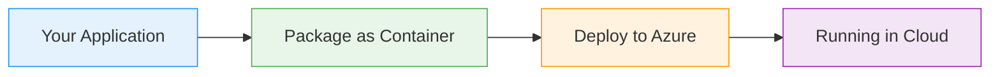

# Kubernetes Ingress

  <iconify-icon icon="logos:kubernetes" style="font-size: 4rem;" />

---

---
layout: center
---

# Kubernetes Ingress - Introduction Script

**Duration:** 2-3 minutes
**Format:** Presentation with slide deck

---

---
layout: center
---

# SLIDE 1: Title Slide

**[Visual: Title + Kubernetes logo + Ingress diagram icon]**

---

---
layout: center
---

# SLIDE 2: What is Kubernetes Ingress?

**[Visual: Architecture diagram showing traffic flow from external client → Ingress Controller → Services → Pods]**...

---

---
layout: center
---

# SLIDE 3: Why Use Ingress?

**[Visual: Comparison diagram - Multiple LoadBalancers vs Single Ingress]**

---

---
layout: center
---

# SLIDE 4: Ingress Controller Components

**[Visual: Breakdown showing Namespace, RBAC, ConfigMap, DaemonSet/Deployment, Service]**

---

---
layout: center
---

# SLIDE 5: Ingress Routing Rules

**[Visual: YAML snippet showing host-based and path-based routing examples]**

---

---
layout: center
---

# SLIDE 6: Advanced Features

**[Visual: Icons showing SSL/TLS, Load Balancing, Response Caching, Rate Limiting]**

---

---
layout: center
---

# SLIDE 7: AZ-204 Exam Relevance

**[Visual: AZ-204 badge + Key topics checklist]**

---

---
layout: center
---

# SLIDE 8: What's Next

**[Visual: Preview of hands-on lab with terminal and code editor screenshots]**

