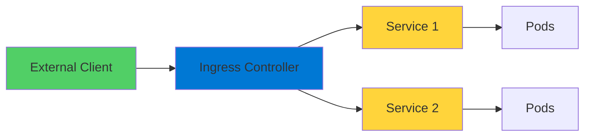
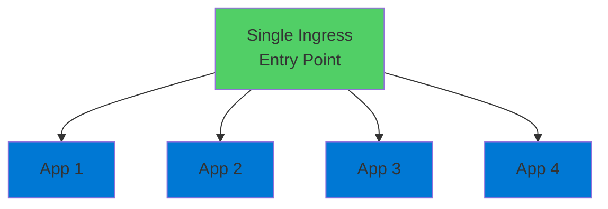

# Kubernetes Ingress

Managing External Access to Applications

<div class="abs-bottom-10 left-10">
  <carbon-network-3 class="text-8xl text-blue-400 opacity-80" />
</div>

---
layout: center
---

# Welcome

<!--
METADATA:
sentence: By the end of this session, you'll understand how Ingress works and why it's an essential topic for the AZ-204 certification exam.
search_anchor: By the end of this
-->
<v-click>

<div class="text-xl mt-8">
Explore Kubernetes Ingress<br/>Critical for the AZ-204 certification
</div>

</v-click>

---
layout: section
---

# What is Kubernetes Ingress?

---

# The Front Door

<v-click>

<div class="mt-4">
  <carbon-login class="text-6xl text-green-400" />
</div>

</v-click>

<!--
METADATA:
sentence: Think of it as the front door to your Kubernetes applications.
search_anchor: Think of it as the
-->
<v-click>

<div class="mt-8 text-xl text-center text-green-400">
Front door to your Kubernetes applications
</div>

</v-click>

<v-click>

<div class="mt-12">



</div>

</v-click>

---

# Two Main Parts

<!--
METADATA:
sentence: Popular options include Nginx, Traefik, and Contour.
search_anchor: Popular options include Nginx, Traefik
-->
<v-click>

<div class="mt-8 flex items-start gap-4">
  <div class="text-3xl text-blue-400 mt-1">1</div>
  <div>
    <carbon-server-proxy class="text-3xl inline-block" />
    <span class="ml-3 text-lg font-bold">Ingress Controller</span>
    <div class="text-sm mt-2 opacity-70">Reverse proxy receiving all traffic</div>
    <div class="text-sm opacity-70">Popular: Nginx, Traefik, Contour</div>
  </div>
</div>

</v-click>

<!--
METADATA:
sentence: Second, you have Ingress objects - these are Kubernetes resources that define the routing rules.
search_anchor: Second, you have Ingress objects
-->
<v-click>

<div class="mt-10 flex items-start gap-4">
  <div class="text-3xl text-green-400 mt-1">2</div>
  <div>
    <carbon-rule class="text-3xl inline-block" />
    <span class="ml-3 text-lg font-bold">Ingress Objects</span>
    <div class="text-sm mt-2 opacity-70">Kubernetes resources defining routing rules</div>
    <div class="text-sm opacity-70">Tell controller where to send traffic</div>
  </div>
</div>

</v-click>

---
layout: section
---

# Why Use Ingress?

---

# The LoadBalancer Problem

<v-click>

<div class="mt-8">

```mermaid
graph TB
    App1[App 1] --> LB1[LoadBalancer 1<br/>💰]
    App2[App 2] --> LB2[LoadBalancer 2<br/>💰]
    App3[App 3] --> LB3[LoadBalancer 3<br/>💰]
    App4[App 4] --> LB4[LoadBalancer 4<br/>💰]
    style LB1 fill:#ff6b6b
    style LB2 fill=#ff6b6b
    style LB3 fill:#ff6b6b
    style LB4 fill:#ff6b6b
```

</div>

</v-click>

<!--
METADATA:
sentence: Here's the thing - without Ingress, you'd need a separate LoadBalancer for every application you expose.
search_anchor: Here's the thing - without
-->
<v-click>

<div class="mt-12 text-center text-xl text-red-400">
Separate LoadBalancer for every application
</div>

</v-click>

<!--
METADATA:
sentence: That gets expensive and messy really fast.
search_anchor: That gets expensive and messy
-->
<v-click>

<div class="mt-4 text-center text-lg text-red-400">
Gets expensive and messy really fast
</div>

</v-click>

---

# The Ingress Solution

<v-click>

<div class="mt-8">



</div>

</v-click>

<!--
METADATA:
sentence: With Ingress, you get a single entry point that can intelligently route to multiple backend services.
search_anchor: Ingress, you get a single
-->
<v-click>

<div class="mt-12 text-center text-2xl text-green-400">
Single entry point
</div>

</v-click>

<!--
METADATA:
sentence: With Ingress, you get a single entry point that can intelligently route to multiple backend services.
search_anchor: Ingress, you get a single
-->
<v-click>

<div class="mt-8 text-center text-xl">
Intelligently routes to multiple backends
</div>

</v-click>

<!--
METADATA:
sentence: It's like having one receptionist who knows where to direct every visitor, instead of having a different door for each office.
search_anchor: It's like having one receptionist
-->
<v-click>

<div class="mt-8 text-center text-lg opacity-70">
One receptionist directing all visitors
</div>

</v-click>

---
layout: section
---

# Ingress Controller Components

---

# Not a Single Object

<!--
METADATA:
sentence: It's not a single Kubernetes object - it's actually a collection of resources working together.
search_anchor: It's not a single Kubernetes
-->
<v-click>

<div class="mt-8 text-center text-xl">
Collection of resources working together
</div>

</v-click>

<!--
METADATA:
sentence: You'll typically deploy it in its own namespace, with RBAC rules so it can query the Kubernetes API.
search_anchor: You'll typically deploy it in
-->
<v-click>

<div class="mt-12 flex items-center gap-4">
  <carbon-folder class="text-4xl text-blue-400" />
  <span class="text-lg">Own Namespace</span>
</div>

</v-click>

<!--
METADATA:
sentence: You'll typically deploy it in its own namespace, with RBAC rules so it can query the Kubernetes API.
search_anchor: You'll typically deploy it in
-->
<v-click>

<div class="mt-6 flex items-center gap-4">
  <carbon-security class="text-4xl text-green-400" />
  <span class="text-lg">RBAC rules to query Kubernetes API</span>
</div>

</v-click>

<!--
METADATA:
sentence: There's a ConfigMap for configuration settings, a Pod controller like a DaemonSet or Deployment running the actual proxy software, and Services for external access.
search_anchor: There's a ConfigMap for configuration
-->
<v-click>

<div class="mt-6 flex items-center gap-4">
  <carbon-settings class="text-4xl text-purple-400" />
  <span class="text-lg">ConfigMap for configuration</span>
</div>

</v-click>

<!--
METADATA:
sentence: There's a ConfigMap for configuration settings, a Pod controller like a DaemonSet or Deployment running the actual proxy software, and Services for external access.
search_anchor: There's a ConfigMap for configuration
-->
<v-click>

<div class="mt-6 flex items-center gap-4">
  <carbon-container-software class="text-4xl text-orange-400" />
  <span class="text-lg">DaemonSet or Deployment running proxy</span>
</div>

</v-click>

<!--
METADATA:
sentence: And you need to grasp how Ingress provides external access patterns for container orchestration.
search_anchor: you need to grasp how
-->
<v-click>

<div class="mt-6 flex items-center gap-4">
  <carbon-network-3 class="text-4xl text-red-400" />
  <span class="text-lg">Services for external access</span>
</div>

</v-click>

---

# Distributed System

<!--
METADATA:
sentence: Understanding this architecture is important because you're not just installing a plug-and-play solution - you're deploying a distributed system.
search_anchor: Understanding this architecture is important
-->
<v-click>

<div class="mt-12 text-center text-xl">
Not plug-and-play
</div>

</v-click>

<!--
METADATA:
sentence: Understanding this architecture is important because you're not just installing a plug-and-play solution - you're deploying a distributed system.
search_anchor: Understanding this architecture is important
-->
<v-click>

<div class="mt-12 text-center text-2xl text-green-400">
Deploying a distributed system
</div>

</v-click>

<!--
METADATA:
sentence: --- [End of presentation section - transition to exercises]
search_anchor: --- [End of presentation section
-->
<v-click>

<div class="mt-12 flex justify-center gap-12">
  <div class="text-center">
    <carbon-enterprise class="text-6xl text-blue-400" />
    <div class="text-sm mt-3">Production-Grade</div>
  </div>
  <div class="text-center">
    <carbon-network-4 class="text-6xl text-green-400" />
    <div class="text-sm mt-3">Complex Architecture</div>
  </div>
</div>

</v-click>

---
layout: section
---

# Ingress Routing Rules

---

# Two Main Routing Types

<!--
METADATA:
sentence: Host-based routing lets you direct traffic based on the domain name.
search_anchor: Host-based routing lets you direct
-->
<v-click>

<div class="mt-6 flex items-start gap-4">
  <div class="text-3xl text-blue-400 mt-1">1</div>
  <div>
    <carbon-earth class="text-3xl inline-block" />
    <span class="ml-3 text-lg font-bold">Host-Based Routing</span>
    <div class="text-sm mt-2 opacity-70">Route by domain name</div>
    <div class="text-sm mt-3">api.example.com → API Service</div>
    <div class="text-sm">app.example.com → Frontend</div>
  </div>
</div>

</v-click>

<!--
METADATA:
sentence: Path-based routing uses the URL path.
search_anchor: Path-based routing uses the URL
-->
<v-click>

<div class="mt-10 flex items-start gap-4">
  <div class="text-3xl text-green-400 mt-1">2</div>
  <div>
    <carbon-flow class="text-3xl inline-block" />
    <span class="ml-3 text-lg font-bold">Path-Based Routing</span>
    <div class="text-sm mt-2 opacity-70">Route by URL path</div>
    <div class="text-sm mt-3">/admin → Admin Service</div>
    <div class="text-sm">/api → Backend API</div>
  </div>
</div>

</v-click>

<!--
METADATA:
sentence: You can even combine these for sophisticated routing patterns.
search_anchor: You can even combine these
-->
<v-click>

<div class="mt-12 text-center text-xl text-green-400">
Can combine both for sophisticated patterns
</div>

</v-click>

---

# Routing Examples

<v-click>

<div class="mt-8">

```yaml
apiVersion: networking.k8s.io/v1
kind: Ingress
metadata:
  name: app-ingress
spec:
  rules:
  - host: api.example.com
    http:
      paths:
      - path: /
        pathType: Prefix
        backend:
          service:
            name: api-service
            port:
              number: 80
```

</div>

</v-click>

---
layout: section
---

# Advanced Features

---

# Enterprise Capabilities

<!--
METADATA:
sentence: SSL and TLS termination means your Ingress handles encryption, so your backend services don't have to.
search_anchor: SSL and TLS termination means
-->
<v-click>

<div class="mt-6 flex items-start gap-4">
  <carbon-locked class="text-4xl text-blue-400 mt-1" />
  <div>
    <div class="text-lg font-bold">SSL/TLS Termination</div>
    <div class="text-sm mt-2 opacity-70">Ingress handles encryption</div>
    <div class="text-sm opacity-70">Backend services don't need to</div>
  </div>
</div>

</v-click>

<!--
METADATA:
sentence: You get automatic load balancing across multiple pod replicas, distributing traffic evenly.
search_anchor: You get automatic load balancing
-->
<v-click>

<div class="mt-8 flex items-start gap-4">
  <carbon-network-overlay class="text-4xl text-green-400 mt-1" />
  <div>
    <div class="text-lg font-bold">Load Balancing</div>
    <div class="text-sm mt-2 opacity-70">Automatic across pod replicas</div>
    <div class="text-sm opacity-70">Distribute traffic evenly</div>
  </div>
</div>

</v-click>

<!--
METADATA:
sentence: Many controllers support response caching through annotations, which can dramatically improve performance for static content.
search_anchor: Many controllers support response caching
-->
<v-click>

<div class="mt-8 flex items-start gap-4">
  <carbon-data-backup class="text-4xl text-purple-400 mt-1" />
  <div>
    <div class="text-lg font-bold">Response Caching</div>
    <div class="text-sm mt-2 opacity-70">Via annotations</div>
    <div class="text-sm opacity-70">Dramatically improve performance</div>
  </div>
</div>

</v-click>

<!--
METADATA:
sentence: And features like rate limiting and authentication can be configured at the Ingress layer, keeping your application code clean.
search_anchor: features like rate limiting and
-->
<v-click>

<div class="mt-8 flex items-start gap-4">
  <carbon-security class="text-4xl text-orange-400 mt-1" />
  <div>
    <div class="text-lg font-bold">Rate Limiting & Auth</div>
    <div class="text-sm mt-2 opacity-70">Configure at Ingress layer</div>
    <div class="text-sm opacity-70">Keep application code clean</div>
  </div>
</div>

</v-click>

---
layout: section
---

# AZ-204 Exam Relevance

---

# Key Exam Topics

<!--
METADATA:
sentence: Microsoft expects you to understand how to implement containerized solutions, and that includes managing external access to your applications.
search_anchor: Microsoft expects you to understand
-->
<v-click>

<div class="mt-6 flex items-center gap-4">
  <carbon-container-software class="text-4xl text-blue-400" />
  <span class="text-lg">Implement containerized solutions</span>
</div>

</v-click>

<!--
METADATA:
sentence: You should know how to configure HTTP routing to direct traffic to different services.
search_anchor: You should know how to
-->
<v-click>

<div class="mt-6 flex items-center gap-4">
  <carbon-flow class="text-4xl text-green-400" />
  <span class="text-lg">Configure HTTP routing</span>
</div>

</v-click>

<!--
METADATA:
sentence: Understanding SSL and TLS termination is crucial for securing your applications.
search_anchor: Understanding SSL and TLS termination
-->
<v-click>

<div class="mt-6 flex items-center gap-4">
  <carbon-locked class="text-4xl text-purple-400" />
  <span class="text-lg">SSL and TLS termination</span>
</div>

</v-click>

<!--
METADATA:
sentence: And you need to grasp how Ingress provides external access patterns for container orchestration.
search_anchor: you need to grasp how
-->
<v-click>

<div class="mt-6 flex items-center gap-4">
  <carbon-network-3 class="text-4xl text-orange-400" />
  <span class="text-lg">External access patterns</span>
</div>

</v-click>

---

# AKS Integration

<!--
METADATA:
sentence: --- SLIDE 2: What is Kubernetes Ingress?
search_anchor: --- SLIDE 2: What is
-->
<v-click>

<div class="mt-12 text-center text-xl">
Azure Kubernetes Service has own ingress options
</div>

</v-click>

<!--
METADATA:
sentence: While Azure Kubernetes Service might have its own ingress options, the core concepts are the same, and they appear throughout the exam objectives.
search_anchor: While Azure Kubernetes Service might
-->
<v-click>

<div class="mt-12 text-center text-xl text-green-400">
Core concepts are the same
</div>

</v-click>

<!--
METADATA:
sentence: --- SLIDE 3: Why Use Ingress?
search_anchor: --- SLIDE 3: Why Use
-->
<v-click>

<div class="mt-12 flex justify-center gap-12">
  <div class="text-center">
    <carbon-cloud-services class="text-6xl text-blue-400" />
    <div class="text-sm mt-3">Application Gateway</div>
  </div>
  <div class="text-center">
    <carbon-network-3 class="text-6xl text-green-400" />
    <div class="text-sm mt-3">Nginx Ingress</div>
  </div>
</div>

</v-click>

<!--
METADATA:
sentence: While Azure Kubernetes Service might have its own ingress options, the core concepts are the same, and they appear throughout the exam objectives.
search_anchor: While Azure Kubernetes Service might
-->
<v-click>

<div class="mt-12 text-center text-lg opacity-70">
Appear throughout exam objectives
</div>

</v-click>

---
layout: section
---

# What's Next

---

# Hands-On Lab

<!--
METADATA:
sentence: --- SLIDE 3: Why Use Ingress?
search_anchor: --- SLIDE 3: Why Use
-->
<v-click>

<div class="mt-8 flex items-center gap-4">
  <carbon-deployment-pattern class="text-4xl text-blue-400" />
  <span class="text-lg">Deploy Nginx Ingress Controller</span>
</div>

</v-click>

<!--
METADATA:
sentence: Path-based routing uses the URL path.
search_anchor: Path-based routing uses the URL
-->
<v-click>

<div class="mt-6 flex items-center gap-4">
  <carbon-rule class="text-4xl text-green-400" />
  <span class="text-lg">Set up routing rules for multiple apps</span>
</div>

</v-click>

<!--
METADATA:
sentence: That gets expensive and messy really fast.
search_anchor: That gets expensive and messy
-->
<v-click>

<div class="mt-6 flex items-center gap-4">
  <carbon-settings-adjust class="text-4xl text-purple-400" />
  <span class="text-lg">Explore advanced features</span>
</div>

</v-click>

<!--
METADATA:
sentence: Let's jump into the exercises and see Ingress in action!
search_anchor: Let's jump into the exercises
-->
<v-click>

<div class="mt-12 text-center text-xl text-green-400">
See Ingress in action
</div>

</v-click>

---
layout: center
class: text-center
---

<div>

<v-click>

<carbon-play-outline class="text-8xl text-green-400 inline-block" />

</v-click>

<!--
METADATA:
sentence: Let's jump into the exercises and see Ingress in action!
search_anchor: Let's jump into the exercises
-->
<v-click>

<div class="text-4xl mt-8 font-bold">
Let's Jump In!
</div>

</v-click>

<!--
METADATA:
sentence: --- SLIDE 3: Why Use Ingress?
search_anchor: --- SLIDE 3: Why Use
-->
<v-click>

<div class="text-xl mt-6 opacity-70">
Master external access with Ingress
</div>

</v-click>

</div>
