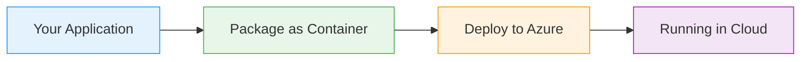

# Kubernetes Namespaces

  <iconify-icon icon="logos:kubernetes" style="font-size: 4rem;" />

---

---
layout: center
---

# SLIDE 1: Title Slide

**[ON SCREEN: "Kubernetes Namespaces: Isolating Workloads"]**

---

---
layout: center
---

# SLIDE 2: What Are Namespaces?

**[ON SCREEN: Diagram showing a Kubernetes cluster divided into separate namespace sections]**...

---

---
layout: center
---

# SLIDE 3: Use Cases & Scenarios

<iconify-icon icon="mdi:web" /> 

---

---
layout: two-cols
---

# SLIDE 4: Resource Isolation Benefits

<iconify-icon icon="mdi:check-circle" class="text-green-500" /> [ON SCREEN: Bullet points appearing one by one]: Why does this matter? Namespaces give you three major benefits:

::right::

  <iconify-icon icon="carbon:chart-line-smooth" style="font-size: 8rem; color: #4caf50;" />

---

---
layout: center
---

# SLIDE 5: Multi-Tenancy

**[ON SCREEN: Diagram showing multiple teams sharing one cluster safely]**

---

---
layout: center
---

# SLIDE 6: AZ-204 Relevance

**[ON SCREEN: AZ-204 exam topics highlighted]**

---

---
layout: center
---

# SLIDE 7: What We'll Cover Today

<iconify-icon icon="mdi:check-circle" class="text-blue-500" /> on lab, we're going to explore:

<iconify-icon icon="mdi:check-circle" class="text-blue-500" /> --

---

---
layout: center
---

# SLIDE 8: Important Considerations

**[ON SCREEN: Key points with icons]**

---

---
layout: center
---

# SLIDE 9: Let's Get Started

**[ON SCREEN: Terminal window ready to go]**

