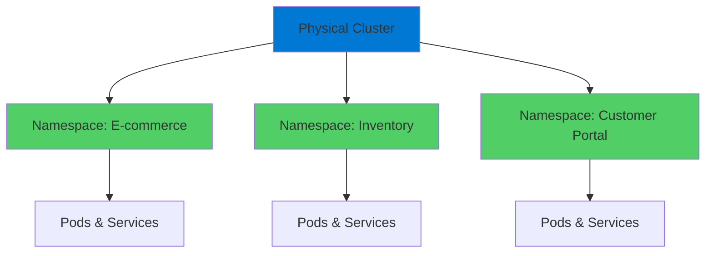
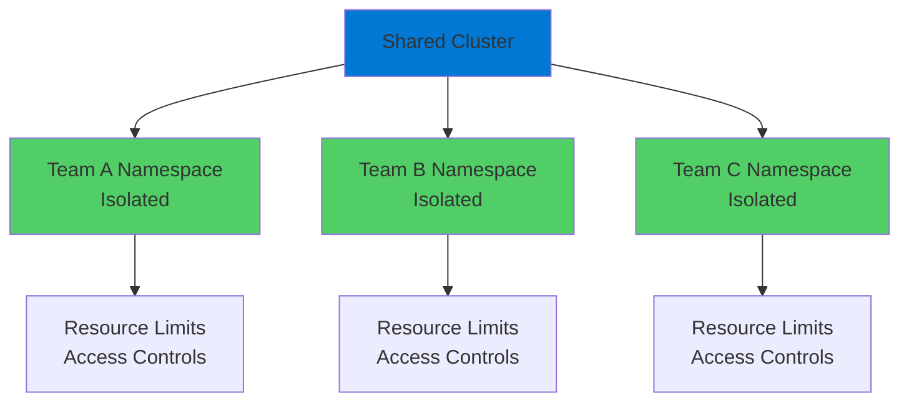
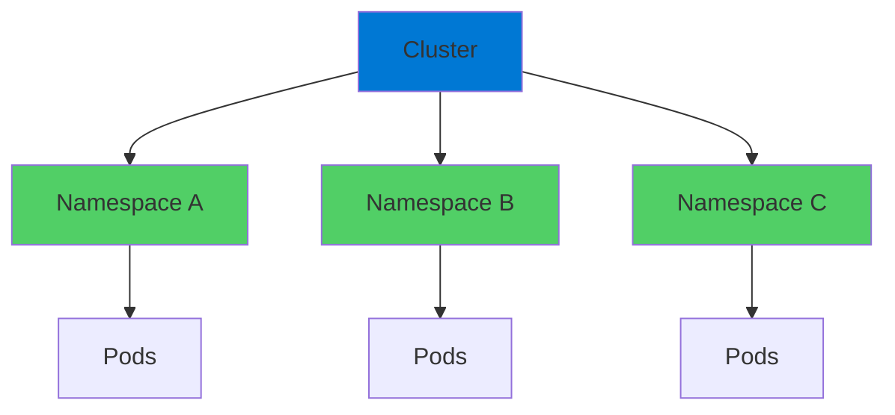

# Kubernetes Namespaces

Isolating Workloads

  <carbon-folder class="text-8xl text-blue-400 opacity-80" />

---
layout: center
---

# Welcome

<v-click>

Explore Kubernetes Namespaces Essential for organizing and isolating workloads

</v-click>

---
layout: section
---

# What Are Namespaces?

---

# Virtual Clusters

<v-click>

  <carbon-collaborate class="text-6xl text-green-400" />

</v-click>

<v-click>

Virtual clusters within your physical cluster

</v-click>

<v-click>

Containers for other Kubernetes resources

</v-click>

<v-click>

</v-click>

---

# Why Namespaces?

<v-click>

Run any type of application

</v-click>

<v-click>

Migrate entire application landscape onto Kubernetes

</v-click>

<v-click>

Without segregation: chaos

</v-click>

<v-click>

With namespaces: organized and safe

</v-click>

---
layout: section
---

# Use Cases & Scenarios

---

# Real-World Examples

<v-click>

  <carbon-application class="text-4xl text-blue-400 mt-1" />
  

    
Production Cluster

    
Different namespace per application

    
E-commerce → ns: ecommerce

    
Inventory → ns: inventory

    
Customer Portal → ns: portal

  

</v-click>

<v-click>

  <carbon-development class="text-4xl text-green-400 mt-1" />
  

    
Non-Production Cluster

    
Organize by environment

    
ns: development

    
ns: testing

    
ns: uat

  

</v-click>

<v-click>

Dev team can experiment without breaking test

</v-click>

---
layout: section
---

# Resource Isolation Benefits

---

# Three Major Benefits

<v-click>

  
1

  

    <carbon-chart-bar class="text-3xl inline-block" />
    Resource Isolation
    
Apply resource quotas per namespace

    
Prevent one app from consuming all resources

  

</v-click>

<v-click>

  
2

  

    <carbon-security class="text-3xl inline-block" />
    Security Boundaries
    
Role-Based Access Control per namespace

    
Junior devs access dev, not production

  

</v-click>

<v-click>

  
3

  

    <carbon-clean class="text-3xl inline-block" />
    Simplified Management
    
No complex label selectors everywhere

    
Natural organization by namespace

  

</v-click>

---
layout: section
---

# Multi-Tenancy

---

# Enterprise Scenarios

<v-click>

Multiple teams, projects, or customers on same cluster

</v-click>

<v-click>

</v-click>

<v-click>

Strict isolation, resource limits, and access controls

</v-click>

<v-click>

Cost optimization

</v-click>

<v-click>

Consolidate workloads while maintaining security

</v-click>

---
layout: section
---

# AZ-204 Exam Relevance

---

# Key Exam Topics

<v-click>

  <carbon-container-software class="text-4xl text-blue-400" />
  Implement Azure solutions with containers

</v-click>

<v-click>

  <carbon-document-tasks class="text-4xl text-green-400" />
  Organize applications properly

</v-click>

<v-click>

  <carbon-security class="text-4xl text-purple-400" />
  Implement proper security boundaries

</v-click>

<v-click>

  <carbon-settings-adjust class="text-4xl text-orange-400" />
  Manage resources efficiently

</v-click>

---

# Essential Knowledge Areas

<v-click>

  <carbon-folder class="text-4xl text-blue-400" />
  Resource organization strategies

</v-click>

<v-click>

  <carbon-user-access class="text-4xl text-green-400" />
  RBAC implementation

</v-click>

<v-click>

  <carbon-development class="text-4xl text-purple-400" />
  Environment separation strategies

</v-click>

<v-click>

Works exactly same in Azure Kubernetes Service

</v-click>

---
layout: section
---

# What We'll Cover Today

---

# Lab Overview

<v-click>

  <carbon-add class="text-4xl text-blue-400" />
  Create and manage namespaces with kubectl

</v-click>

<v-click>

  <carbon-deployment-pattern class="text-4xl text-green-400" />
  Deploy applications into specific namespaces

</v-click>

<v-click>

  <carbon-network-3 class="text-4xl text-purple-400" />
  Explore service discovery and DNS resolution

</v-click>

<v-click>

  <carbon-tools class="text-4xl text-orange-400" />
  Practical tools for working with namespaces

</v-click>

---
layout: section
---

# Important Considerations

---

# Key Points to Remember

<v-click>

Namespaces introduce some complexity

</v-click>

<v-click>

Need to be more explicit about where things live

</v-click>

<v-click>

But the safeguards are absolutely worth it

</v-click>

<v-click>

  

    <carbon-checkmark-outline class="text-6xl text-green-400" />
    
Confident multi-workload

  

  

    <carbon-scale class="text-6xl text-blue-400" />
    
No compromise on scale

  

  

    <carbon-security class="text-6xl text-purple-400" />
    
No compromise on security

  

</v-click>

---

# Structure Rules

<v-click>

</v-click>

<v-click>

Namespaces can't be nested

</v-click>

<v-click>

Single-level hierarchy

</v-click>

<v-click>

Keep your organization strategy simple and clear

</v-click>

---
layout: center
class: text-center
---

<v-click>

<carbon-play-outline class="text-8xl text-green-400 inline-block" />

</v-click>

<v-click>

Let's Get Started!

</v-click>

<v-click>

Master namespace organization and isolation

</v-click>

