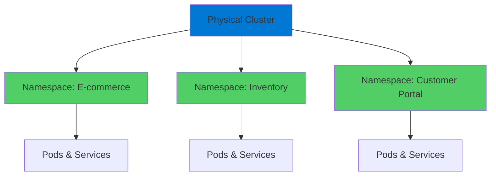
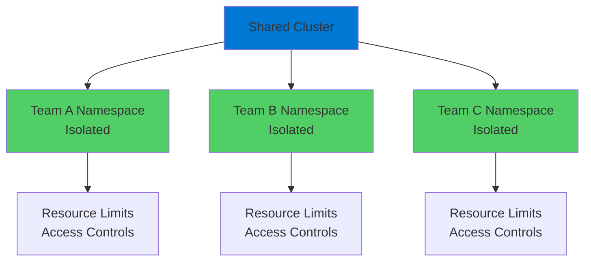
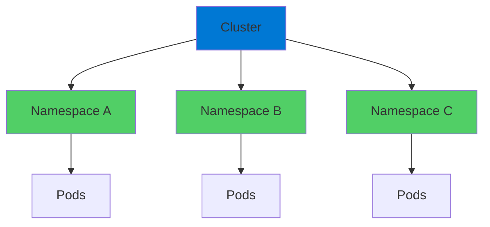

# Kubernetes Namespaces

Isolating Workloads

  <carbon-folder class="text-8xl text-blue-400 opacity-80" />

---
layout: center
---

# Welcome

<!--
METADATA:
sentence: Today we're diving into Kubernetes Namespaces, one of the most powerful features for organizing and isolating workloads in your cluster.
search_anchor: Today we're diving into Kubernetes
-->
<v-click>

Explore Kubernetes Namespaces Essential for organizing and isolating workloads

</v-click>

---
layout: section
---

# What Are Namespaces?

---

# Virtual Clusters

<v-click>

  <carbon-collaborate class="text-6xl text-green-400" />

</v-click>

<!--
METADATA:
sentence: Think of them as virtual clusters within your physical cluster.
search_anchor: Think of them as virtual
-->
<v-click>

Virtual clusters within your physical cluster

</v-click>

<!--
METADATA:
sentence: They're containers for other Kubernetes resources, giving you a way to divide your cluster into separate, isolated environments.
search_anchor: They're containers for other Kubernetes
-->
<v-click>

Containers for other Kubernetes resources

</v-click>

<v-click>

</v-click>

---

# Why Namespaces?

<!--
METADATA:
sentence: One of the coolest things about Kubernetes is that you can run any type of application.
search_anchor: One of the coolest things
-->
<v-click>

Run any type of application

</v-click>

<!--
METADATA:
sentence: Many organizations want to migrate their entire application landscape onto Kubernetes.
search_anchor: Many organizations want to migrate
-->
<v-click>

Migrate entire application landscape onto Kubernetes

</v-click>

<!--
METADATA:
sentence: But without a way to segregate the cluster, operations could get really messy, really fast.
search_anchor: But without a way to
-->
<v-click>

Without segregation: chaos

</v-click>

<!--
METADATA:
sentence: That's where namespaces come in.
search_anchor: That's where namespaces come in
-->
<v-click>

With namespaces: organized and safe

</v-click>

---
layout: section
---

# Use Cases & Scenarios

---

# Real-World Examples

<!--
METADATA:
sentence: On your production cluster, you might create a different namespace for each application.
search_anchor: your production cluster, you might
-->
<v-click>

  <carbon-application class="text-4xl text-blue-400 mt-1" />
  

    
Production Cluster

    
Different namespace per application

    
E-commerce → ns: ecommerce

    
Inventory → ns: inventory

    
Customer Portal → ns: portal

  

</v-click>

<!--
METADATA:
sentence: On your non-production cluster, you might organize by environment.
search_anchor: your non-production cluster, you might
-->
<v-click>

  <carbon-development class="text-4xl text-green-400 mt-1" />
  

    
Non-Production Cluster

    
Organize by environment

    
ns: development

    
ns: testing

    
ns: uat

  

</v-click>

<!--
METADATA:
sentence: This way, your dev team can experiment freely without worrying about breaking the test environment.
search_anchor: This way, your dev team
-->
<v-click>

Dev team can experiment without breaking test

</v-click>

---
layout: section
---

# Resource Isolation Benefits

---

# Three Major Benefits

<!--
METADATA:
sentence: You can apply resource quotas per namespace, preventing one application from consuming all your cluster resources.
search_anchor: You can apply resource quotas
-->
<v-click>

  
1

  

    <carbon-chart-bar class="text-3xl inline-block" />
    Resource Isolation
    
Apply resource quotas per namespace

    
Prevent one app from consuming all resources

  

</v-click>

<!--
METADATA:
sentence: Your junior developers might have access to the dev namespace but not production.
search_anchor: Your junior developers might have
-->
<v-click>

  
2

  

    <carbon-security class="text-3xl inline-block" />
    Security Boundaries
    
Role-Based Access Control per namespace

    
Junior devs access dev, not production

  

</v-click>

<!--
METADATA:
sentence: Instead of using complex label selectors everywhere, you can organize resources naturally by namespace.
search_anchor: Instead of using complex label
-->
<v-click>

  
3

  

    <carbon-clean class="text-3xl inline-block" />
    Simplified Management
    
No complex label selectors everywhere

    
Natural organization by namespace

  

</v-click>

---
layout: section
---

# Multi-Tenancy

---

# Enterprise Scenarios

<!--
METADATA:
sentence: Namespaces let you safely run multiple teams, projects, or even customers on the same Kubernetes cluster.
search_anchor: Namespaces let you safely run
-->
<v-click>

Multiple teams, projects, or customers on same cluster

</v-click>

<v-click>

</v-click>

<!--
METADATA:
sentence: Each tenant gets their own namespace with strict isolation, resource limits, and access controls.
search_anchor: Each tenant gets their own
-->
<v-click>

Strict isolation, resource limits, and access controls

</v-click>

<!--
METADATA:
sentence: This is huge for cost optimization.
search_anchor: This is huge for cost
-->
<v-click>

Cost optimization

</v-click>

<!--
METADATA:
sentence: Instead of spinning up separate clusters for every team or project, you can consolidate workloads while maintaining the security and isolation you need.
search_anchor: Instead of spinning up separate
-->
<v-click>

Consolidate workloads while maintaining security

</v-click>

---
layout: section
---

# AZ-204 Exam Relevance

---

# Key Exam Topics

<!--
METADATA:
sentence: Microsoft expects you to understand how to implement Azure solutions, and that includes container-based deployments.
search_anchor: Microsoft expects you to understand
-->
<v-click>

  <carbon-container-software class="text-4xl text-blue-400" />
  Implement Azure solutions with containers

</v-click>

<!--
METADATA:
sentence: Second, how to deploy applications into specific namespaces.
search_anchor: Second, how to deploy applications
-->
<v-click>

  <carbon-document-tasks class="text-4xl text-green-400" />
  Organize applications properly

</v-click>

<!--
METADATA:
sentence: Second, security boundaries.
search_anchor: Second, security boundaries
-->
<v-click>

  <carbon-security class="text-4xl text-purple-400" />
  Implement proper security boundaries

</v-click>

<!--
METADATA:
sentence: You need to know how to organize applications, implement proper security boundaries, and manage resources efficiently.
search_anchor: You need to know how
-->
<v-click>

  <carbon-settings-adjust class="text-4xl text-orange-400" />
  Manage resources efficiently

</v-click>

---

# Essential Knowledge Areas

<!--
METADATA:
sentence: Keep your organization strategy simple and clear.
search_anchor: Keep your organization strategy simple
-->
<v-click>

  <carbon-folder class="text-4xl text-blue-400" />
  Resource organization strategies

</v-click>

<!--
METADATA:
sentence: Third, simplified management.
search_anchor: Third, simplified management
-->
<v-click>

  <carbon-user-access class="text-4xl text-green-400" />
  RBAC implementation

</v-click>

<!--
METADATA:
sentence: You'll need to demonstrate knowledge of resource organization, RBAC implementation, and environment separation strategies.
search_anchor: You'll need to demonstrate knowledge
-->
<v-click>

  <carbon-development class="text-4xl text-purple-400" />
  Environment separation strategies

</v-click>

<!--
METADATA:
sentence: In Azure Kubernetes Service, namespaces work exactly the same way as standard Kubernetes, so everything we cover today applies directly to your AKS deployments.
search_anchor: Azure Kubernetes Service, namespaces work
-->
<v-click>

Works exactly same in Azure Kubernetes Service

</v-click>

---
layout: section
---

# What We'll Cover Today

---

# Lab Overview

<!--
METADATA:
sentence: Also, remember: namespaces can't be nested.
search_anchor: Also, remember: namespaces can't be
-->
<v-click>

  <carbon-add class="text-4xl text-blue-400" />
  Create and manage namespaces with kubectl

</v-click>

<!--
METADATA:
sentence: Second, how to deploy applications into specific namespaces.
search_anchor: Second, how to deploy applications
-->
<v-click>

  <carbon-deployment-pattern class="text-4xl text-green-400" />
  Deploy applications into specific namespaces

</v-click>

<!--
METADATA:
sentence: Third, how namespaces affect service discovery and DNS resolution.
search_anchor: Third, how namespaces affect service
-->
<v-click>

  <carbon-network-3 class="text-4xl text-purple-400" />
  Explore service discovery and DNS resolution

</v-click>

<!--
METADATA:
sentence: And finally, we'll look at some practical tools that make working with namespaces much easier.
search_anchor: finally, we'll look at some
-->
<v-click>

  <carbon-tools class="text-4xl text-orange-400" />
  Practical tools for working with namespaces

</v-click>

---
layout: section
---

# Important Considerations

---

# Key Points to Remember

<!--
METADATA:
sentence: That's where namespaces come in.
search_anchor: That's where namespaces come in
-->
<v-click>

Namespaces introduce some complexity

</v-click>

<!--
METADATA:
sentence: You need to be more explicit about where things live.
search_anchor: You need to be more
-->
<v-click>

Need to be more explicit about where things live

</v-click>

<!--
METADATA:
sentence: But the safeguards they provide are absolutely worth it.
search_anchor: But the safeguards they provide
-->
<v-click>

But the safeguards are absolutely worth it

</v-click>

<!--
METADATA:
sentence: With namespaces, you can confidently run multiple workloads on a single cluster without compromising scale or security.
search_anchor: namespaces, you can confidently run
-->
<v-click>

  

    <carbon-checkmark-outline class="text-6xl text-green-400" />
    
Confident multi-workload

  

  

    <carbon-scale class="text-6xl text-blue-400" />
    
No compromise on scale

  

  

    <carbon-security class="text-6xl text-purple-400" />
    
No compromise on security

  

</v-click>

---

# Structure Rules

<v-click>

</v-click>

<!--
METADATA:
sentence: Also, remember: namespaces can't be nested.
search_anchor: Also, remember: namespaces can't be
-->
<v-click>

Namespaces can't be nested

</v-click>

<!--
METADATA:
sentence: It's a single-level hierarchy.
search_anchor: It's a single-level hierarchy
-->
<v-click>

Single-level hierarchy

</v-click>

<!--
METADATA:
sentence: Keep your organization strategy simple and clear.
search_anchor: Keep your organization strategy simple
-->
<v-click>

Keep your organization strategy simple and clear

</v-click>

---
layout: center
class: text-center
---

<v-click>

<carbon-play-outline class="text-8xl text-green-400 inline-block" />

</v-click>

<!--
METADATA:
sentence: So let's get started!
search_anchor: So let's get started
-->
<v-click>

Let's Get Started!

</v-click>

<!--
METADATA:
sentence: Keep your organization strategy simple and clear.
search_anchor: Keep your organization strategy simple
-->
<v-click>

Master namespace organization and isolation

</v-click>

