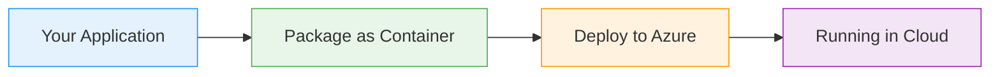
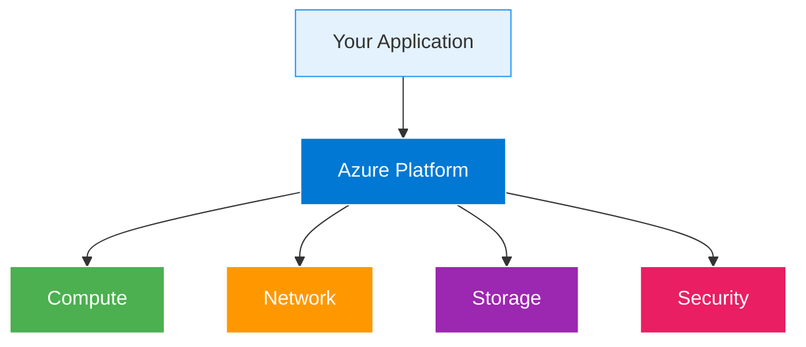

# Kubernetes Nodes

  <iconify-icon icon="logos:kubernetes" style="font-size: 4rem;" />

---

---
layout: center
---

# Kubernetes Nodes - Introduction Script

**Duration:** 2-3 minutes
**Target:** AZ-204 exam candidates

---

---
layout: center
---

# Slide 1: Title Slide

Welcome back! In this lesson, we're diving into Kubernetes Nodes - the fundamental building blocks of your cluster infrastructure. Understanding nodes is essential for the AZ-204 exam, especially when

---

---
layout: center
---

# Slide 2: What Are Kubernetes Nodes?

So, what exactly is a node? In Kubernetes, a node is simply a worker machine - it could be a virtual machine or a physical server. Nodes are where you...

---

---
layout: two-cols
---

# Slide 3: Node Architecture

::right::

<h3>Azure Manages</h3>
<ul>

</ul>

<h3>You Control</h3>
<ul>

</ul>

---

---
layout: center
---

# Slide 4: Node Pools in AKS

When working with Azure Kubernetes Service, you'll encounter node pools. A node pool is a group of nodes within a cluster that all have the same configuration.

---

---
layout: center
---

# Slide 5: Node Capacity and Resources

Every node has a certain capacity - CPU cores, memory, and storage. Kubernetes tracks these resources carefully. When you request resources for your pods, Kubernetes uses this information to decide wh

---

---
layout: center
---

# Slide 6: AZ-204 Exam Relevance

For the AZ-204 exam, you need to know how to:
- Inspect and query node information using kubectl
- Understand node capacity and resource allocation
- Work with node labels and selectors
- Troubleshoot

---

---
layout: center
---

# Slide 7: Tools We'll Use

The primary tool for working with nodes is kubectl - the Kubernetes command-line interface. Throughout this lesson, you'll learn essential kubectl commands like:
- kubectl get nodes - to list nodes
- 

---

---
layout: center
---

# Slide 8: What's Next

In the exercises that follow, we'll get hands-on with kubectl. You'll learn how to examine nodes, query their properties, and extract specific information using different output formats.

