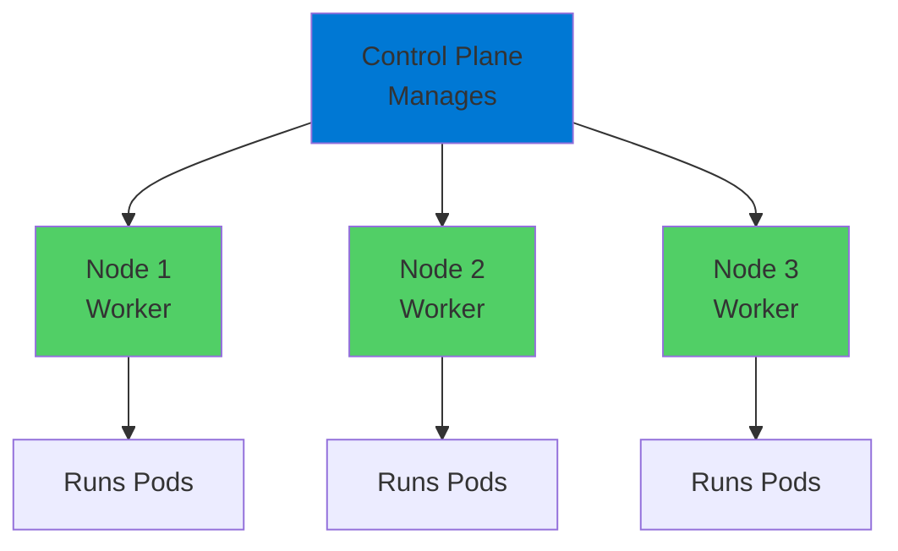
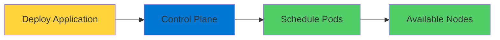
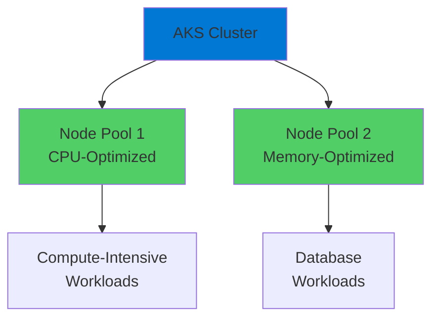
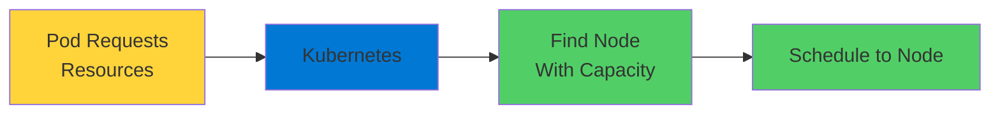

# Kubernetes Nodes

The Worker Machines

  <carbon-server class="text-8xl text-blue-400 opacity-80" />

---
layout: center
---

# Welcome

<!--
METADATA:
sentence: In this lesson, we're diving into Kubernetes Nodes - the fundamental building blocks of your cluster infrastructure.
search_anchor: this lesson, we're diving into
-->
<v-click>

Explore Kubernetes Nodes The foundation of your cluster infrastructure

</v-click>

---
layout: section
---

# What Are Kubernetes Nodes?

---

# Worker Machines

<v-click>

  <carbon-server class="text-6xl text-green-400" />

</v-click>

<!--
METADATA:
sentence: In Kubernetes, a node is simply a worker machine - it could be a virtual machine or a physical server.
search_anchor: Kubernetes, a node is simply
-->
<v-click>

Virtual machine or physical server

</v-click>

<!--
METADATA:
sentence: Nodes are where your containerized applications actually run.
search_anchor: Nodes are where your containerized
-->
<v-click>

Where your containerized applications actually run

</v-click>

<v-click>

</v-click>

---

# The Workhorses

<!--
METADATA:
sentence: Each node contains the services necessary to run pods, which are managed by the Kubernetes control plane.
search_anchor: Each node contains the services
-->
<v-click>

Nodes contain services necessary to run pods

</v-click>

<!--
METADATA:
sentence: Each node contains the services necessary to run pods, which are managed by the Kubernetes control plane.
search_anchor: Each node contains the services
-->
<v-click>

Managed by Kubernetes control plane

</v-click>

<v-click>

</v-click>

---
layout: section
---

# Node Architecture

---

# Inside a Node

<!--
METADATA:
sentence: It ensures containers are running and healthy.
search_anchor: It ensures containers are running
-->
<v-click>

  
1

  

    <carbon-network-4 class="text-3xl inline-block" />
    kubelet
    
Primary node agent

    
Communicates with control plane

    
Ensures containers are running and healthy

  

</v-click>

<!--
METADATA:
sentence: Next, you have the container runtime - this is what actually runs your containers.
search_anchor: Next, you have the container
-->
<v-click>

  
2

  

    <carbon-container-software class="text-3xl inline-block" />
    Container Runtime
    
Actually runs your containers

    
In AKS: typically containerd

  

</v-click>

<!--
METADATA:
sentence: Finally, there's kube-proxy - a network proxy that maintains network rules and enables communication to your pods.
search_anchor: Finally, there's kube-proxy - a
-->
<v-click>

  
3

  

    <carbon-network-3 class="text-3xl inline-block" />
    kube-proxy
    
Network proxy

    
Maintains network rules

    
Enables communication to your pods

  

</v-click>

---
layout: section
---

# Node Pools in AKS

---

# Grouping Nodes

<v-click>

  <carbon-data-structured class="text-6xl text-blue-400" />

</v-click>

<!--
METADATA:
sentence: A node pool is a group of nodes within a cluster that all have the same configuration.
search_anchor: node pool is a group
-->
<v-click>

Node pool: group of nodes with same configuration

</v-click>

<!--
METADATA:
sentence: You can have multiple node pools in a single AKS cluster, which is useful when you need different VM sizes for different workloads.
search_anchor: You can have multiple node
-->
<v-click>

Multiple node pools in single AKS cluster

</v-click>

<v-click>

</v-click>

---

# Different VM Sizes

<!--
METADATA:
sentence: For example, you might have one pool with CPU-optimized nodes for compute-intensive tasks, and another pool with memory-optimized nodes for databases.
search_anchor: example, you might have one
-->
<v-click>

  

    <carbon-chip class="text-6xl text-blue-400" />
    
CPU-Optimized

    
Compute tasks

  

  

    <carbon-data-base class="text-6xl text-green-400" />
    
Memory-Optimized

    
Databases

  

  

    <carbon-data-storage class="text-6xl text-purple-400" />
    
Storage-Optimized

    
Data-intensive

  

</v-click>

<!--
METADATA:
sentence: You'll learn how to examine nodes, query their properties, and extract specific information using different output formats.
search_anchor: You'll learn how to examine
-->
<v-click>

Different workloads, different requirements

</v-click>

---
layout: section
---

# Node Capacity and Resources

---

# Resource Tracking

<v-click>

  <carbon-chip class="text-4xl text-blue-400" />
  CPU cores

</v-click>

<v-click>

  <carbon-data-base class="text-4xl text-green-400" />
  Memory

</v-click>

<v-click>

  <carbon-data-storage class="text-4xl text-purple-400" />
  Storage

</v-click>

<!--
METADATA:
sentence: Kubernetes tracks these resources carefully.
search_anchor: Kubernetes tracks these resources carefully
-->
<v-click>

Kubernetes tracks capacity carefully

</v-click>

<!--
METADATA:
sentence: When you request resources for your pods, Kubernetes uses this information to decide which node has enough capacity to run your workload.
search_anchor: When you request resources for
-->
<v-click>

Decides which node has enough capacity

</v-click>

---

# Resource Requests and Limits

<v-click>

</v-click>

<!--
METADATA:
sentence: --- Slide 2: What Are Kubernetes Nodes?
search_anchor: --- Slide 2: What Are
-->
<v-click>

Resource requests: what pod needs

</v-click>

<!--
METADATA:
sentence: You'll need to understand concepts like resource requests and limits, which we'll explore in the hands-on exercises.
search_anchor: You'll need to understand concepts
-->
<v-click>

Resource limits: maximum pod can use

</v-click>

---
layout: section
---

# AZ-204 Exam Relevance

---

# What You Need to Know

<!--
METADATA:
sentence: You'll learn how to examine nodes, query their properties, and extract specific information using different output formats.
search_anchor: You'll learn how to examine
-->
<v-click>

  <carbon-view class="text-4xl text-blue-400" />
  Inspect and query node information with kubectl

</v-click>

<!--
METADATA:
sentence: --- Slide 5: Node Capacity and Resources Every node has a certain capacity - CPU cores, memory, and storage.
search_anchor: --- Slide 5: Node Capacity
-->
<v-click>

  <carbon-chart-bar class="text-4xl text-green-400" />
  Understand node capacity and resource allocation

</v-click>

<!--
METADATA:
sentence: It ensures containers are running and healthy.
search_anchor: It ensures containers are running
-->
<v-click>

  <carbon-tag class="text-4xl text-purple-400" />
  Work with node labels and selectors

</v-click>

<!--
METADATA:
sentence: --- Slide 3: Node Architecture Let's look at what's inside a node.
search_anchor: --- Slide 3: Node Architecture
-->
<v-click>

  <carbon-debug class="text-4xl text-orange-400" />
  Troubleshoot node-related issues in AKS

</v-click>

---

# AKS Handles Configuration

<!--
METADATA:
sentence: --- Slide 2: What Are Kubernetes Nodes?
search_anchor: --- Slide 2: What Are
-->
<v-click>

Don't need to install or configure nodes from scratch

</v-click>

<!--
METADATA:
sentence: So, what exactly is a node?
search_anchor: So, what exactly is a
-->
<v-click>

That's handled by AKS

</v-click>

<!--
METADATA:
sentence: When you deploy an application to Kubernetes, the control plane schedules your pods to run on available nodes.
search_anchor: When you deploy an application
-->
<v-click>

But you DO need to know how to work with them

</v-click>

<!--
METADATA:
sentence: Kubernetes tracks these resources carefully.
search_anchor: Kubernetes tracks these resources carefully
-->
<v-click>

  

    <carbon-search class="text-6xl text-blue-400" />
    
Query

  

  

    <carbon-data-view-alt class="text-6xl text-green-400" />
    
Inspect

  

  

    <carbon-debug class="text-6xl text-purple-400" />
    
Troubleshoot

  

</v-click>

---
layout: section
---

# Tools We'll Use

---

# kubectl Commands

<!--
METADATA:
sentence: --- Slide 2: What Are Kubernetes Nodes?
search_anchor: --- Slide 2: What Are
-->
<v-click>

  <carbon-terminal class="text-4xl text-blue-400" />
  kubectl get nodes

</v-click>

<!--
METADATA:
sentence: A node pool is a group of nodes within a cluster that all have the same configuration.
search_anchor: node pool is a group
-->
<v-click>

List all nodes in cluster

</v-click>

<!--
METADATA:
sentence: --- Slide 2: What Are Kubernetes Nodes?
search_anchor: --- Slide 2: What Are
-->
<v-click>

  <carbon-document-view class="text-4xl text-green-400" />
  kubectl describe nodes

</v-click>

<!--
METADATA:
sentence: --- Slide 2: What Are Kubernetes Nodes?
search_anchor: --- Slide 2: What Are
-->
<v-click>

Detailed information about nodes

</v-click>

<!--
METADATA:
sentence: In Azure Kubernetes Service, this is typically containerd.
search_anchor: Azure Kubernetes Service, this is
-->
<v-click>

  <carbon-help class="text-4xl text-purple-400" />
  kubectl explain

</v-click>

<!--
METADATA:
sentence: Kubernetes tracks these resources carefully.
search_anchor: Kubernetes tracks these resources carefully
-->
<v-click>

Learn about Kubernetes resources

</v-click>

<!--
METADATA:
sentence: Think of them as the workhorses of your cluster.
search_anchor: Think of them as the
-->
<v-click>

Your bread and butter for cluster management

</v-click>

---
layout: section
---

# What's Next

---

# Hands-On Exercises

<!--
METADATA:
sentence: Think of them as the workhorses of your cluster.
search_anchor: Think of them as the
-->
<v-click>

  <carbon-search class="text-4xl text-blue-400" />
  Examine nodes in your cluster

</v-click>

<!--
METADATA:
sentence: So, what exactly is a node?
search_anchor: So, what exactly is a
-->
<v-click>

  <carbon-data-view-alt class="text-4xl text-green-400" />
  Query node properties

</v-click>

<!--
METADATA:
sentence: You'll learn how to examine nodes, query their properties, and extract specific information using different output formats.
search_anchor: You'll learn how to examine
-->
<v-click>

  <carbon-document class="text-4xl text-purple-400" />
  Extract information using different output formats

</v-click>

<!--
METADATA:
sentence: By the end of this lesson, you'll be comfortable navigating your cluster's node infrastructure - a crucial skill for both the exam and real-world Azure development.
search_anchor: By the end of this
-->
<v-click>

Comfortable navigating node infrastructure

</v-click>

<!--
METADATA:
sentence: By the end of this lesson, you'll be comfortable navigating your cluster's node infrastructure - a crucial skill for both the exam and real-world Azure development.
search_anchor: By the end of this
-->
<v-click>

Crucial for exam and real-world development

</v-click>

---
layout: center
class: text-center
---

<v-click>

<carbon-play-outline class="text-8xl text-green-400 inline-block" />

</v-click>

<!--
METADATA:
sentence: --- Slide 3: Node Architecture Let's look at what's inside a node.
search_anchor: --- Slide 3: Node Architecture
-->
<v-click>

Let's Get Started!

</v-click>

<!--
METADATA:
sentence: Think of them as the workhorses of your cluster.
search_anchor: Think of them as the
-->
<v-click>

Explore the worker machines powering your cluster

</v-click>

