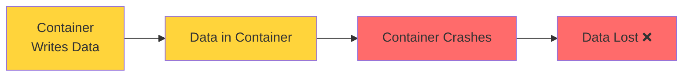
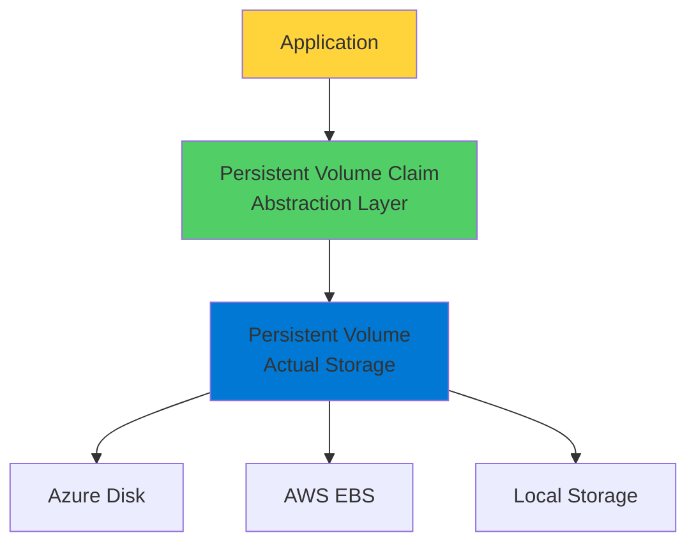
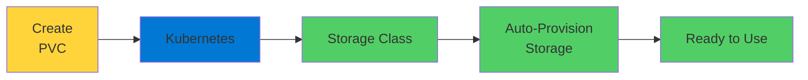

# Kubernetes Persistent Volumes

Storage That Survives Pod Restarts

  <carbon-data-storage class="text-8xl text-blue-400 opacity-80" />

---
layout: center
---

# Welcome

<v-click>

Explore Persistent Volumes and Claims Critical for stateful applications

</v-click>

---
layout: section
---

# The Storage Challenge

---

# The Problem

<v-click>

  <carbon-warning class="text-6xl text-red-400" />

</v-click>

<v-click>

Container writes data to filesystem

</v-click>

<v-click>

Data lives inside container

</v-click>

<v-click>

Container restarts → All data disappears

</v-click>

<v-click>

</v-click>

---

# Not Good for Production

<v-click>

Imagine a database where all data vanishes

</v-click>

<v-click>

Every time a pod restarts

</v-click>

<v-click>

We need storage that persists

</v-click>

<v-click>

Beyond lifecycle of individual containers and pods

</v-click>

---
layout: section
---

# The Kubernetes Storage Abstraction

---

# Clean Separation

<v-click>

  <carbon-network-overlay class="text-6xl text-green-400" />

</v-click>

<v-click>

Application doesn't need to know infrastructure

</v-click>

<v-click>

Running on AWS, Azure, or on-premises?

</v-click>

<v-click>

Application doesn't care

</v-click>

<v-click>

</v-click>

---

# Two Key Resources

<v-click>

  
1

  

    <carbon-data-storage class="text-3xl inline-block" />
    Persistent Volume (PV)
    
The actual storage resource

    
Like a disk or network file share

  

</v-click>

<v-click>

  
2

  

    <carbon-document-blank class="text-3xl inline-block" />
    Persistent Volume Claim (PVC)
    
Application's request for storage

    
"I need 100 GB with read-write access"

  

</v-click>

<v-click>

Kubernetes handles the rest

</v-click>

---

# Portable Applications

<v-click>

Application says: "I need storage"

</v-click>

<v-click>

Not: "Give me an Azure Disk"

</v-click>

<v-click>

Abstraction keeps applications portable

</v-click>

<v-click>

  

    <carbon-cloud class="text-6xl text-blue-400" />
    
Azure

  

  

    <carbon-cloud class="text-6xl text-orange-400" />
    
AWS

  

  

    <carbon-server class="text-6xl text-green-400" />
    
On-Premises

  

</v-click>

---
layout: section
---

# Storage Classes and Dynamic Provisioning

---

# Multiple Storage Options

<v-click>

Production clusters have different storage types

</v-click>

<v-click>

  

    <carbon-flash class="text-6xl text-blue-400" />
    
Fast SSD

    
Databases

  

  

    <carbon-data-storage class="text-6xl text-green-400" />
    
Standard HDD

    
Backups

  

  

    <carbon-share class="text-6xl text-purple-400" />
    
Shared Files

    
Concurrent access

  

</v-click>

<v-click>

Storage Classes define these options

</v-click>

---

# Dynamic Provisioning Magic

<v-click>

</v-click>

<v-click>

No need to pre-create volumes

</v-click>

<v-click>

Describe what you need, storage provisioner creates it

</v-click>

<v-click>

Makes scaling and managing applications much simpler

</v-click>

---
layout: section
---

# Access Modes

---

# How Storage Can Be Accessed

<v-click>

  <carbon-document class="text-4xl text-blue-400 mt-1" />
  

    
ReadWriteOnce (RWO)

    
One node can mount for read-write

    
Most common for databases

  

</v-click>

<v-click>

  <carbon-view class="text-4xl text-green-400 mt-1" />
  

    
ReadOnlyMany (ROX)

    
Multiple nodes can mount read-only

    
Shared read-only data

  

</v-click>

<v-click>

  <carbon-share class="text-4xl text-purple-400 mt-1" />
  

    
ReadWriteMany (RWX)

    
Multiple nodes with write access

    
Shared file systems

  

</v-click>

<v-click>

Choose based on application requirements

</v-click>

---
layout: section
---

# AZ-204 Exam Relevance

---

# Critical Exam Topics

<v-click>

  <carbon-cloud-services class="text-4xl text-blue-400" />
  Azure Disk integration with AKS

</v-click>

<v-click>

  <carbon-share class="text-4xl text-green-400" />
  Azure Files for shared storage

</v-click>

<v-click>

  <carbon-data-base class="text-4xl text-purple-400" />
  Stateful application patterns

</v-click>

<v-click>

  <carbon-document-blank class="text-4xl text-orange-400" />
  PVC configuration and binding

</v-click>

---

# What You Need to Know

<v-click>

  <carbon-decision-tree class="text-4xl text-blue-400" />
  When to use managed disks vs file shares

</v-click>

<v-click>

  <carbon-settings class="text-4xl text-green-400" />
  Configure persistent volume claims

</v-click>

<v-click>

  <carbon-application class="text-4xl text-purple-400" />
  How applications consume persistent storage in AKS

</v-click>

<v-click>

Data persistence strategies for different workloads

</v-click>

---
layout: section
---

# What's Next

---

# Hands-On Examples

<v-click>

  <carbon-flash class="text-4xl text-blue-400" />
  Azure Disk for single-node access

</v-click>

<v-click>

  <carbon-share class="text-4xl text-green-400" />
  Azure Files for multi-node sharing

</v-click>

<v-click>

  <carbon-deployment-pattern class="text-4xl text-purple-400" />
  Deploy stateful applications

</v-click>

<v-click>

  <carbon-settings class="text-4xl text-orange-400" />
  Work with storage classes

</v-click>

<v-click>

Different storage options in action

</v-click>

---
layout: center
class: text-center
---

<v-click>

<carbon-play-outline class="text-8xl text-green-400 inline-block" />

</v-click>

<v-click>

Let's Get Hands-On!

</v-click>

<v-click>

Master persistent storage in Kubernetes

</v-click>

