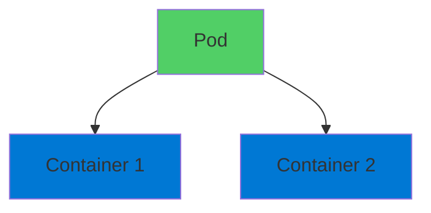
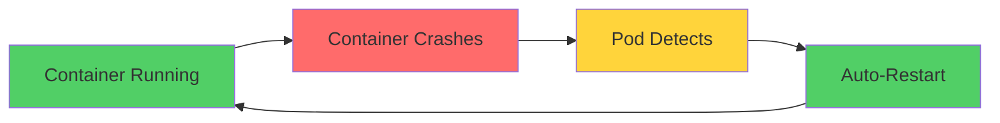
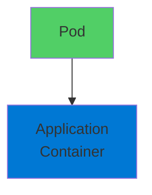
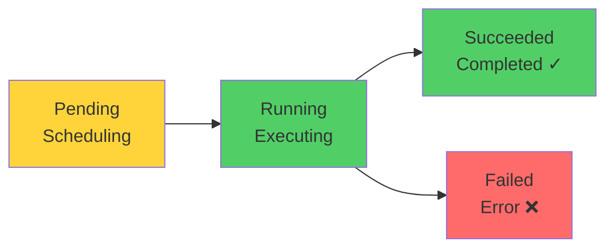
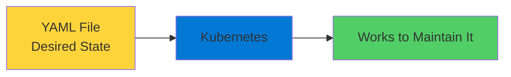

# Kubernetes Pods

The Foundation of Container Orchestration

  <carbon-container-software class="text-8xl text-blue-400 opacity-80" />

---
layout: center
---

# Welcome

<!--
METADATA:
sentence: Understanding Pods is essential for the AZ-204 exam and for working with Azure Kubernetes Service in the real world.
search_anchor: Understanding Pods is essential for
-->
<v-click>

Explore Kubernetes Pods Essential for AZ-204 and Azure Kubernetes Service

</v-click>

---
layout: section
---

# What is a Pod?

---

# Smallest Deployable Unit

<v-click>

  <carbon-container-software class="text-6xl text-green-400" />

</v-click>

<!--
METADATA:
sentence: It's not the container itself, but rather a wrapper around one or more containers.
search_anchor: It's not the container itself
-->
<v-click>

Not the container itself

</v-click>

<!--
METADATA:
sentence: It's not the container itself, but rather a wrapper around one or more containers.
search_anchor: It's not the container itself
-->
<v-click>

A wrapper around one or more containers

</v-click>

<v-click>

</v-click>

---

# Pod's Job

<!--
METADATA:
sentence: The Pod's job is pretty straightforward - it ensures your containers keep running.
search_anchor: Pod's job is pretty straightforward
-->
<v-click>

Ensure containers keep running

</v-click>

<v-click>

</v-click>

<!--
METADATA:
sentence: This is the first layer of high availability that Kubernetes provides.
search_anchor: This is the first layer
-->
<v-click>

First layer of high availability

</v-click>

---
layout: section
---

# Pod Architecture

---

# What's Inside

<!--
METADATA:
sentence: Every Pod gets its own unique IP address within the cluster network.
search_anchor: Every Pod gets its own
-->
<v-click>

  <carbon-network-3 class="text-4xl text-blue-400 mt-1" />
  

    
Unique IP Address

    
Every Pod gets own IP in cluster network

  

</v-click>

<!--
METADATA:
sentence: All containers inside that Pod share the same network namespace, which means they can communicate with each other using localhost.
search_anchor: All containers inside that Pod
-->
<v-click>

  <carbon-share class="text-4xl text-green-400 mt-1" />
  

    
Shared Network Namespace

    
All containers share same network

    
Communicate using localhost

  

</v-click>

<!--
METADATA:
sentence: Pods can also share storage volumes between containers.
search_anchor: Pods can also share storage
-->
<v-click>

  <carbon-data-storage class="text-4xl text-purple-400 mt-1" />
  

    
Shared Storage Volumes

    
Containers can access same data

  

</v-click>

---
layout: section
---

# Single vs Multi-Container Pods

---

# Most Common: Single Container

<v-click>

</v-click>

<!--
METADATA:
sentence: You should also understand how Pods communicate within a cluster.
search_anchor: You should also understand how
-->
<v-click>

Simplest and most common pattern

</v-click>

---

# Multi-Container Patterns

<!--
METADATA:
sentence: Common patterns include sidecar containers for logging or monitoring, adapter containers that standardize output, and ambassador containers that proxy connections.
search_anchor: Common patterns include sidecar containers
-->
<v-click>

  <carbon-document-tasks class="text-4xl text-blue-400 mt-1" />
  

    
Sidecar

    
Logging or monitoring containers

  

</v-click>

<!--
METADATA:
sentence: Common patterns include sidecar containers for logging or monitoring, adapter containers that standardize output, and ambassador containers that proxy connections.
search_anchor: Common patterns include sidecar containers
-->
<v-click>

  <carbon-settings-adjust class="text-4xl text-green-400 mt-1" />
  

    
Adapter

    
Standardize output from main container

  

</v-click>

<!--
METADATA:
sentence: Common patterns include sidecar containers for logging or monitoring, adapter containers that standardize output, and ambassador containers that proxy connections.
search_anchor: Common patterns include sidecar containers
-->
<v-click>

  <carbon-network-3 class="text-4xl text-purple-400 mt-1" />
  

    
Ambassador

    
Proxy connections

  

</v-click>

<!--
METADATA:
sentence: The key thing to remember is that containers in the same Pod are always scheduled together on the same node.
search_anchor: key thing to remember is
-->
<v-click>

Containers always scheduled together on same node

</v-click>

---
layout: section
---

# Pod Lifecycle

---

# State Transitions

<v-click>

</v-click>

<!--
METADATA:
sentence: They start in a Pending state while Kubernetes schedules them and pulls the container images.
search_anchor: They start in a Pending
-->
<v-click>

  
1

  

    
Pending

    
Kubernetes schedules, pulls images

  

</v-click>

<!--
METADATA:
sentence: Then they move to Running when at least one container is executing.
search_anchor: Then they move to Running
-->
<v-click>

  
2

  

    
Running

    
At least one container executing

  

</v-click>

<!--
METADATA:
sentence: Eventually, they'll reach a terminal state - either Succeeded if all containers completed successfully, or Failed if any container terminated with an error.
search_anchor: Eventually, they'll reach a terminal
-->
<v-click>

  
3

  

    
Terminal State

    
Succeeded (completed) or Failed (error)

  

</v-click>

---

# Understanding Lifecycle

<!--
METADATA:
sentence: Understanding this lifecycle is crucial for troubleshooting.
search_anchor: Understanding this lifecycle is crucial
-->
<v-click>

Crucial for troubleshooting

</v-click>

<!--
METADATA:
sentence: Understanding this lifecycle is crucial for troubleshooting.
search_anchor: Understanding this lifecycle is crucial
-->
<v-click>

  

    <carbon-view class="text-6xl text-blue-400" />
    
Check Status

  

  

    <carbon-debug class="text-6xl text-green-400" />
    
Debug Issues

  

  

    <carbon-data-view-alt class="text-6xl text-purple-400" />
    
Monitor Health

  

</v-click>

---
layout: section
---

# Working with Pods

---

# kubectl Commands

<!--
METADATA:
sentence: Common operations include deploying Pods from YAML files, checking their status, viewing logs, and even executing commands inside running containers.
search_anchor: Common operations include deploying Pods
-->
<v-click>

  <carbon-deployment-pattern class="text-4xl text-blue-400" />
  Deploy Pods from YAML files

</v-click>

<!--
METADATA:
sentence: Think of a Pod as the smallest deployable unit in Kubernetes.
search_anchor: Think of a Pod as
-->
<v-click>

  <carbon-view class="text-4xl text-green-400" />
  Check Pod status

</v-click>

<v-click>

  <carbon-document class="text-4xl text-purple-400" />
  View logs

</v-click>

<!--
METADATA:
sentence: Pods can also share storage volumes between containers.
search_anchor: Pods can also share storage
-->
<v-click>

  <carbon-terminal class="text-4xl text-orange-400" />
  Execute commands inside containers

</v-click>

---

# Declarative Approach

<!--
METADATA:
sentence: You describe the desired state, and Kubernetes works to maintain it.
search_anchor: You describe the desired state
-->
<v-click>

Describe desired state in YAML

</v-click>

<v-click>

</v-click>

<!--
METADATA:
sentence: The declarative approach using YAML is what makes Kubernetes powerful.
search_anchor: declarative approach using YAML is
-->
<v-click>

What makes Kubernetes powerful

</v-click>

---
layout: section
---

# AZ-204 Exam Relevance

---

# What You Need to Know

<!--
METADATA:
sentence: Ready to see Pods in action?
search_anchor: Ready to see Pods in
-->
<v-click>

  <carbon-add class="text-4xl text-blue-400" />
  Create and configure Pods

</v-click>

<!--
METADATA:
sentence: Understanding this lifecycle is crucial for troubleshooting.
search_anchor: Understanding this lifecycle is crucial
-->
<v-click>

  <carbon-flow class="text-4xl text-green-400" />
  Understand Pod lifecycle

</v-click>

<!--
METADATA:
sentence: --- SLIDE 2: What is a Pod?
search_anchor: --- SLIDE 2: What is
-->
<v-click>

  <carbon-container-software class="text-4xl text-purple-400" />
  Multi-container Pod patterns

</v-click>

<!--
METADATA:
sentence: --- SLIDE 2: What is a Pod?
search_anchor: --- SLIDE 2: What is
-->
<v-click>

  <carbon-debug class="text-4xl text-orange-400" />
  Troubleshoot Pod issues

</v-click>

<!--
METADATA:
sentence: You should also understand how Pods communicate within a cluster.
search_anchor: You should also understand how
-->
<v-click>

  <carbon-network-3 class="text-4xl text-red-400" />
  Pod communication within cluster

</v-click>

---

# Foundation Knowledge

<!--
METADATA:
sentence: Ready to see Pods in action?
search_anchor: Ready to see Pods in
-->
<v-click>

Pods form the foundation

</v-click>

<!--
METADATA:
sentence: This knowledge forms the foundation for more advanced topics like Deployments, Services, and StatefulSets that build on top of Pods.
search_anchor: This knowledge forms the foundation
-->
<v-click>

  

    <carbon-deployment-pattern class="text-6xl text-blue-400" />
    
Deployments

  

  

    <carbon-network-3 class="text-6xl text-green-400" />
    
Services

  

  

    <carbon-data-base class="text-6xl text-purple-400" />
    
StatefulSets

  

</v-click>

<!--
METADATA:
sentence: This knowledge forms the foundation for more advanced topics like Deployments, Services, and StatefulSets that build on top of Pods.
search_anchor: This knowledge forms the foundation
-->
<v-click>

Advanced topics build on top of Pods

</v-click>

---
layout: section
---

# What's Next

---

# Hands-On Exercises

<!--
METADATA:
sentence: Ready to see Pods in action?
search_anchor: Ready to see Pods in
-->
<v-click>

  <carbon-deployment-pattern class="text-4xl text-blue-400" />
  Deploy first Pods

</v-click>

<!--
METADATA:
sentence: --- [End of intro video]
search_anchor: --- [End of intro video]
-->
<v-click>

  <carbon-explore class="text-4xl text-green-400" />
  Explore from inside

</v-click>

<!--
METADATA:
sentence: You should also understand how Pods communicate within a cluster.
search_anchor: You should also understand how
-->
<v-click>

  <carbon-network-3 class="text-4xl text-purple-400" />
  See how Pods communicate

</v-click>

<!--
METADATA:
sentence: Today we're diving into one of the most fundamental concepts in Kubernetes - Pods.
search_anchor: Today we're diving into one
-->
<v-click>

  <carbon-container-software class="text-4xl text-orange-400" />
  Work with multi-container Pods

</v-click>

<!--
METADATA:
sentence: Ready to see Pods in action?
search_anchor: Ready to see Pods in
-->
<v-click>

See Pods in action!

</v-click>

---
layout: center
class: text-center
---

<v-click>

<carbon-play-outline class="text-8xl text-green-400 inline-block" />

</v-click>

<!--
METADATA:
sentence: Ready to see Pods in action?
search_anchor: Ready to see Pods in
-->
<v-click>

Ready to Go!

</v-click>

<!--
METADATA:
sentence: Today we're diving into one of the most fundamental concepts in Kubernetes - Pods.
search_anchor: Today we're diving into one
-->
<v-click>

Build a solid foundation with Kubernetes Pods

</v-click>

