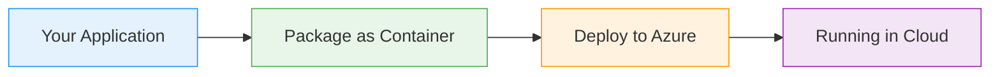

# Kubernetes Secrets

  <iconify-icon icon="logos:kubernetes" style="font-size: 4rem;" />

---

---
layout: center
---

# Kubernetes Secrets - Introduction Script

**Duration:** 2-3 minutes
**Format:** Presentation with slides
**Tone:** Professional, educational, conversational

---

---
layout: center
---

# Slide 1: Title Slide

**[On screen: "Kubernetes Secrets: Secure Configuration Management"]**

---

---
layout: center
---

# Slide 2: The Problem with ConfigMaps

**[On screen: ConfigMap icon with warning symbol]**

---

---
layout: center
---

# Slide 3: What Are Kubernetes Secrets?

**[On screen: Secret object diagram with lock icon]**...

---

---
layout: center
---

# Slide 4: Secret Types

**[On screen: Three boxes showing different secret types]**

---

---
layout: center
---

# Slide 5: Security Considerations

**[On screen: Checklist of security best practices]**

---

---
layout: center
---

# Slide 6: AZ-204 Relevance

**[On screen: AZ-204 exam objectives highlighted]**

---

---
layout: center
---

# Slide 7: What We'll Cover

<iconify-icon icon="mdi:check-circle" class="text-blue-500" /> 64 encoding and decoding. And we'll look at how to structure your deployments to separate secret management from application deployment.

<iconify-icon icon="mdi:check-circle" class="text-blue-500" /> --

---

---
layout: center
---

# Slide 8: Let's Get Started

**[On screen: "Ready to Practice?" with action button]**

