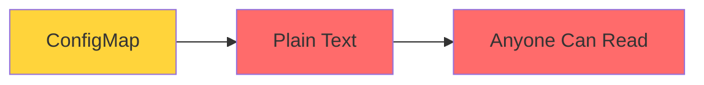

# Kubernetes Secrets

Secure Configuration Management

  <carbon-locked class="text-8xl text-blue-400 opacity-80" />

---
layout: center
---

# Welcome

<!--
METADATA:
sentence: We'll explore how secrets appear inside containers.
search_anchor: We'll explore how secrets appear
-->
<v-click>

Explore Kubernetes Secrets Essential for secure application configuration

</v-click>

---
layout: section
---

# The Problem with ConfigMaps

---

# Plain Text Limitation

<v-click>

  <carbon-warning class="text-6xl text-red-400" />

</v-click>

<!--
METADATA:
sentence: ConfigMaps are fantastic for general settings, but there's a major limitation: they store everything in plain text.
search_anchor: ConfigMaps are fantastic for general
-->
<v-click>

ConfigMaps store everything in plain text

</v-click>

<!--
METADATA:
sentence: Anyone with access to your cluster can read those values.
search_anchor: Anyone with access to your
-->
<v-click>

Anyone with cluster access can read values

</v-click>

<!--
METADATA:
sentence: So what happens when you need to store passwords, API keys, or connection strings?
search_anchor: So what happens when you
-->
<v-click>

What about passwords, API keys, connection strings?

</v-click>

<v-click>

</v-click>

---
layout: section
---

# What Are Kubernetes Secrets?

---

# Designed for Sensitive Data

<v-click>

  <carbon-locked class="text-6xl text-green-400" />

</v-click>

<!--
METADATA:
sentence: [On screen: Secret object diagram with lock icon] Kubernetes Secrets are designed specifically for sensitive data.
search_anchor: [On screen: Secret object diagram
-->
<v-click>

Specifically for sensitive information

</v-click>

<!--
METADATA:
sentence: They use the same familiar API as ConfigMaps, so you can inject them as environment variables or mount them as files.
search_anchor: They use the same familiar
-->
<v-click>

  <carbon-checkmark class="text-4xl text-green-400" />
  Same familiar API as ConfigMaps

</v-click>

<!--
METADATA:
sentence: They use the same familiar API as ConfigMaps, so you can inject them as environment variables or mount them as files.
search_anchor: They use the same familiar
-->
<v-click>

  <carbon-checkmark class="text-4xl text-green-400" />
  Inject as environment variables or mount as files

</v-click>

<!--
METADATA:
sentence: But Secrets have additional safeguards built in.
search_anchor: But Secrets have additional safeguards
-->
<v-click>

  <carbon-checkmark class="text-4xl text-green-400" />
  Additional safeguards built in

</v-click>

---

# Built-In Safeguards

<!--
METADATA:
sentence: They're base-64 encoded at rest, and depending on your cluster configuration, they can be encrypted in the Kubernetes database.
search_anchor: They're base-64 encoded at rest
-->
<v-click>

  <carbon-encryption class="text-4xl text-blue-400 mt-1" />
  

    
Base-64 Encoded

    
At rest in Kubernetes

  

</v-click>

<!--
METADATA:
sentence: They're base-64 encoded at rest, and depending on your cluster configuration, they can be encrypted in the Kubernetes database.
search_anchor: They're base-64 encoded at rest
-->
<v-click>

  <carbon-security class="text-4xl text-green-400 mt-1" />
  

    
Encryption Available

    
Can be encrypted in Kubernetes database

    
Depending on cluster configuration

  

</v-click>

<!--
METADATA:
sentence: Anyone with access to your cluster can read those values.
search_anchor: Anyone with access to your
-->
<v-click>

  <carbon-user-access class="text-4xl text-purple-400 mt-1" />
  

    
Access Controls

    
RBAC integration

  

</v-click>

---
layout: section
---

# Secret Types

---

# Three Ways to Create

<!--
METADATA:
sentence: You can encode values in base-64 and define them directly in YAML.
search_anchor: You can encode values in
-->
<v-click>

  
1

  

    <carbon-code class="text-3xl inline-block" />
    Base-64 in YAML
    
Encode values and define in YAML

  

</v-click>

<!--
METADATA:
sentence: You can use plain text in your YAML files when they're properly secured.
search_anchor: You can use plain text
-->
<v-click>

  
2

  

    <carbon-document-blank class="text-3xl inline-block" />
    Plain Text in YAML
    
When files are properly secured

  

</v-click>

<!--
METADATA:
sentence: So where does real security come from?
search_anchor: So where does real security
-->
<v-click>

  
3

  

    <carbon-folder class="text-3xl inline-block" />
    From Files
    
Separate security teams from dev teams

  

</v-click>

<!--
METADATA:
sentence: Each approach has its use cases, and we'll explore all of them in the hands-on exercises.
search_anchor: Each approach has its use
-->
<v-click>

Each approach has its use cases

</v-click>

---
layout: section
---

# Security Considerations

---

# Important Truth

<!--
METADATA:
sentence: We'll work with base-64 encoding and decoding.
search_anchor: We'll work with base-64 encoding
-->
<v-click>

Base-64 encoding is NOT encryption

</v-click>

<!--
METADATA:
sentence: It's trivially easy to decode.
search_anchor: It's trivially easy to decode
-->
<v-click>

Trivially easy to decode

</v-click>

<!--
METADATA:
sentence: So where does real security come from?
search_anchor: So where does real security
-->
<v-click>

So where does real security come from?

</v-click>

---

# Real Security Sources

<!--
METADATA:
sentence: Anyone with access to your cluster can read those values.
search_anchor: Anyone with access to your
-->
<v-click>

  <carbon-user-access class="text-4xl text-blue-400 mt-1" />
  

    
Access Controls

    
RBAC limiting who can read secrets

  

</v-click>

<!--
METADATA:
sentence: That's where Secrets come in.
search_anchor: That's where Secrets come in
-->
<v-click>

  <carbon-encryption class="text-4xl text-green-400 mt-1" />
  

    
Encryption at Rest

    
Encrypt secrets in cluster database

  

</v-click>

<!--
METADATA:
sentence: This includes creating and managing secrets, integrating with Azure Key Vault, and following security best practices.
search_anchor: This includes creating and managing
-->
<v-click>

  <carbon-cloud-services class="text-4xl text-purple-400 mt-1" />
  

    
External Secret Management

    
Integrate with Azure Key Vault

    
Pull secrets at runtime

  

</v-click>

---

# Production Best Practice

<!--
METADATA:
sentence: It comes from access controls, from encrypting secrets at rest in your cluster, and increasingly, from integrating with dedicated secret management systems like Azure Key Vault.
search_anchor: It comes from access controls
-->
<v-click>

Use dedicated secret management systems

</v-click>

<!--
METADATA:
sentence: In production environments, you'll want to use solutions like the Secrets Store CSI driver or external secrets operators to pull secrets from Azure Key Vault at runtime.
search_anchor: production environments, you'll want to
-->
<v-click>

  

    <carbon-locked class="text-6xl text-blue-400" />
    
Secrets Store CSI driver

  

  

    <carbon-network-overlay class="text-6xl text-green-400" />
    
External Secrets Operator

  

</v-click>

<!--
METADATA:
sentence: This includes creating and managing secrets, integrating with Azure Key Vault, and following security best practices.
search_anchor: This includes creating and managing
-->
<v-click>

Integrate with Azure Key Vault at runtime

</v-click>

---
layout: section
---

# AZ-204 Exam Relevance

---

# Key Exam Topics

<!--
METADATA:
sentence: That's where Secrets come in.
search_anchor: That's where Secrets come in
-->
<v-click>

  <carbon-settings class="text-4xl text-blue-400" />
  Configure secure application settings in AKS

</v-click>

<!--
METADATA:
sentence: That's where Secrets come in.
search_anchor: That's where Secrets come in
-->
<v-click>

  <carbon-locked class="text-4xl text-green-400" />
  Create and manage secrets

</v-click>

<!--
METADATA:
sentence: This includes creating and managing secrets, integrating with Azure Key Vault, and following security best practices.
search_anchor: This includes creating and managing
-->
<v-click>

  <carbon-cloud-services class="text-4xl text-purple-400" />
  Integrate with Azure Key Vault

</v-click>

<!--
METADATA:
sentence: This includes creating and managing secrets, integrating with Azure Key Vault, and following security best practices.
search_anchor: This includes creating and managing
-->
<v-click>

  <carbon-security class="text-4xl text-orange-400" />
  Follow security best practices

</v-click>

---

# Critical Knowledge

<!--
METADATA:
sentence: You can encode values in base-64 and define them directly in YAML.
search_anchor: You can encode values in
-->
<v-click>

Understand the difference

</v-click>

<!--
METADATA:
sentence: That's where Secrets come in.
search_anchor: That's where Secrets come in
-->
<v-click>

  

    <carbon-settings class="text-6xl text-blue-400" />
    
ConfigMaps

    
General config

  

  

    <carbon-locked class="text-6xl text-green-400" />
    
Secrets

    
Sensitive data

  

</v-click>

<!--
METADATA:
sentence: You'll also need to know how secrets differ from ConfigMaps and when to use each.
search_anchor: You'll also need to know
-->
<v-click>

Know when to use each

</v-click>

---
layout: section
---

# What We'll Cover

---

# Lab Objectives

<!--
METADATA:
sentence: --- Slide 7: What We'll Cover [On screen: Agenda with checkboxes] In the exercises ahead, we'll create secrets using different methods.
search_anchor: --- Slide 7: What We'll
-->
<v-click>

  <carbon-add class="text-4xl text-blue-400" />
  Create secrets using different methods

</v-click>

<!--
METADATA:
sentence: We'll explore how secrets appear inside containers.
search_anchor: We'll explore how secrets appear
-->
<v-click>

  <carbon-explore class="text-4xl text-green-400" />
  Explore how secrets appear inside containers

</v-click>

<!--
METADATA:
sentence: We'll work with base-64 encoding and decoding.
search_anchor: We'll work with base-64 encoding
-->
<v-click>

  <carbon-encryption class="text-4xl text-purple-400" />
  Work with base-64 encoding and decoding

</v-click>

<!--
METADATA:
sentence: And we'll look at how to structure your deployments to separate secret management from application deployment.
search_anchor: we'll look at how to
-->
<v-click>

  <carbon-document-tasks class="text-4xl text-orange-400" />
  Structure deployments to separate concerns

</v-click>

<!--
METADATA:
sentence: The hands-on labs will give you the practical experience you need to confidently answer questions about secret management on the exam.
search_anchor: hands-on labs will give you
-->
<v-click>

Practical experience for exam confidence

</v-click>

---
layout: center
class: text-center
---

<v-click>

<carbon-play-outline class="text-8xl text-green-400 inline-block" />

</v-click>

<!--
METADATA:
sentence: Get your terminal ready, and let's start securing some configuration data!
search_anchor: Get your terminal ready, and
-->
<v-click>

Let's Get Started!

</v-click>

<!--
METADATA:
sentence: Get your terminal ready, and let's start securing some configuration data!
search_anchor: Get your terminal ready, and
-->
<v-click>

Secure your configuration data

</v-click>

