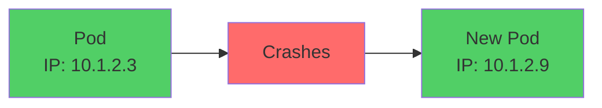
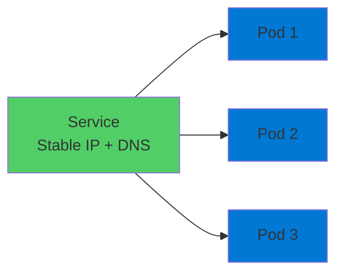
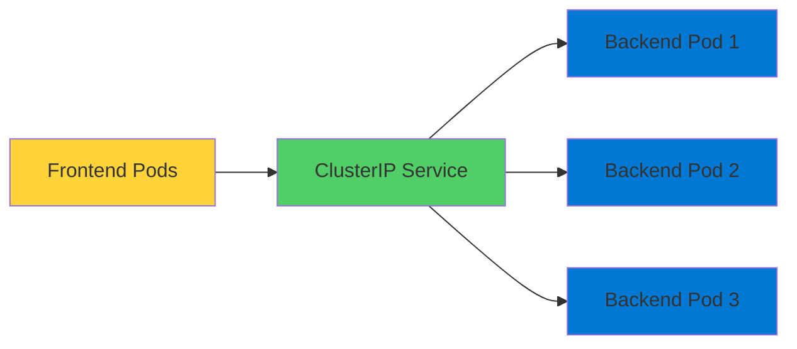
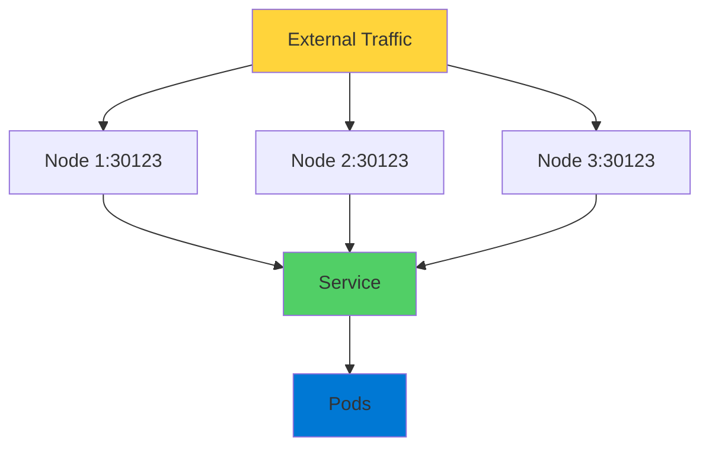
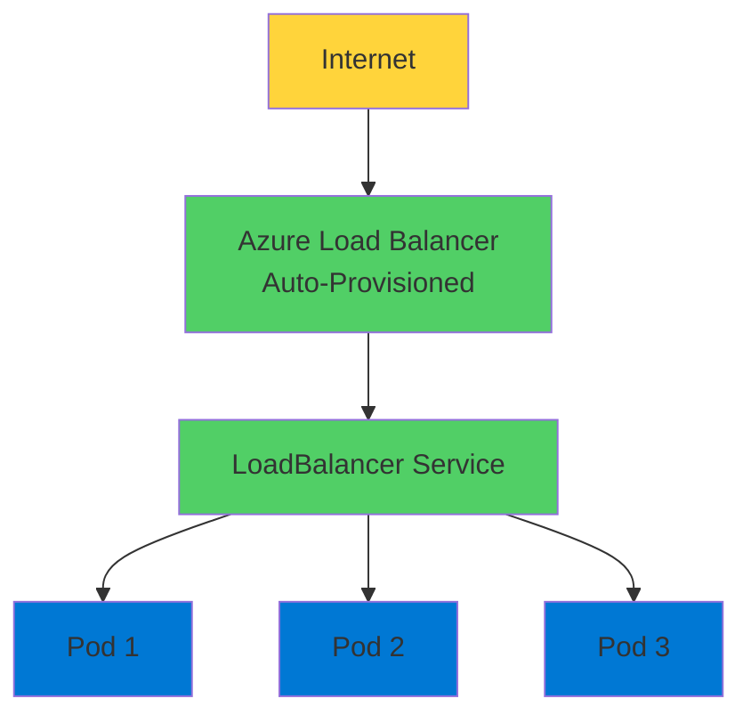
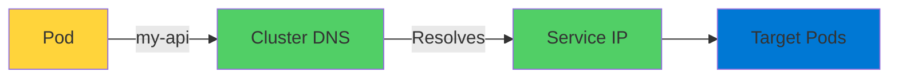

# Kubernetes Services

Networking Made Simple

  <carbon-network-3 class="text-8xl text-blue-400 opacity-80" />

---
layout: center
---

# Welcome

<!--
METADATA:
sentence: Let's explore how Kubernetes handles networking and service discovery.
search_anchor: Let's explore how Kubernetes handles
-->
<v-click>

Explore Kubernetes Services Essential for networking and service discovery

</v-click>

---
layout: section
---

# The Problem - Pod IP Addresses

---

# Dynamic Addresses Challenge

<v-click>

  <carbon-warning class="text-6xl text-red-400" />

</v-click>

<!--
METADATA:
sentence: That IP address only exists for the lifetime of the Pod.
search_anchor: That IP address only exists
-->
<v-click>

Every Pod gets its own IP address

</v-click>

<!--
METADATA:
sentence: First up is ClusterIP, which is the default type.
search_anchor: First up is ClusterIP, which
-->
<v-click>

Sounds great, right?

</v-click>

<!--
METADATA:
sentence: That IP address only exists for the lifetime of the Pod.
search_anchor: That IP address only exists
-->
<v-click>

But... IP only exists for Pod lifetime

</v-click>

<v-click>

</v-click>

---

# Constantly Changing

<!--
METADATA:
sentence: When a Pod crashes and gets replaced, or when you scale your application, those IP addresses change.
search_anchor: When a Pod crashes and
-->
<v-click>

Pod crashes and gets replaced

</v-click>

<!--
METADATA:
sentence: When a Pod crashes and gets replaced, or when you scale your application, those IP addresses change.
search_anchor: When a Pod crashes and
-->
<v-click>

Application scales up or down

</v-click>

<!--
METADATA:
sentence: When a Pod crashes and gets replaced, or when you scale your application, those IP addresses change.
search_anchor: When a Pod crashes and
-->
<v-click>

IP addresses change

</v-click>

<!--
METADATA:
sentence: So how do other parts of your application reliably communicate with these constantly changing Pods?
search_anchor: So how do other parts
-->
<v-click>

How do other parts reliably communicate?

</v-click>

---
layout: section
---

# What is a Kubernetes Service?

---

# Networking Abstraction

<v-click>

  <carbon-network-3 class="text-6xl text-green-400" />

</v-click>

<!--
METADATA:
sentence: That IP address only exists for the lifetime of the Pod.
search_anchor: That IP address only exists
-->
<v-click>

Stable IP address and DNS name

</v-click>

<!--
METADATA:
sentence: This means your Pods can communicate using friendly DNS names instead of IP addresses.
search_anchor: This means your Pods can
-->
<v-click>

For accessing a group of Pods

</v-click>

<v-click>

</v-click>

---

# Load Balancer with Service Discovery

<!--
METADATA:
sentence: Think of it as a load balancer with built-in service discovery.
search_anchor: Think of it as a
-->
<v-click>

  

    <carbon-network-overlay class="text-6xl text-blue-400" />
    
Load Balancing

  

  

    <carbon-search class="text-6xl text-green-400" />
    
Service Discovery

  

</v-click>

<!--
METADATA:
sentence: Services use label selectors to find their target Pods.
search_anchor: Services use label selectors to
-->
<v-click>

Uses label selectors to find target Pods

</v-click>

<!--
METADATA:
sentence: Alright, let's get building!
search_anchor: Alright, let's get building
-->
<v-click>

Loose coupling

</v-click>

<!--
METADATA:
sentence: This loose coupling means you can replace, scale, or update Pods without breaking connectivity.
search_anchor: This loose coupling means you
-->
<v-click>

Replace, scale, or update Pods without breaking connectivity

</v-click>

---
layout: section
---

# Service Type - ClusterIP

---

# Internal Communication

<v-click>

  <carbon-network-3 class="text-6xl text-blue-400" />

</v-click>

<!--
METADATA:
sentence: First up is ClusterIP, which is the default type.
search_anchor: First up is ClusterIP, which
-->
<v-click>

ClusterIP: Default service type

</v-click>

<!--
METADATA:
sentence: ClusterIP Services get an IP address that's only accessible within the cluster.
search_anchor: ClusterIP Services get an IP
-->
<v-click>

IP address only accessible within cluster

</v-click>

<v-click>

</v-click>

---

# Perfect for Microservices

<!--
METADATA:
sentence: For example, your frontend Pods can reliably communicate with your backend API using a ClusterIP Service, regardless of how many backend Pods are running or when they get replaced.
search_anchor: example, your frontend Pods can
-->
<v-click>

Frontend communicates with backend API

</v-click>

<!--
METADATA:
sentence: For example, your frontend Pods can reliably communicate with your backend API using a ClusterIP Service, regardless of how many backend Pods are running or when they get replaced.
search_anchor: example, your frontend Pods can
-->
<v-click>

Regardless of how many backend Pods

</v-click>

<!--
METADATA:
sentence: Alright, let's get building!
search_anchor: Alright, let's get building
-->
<v-click>

Or when they get replaced

</v-click>

<!--
METADATA:
sentence: Alright, let's get building!
search_anchor: Alright, let's get building
-->
<v-click>

  

    <carbon-checkmark-outline class="text-6xl text-green-400" />
    
Reliable

  

  

    <carbon-renew class="text-6xl text-blue-400" />
    
Resilient

  

</v-click>

---
layout: section
---

# Service Type - NodePort

---

# Static Port on Nodes

<v-click>

  <carbon-server class="text-6xl text-purple-400" />

</v-click>

<!--
METADATA:
sentence: This Service type exposes your application on a static port on each node in your cluster, typically in the range 30000 to 32767.
search_anchor: This Service type exposes your
-->
<v-click>

Exposes application on static port on each node

</v-click>

<!--
METADATA:
sentence: This Service type exposes your application on a static port on each node in your cluster, typically in the range 30000 to 32767.
search_anchor: This Service type exposes your
-->
<v-click>

Typically port range 30000-32767

</v-click>

<v-click>

</v-click>

---

# Use Cases

<!--
METADATA:
sentence: Alright, let's get building!
search_anchor: Alright, let's get building
-->
<v-click>

  

    <carbon-development class="text-6xl text-blue-400" />
    
Development

  

  

    <carbon-test-tool class="text-6xl text-green-400" />
    
Testing

  

</v-click>

<!--
METADATA:
sentence: NodePort is useful for development and testing, or when you need direct access to your cluster without a cloud load balancer.
search_anchor: NodePort is useful for development
-->
<v-click>

Direct access without cloud load balancer

</v-click>

<!--
METADATA:
sentence: Any traffic hitting any node's IP address on that specific port gets routed to your Pods.
search_anchor: Any traffic hitting any node's
-->
<v-click>

Traffic to any node routes to Pods

</v-click>

---
layout: section
---

# Service Type - LoadBalancer

---

# Production External Access

<v-click>

  <carbon-cloud-services class="text-6xl text-green-400" />

</v-click>

<!--
METADATA:
sentence: When you create a LoadBalancer Service on AKS, Azure automatically provisions an Azure Load Balancer for you.
search_anchor: When you create a LoadBalancer
-->
<v-click>

What you'll typically use in production on AKS

</v-click>

<v-click>

</v-click>

---

# Azure Integration

<!--
METADATA:
sentence: When you create a LoadBalancer Service on AKS, Azure automatically provisions an Azure Load Balancer for you.
search_anchor: When you create a LoadBalancer
-->
<v-click>

Azure automatically provisions Azure Load Balancer

</v-click>

<!--
METADATA:
sentence: This gives you a public IP address that distributes traffic across your Pods.
search_anchor: This gives you a public
-->
<v-click>

Public IP address

</v-click>

<!--
METADATA:
sentence: This gives you a public IP address that distributes traffic across your Pods.
search_anchor: This gives you a public
-->
<v-click>

Distributes traffic across your Pods

</v-click>

<!--
METADATA:
sentence: It's the most straightforward way to expose applications to the internet on managed Kubernetes platforms.
search_anchor: It's the most straightforward way
-->
<v-click>

Most straightforward way to expose to internet

</v-click>

---
layout: section
---

# Service Discovery with DNS

---

# Automatic DNS Entries

<v-click>

  <carbon-earth class="text-6xl text-blue-400" />

</v-click>

<!--
METADATA:
sentence: Every Service automatically gets a DNS entry in the cluster's internal DNS server.
search_anchor: Every Service automatically gets a
-->
<v-click>

Every Service gets DNS entry automatically

</v-click>

<!--
METADATA:
sentence: Every Service automatically gets a DNS entry in the cluster's internal DNS server.
search_anchor: Every Service automatically gets a
-->
<v-click>

In cluster's internal DNS server

</v-click>

<v-click>

</v-click>

---

# Friendly Names

<!--
METADATA:
sentence: This means your Pods can communicate using friendly DNS names instead of IP addresses.
search_anchor: This means your Pods can
-->
<v-click>

Communicate using DNS names, not IP addresses

</v-click>

<!--
METADATA:
sentence: When you create a Service named "my-api," any Pod in the same namespace can reach it using that name.
search_anchor: When you create a Service
-->
<v-click>

Service named "my-api"

</v-click>

<!--
METADATA:
sentence: When you create a Service named "my-api," any Pod in the same namespace can reach it using that name.
search_anchor: When you create a Service
-->
<v-click>

Any Pod in same namespace can reach it using that name

</v-click>

<!--
METADATA:
sentence: Kubernetes handles all the DNS resolution and routing behind the scenes.
search_anchor: Kubernetes handles all the DNS
-->
<v-click>

Kubernetes handles all DNS resolution and routing

</v-click>

<!--
METADATA:
sentence: Alright, let's get building!
search_anchor: Alright, let's get building
-->
<v-click>

  

    <carbon-checkmark-outline class="text-6xl text-green-400" />
    
Simple

  

  

    <carbon-rocket class="text-6xl text-blue-400" />
    
Powerful

  

</v-click>

---
layout: section
---

# AZ-204 Exam Relevance

---

# Key Exam Topics

<!--
METADATA:
sentence: Let's explore how Kubernetes handles networking and service discovery.
search_anchor: Let's explore how Kubernetes handles
-->
<v-click>

  <carbon-network-3 class="text-4xl text-blue-400" />
  Configure networking for containerized apps in AKS

</v-click>

<!--
METADATA:
sentence: This is perfect for internal communication between microservices.
search_anchor: This is perfect for internal
-->
<v-click>

  <carbon-decision-tree class="text-4xl text-green-400" />
  Differences between Service types

</v-click>

<!--
METADATA:
sentence: Think of it as a load balancer with built-in service discovery.
search_anchor: Think of it as a
-->
<v-click>

  <carbon-earth class="text-4xl text-purple-400" />
  Service discovery with DNS

</v-click>

<!--
METADATA:
sentence: Think of it as a load balancer with built-in service discovery.
search_anchor: Think of it as a
-->
<v-click>

  <carbon-cloud-services class="text-4xl text-orange-400" />
  Integration with Azure Load Balancer

</v-click>

<!--
METADATA:
sentence: Services use label selectors to find their target Pods.
search_anchor: Services use label selectors to
-->
<v-click>

  <carbon-tag class="text-4xl text-red-400" />
  Label selectors and traffic routing

</v-click>

---

# Exam Scenarios

<!--
METADATA:
sentence: Every Service automatically gets a DNS entry in the cluster's internal DNS server.
search_anchor: Every Service automatically gets a
-->
<v-click>

Frequently appear in exam questions about

</v-click>

<!--
METADATA:
sentence: Today we're diving into one of the most essential concepts in Kubernetes: Services.
search_anchor: Today we're diving into one
-->
<v-click>

  

    <carbon-deployment-pattern class="text-6xl text-blue-400" />
    
Deploying

  

  

    <carbon-settings-adjust class="text-6xl text-green-400" />
    
Managing

  

  

    <carbon-container-software class="text-6xl text-purple-400" />
    
Containerized Solutions

  

</v-click>

---
layout: section
---

# What's Next

---

# Hands-On Lab

<!--
METADATA:
sentence: --- SLIDE 3: What is a Kubernetes Service?
search_anchor: --- SLIDE 3: What is
-->
<v-click>

  <carbon-add class="text-4xl text-blue-400" />
  Create all three Service types

</v-click>

<!--
METADATA:
sentence: Kubernetes handles all the DNS resolution and routing behind the scenes.
search_anchor: Kubernetes handles all the DNS
-->
<v-click>

  <carbon-earth class="text-4xl text-green-400" />
  Explore DNS resolution

</v-click>

<!--
METADATA:
sentence: In our lab exercises, we'll create all three types of Services, explore DNS resolution, and see how traffic routing works in real-time.
search_anchor: our lab exercises, we'll create
-->
<v-click>

  <carbon-network-overlay class="text-4xl text-purple-400" />
  See traffic routing in real-time

</v-click>

<!--
METADATA:
sentence: You'll deploy Pods, create Services with different configurations, and test scenarios like Pod failures and scaling.
search_anchor: You'll deploy Pods, create Services
-->
<v-click>

  <carbon-warning class="text-4xl text-orange-400" />
  Test scenarios: Pod failures and scaling

</v-click>

<!--
METADATA:
sentence: This practical experience will solidify your understanding and prepare you for real-world scenarios.
search_anchor: This practical experience will solidify
-->
<v-click>

Practical experience for real-world scenarios

</v-click>

---

# Summary

<!--
METADATA:
sentence: --- SLIDE 10: Summary [On screen: Key takeaways bullet points] Quick recap: Kubernetes Services provide stable networking endpoints for dynamic Pods.
search_anchor: --- SLIDE 10: Summary [On
-->
<v-click>

Services provide stable networking endpoints

</v-click>

<!--
METADATA:
sentence: ClusterIP for internal communication, NodePort for direct access, and LoadBalancer for production external access.
search_anchor: ClusterIP for internal communication, NodePort
-->
<v-click>

  

    <carbon-network-3 class="text-5xl text-blue-400" />
    
ClusterIP

    
Internal

  

  

    <carbon-server class="text-5xl text-purple-400" />
    
NodePort

    
Direct access

  

  

    <carbon-cloud-services class="text-5xl text-green-400" />
    
LoadBalancer

    
Production

  

</v-click>

<!--
METADATA:
sentence: Service discovery happens automatically through DNS, making your applications resilient and scalable.
search_anchor: Service discovery happens automatically through
-->
<v-click>

Automatic service discovery through DNS

</v-click>

<!--
METADATA:
sentence: Service discovery happens automatically through DNS, making your applications resilient and scalable.
search_anchor: Service discovery happens automatically through
-->
<v-click>

Resilient and scalable applications

</v-click>

---
layout: center
class: text-center
---

<v-click>

<carbon-play-outline class="text-8xl text-green-400 inline-block" />

</v-click>

<!--
METADATA:
sentence: Alright, let's get building!
search_anchor: Alright, let's get building
-->
<v-click>

Let's Get Building!

</v-click>

<!--
METADATA:
sentence: Let's explore how Kubernetes handles networking and service discovery.
search_anchor: Let's explore how Kubernetes handles
-->
<v-click>

Master Kubernetes networking

</v-click>

