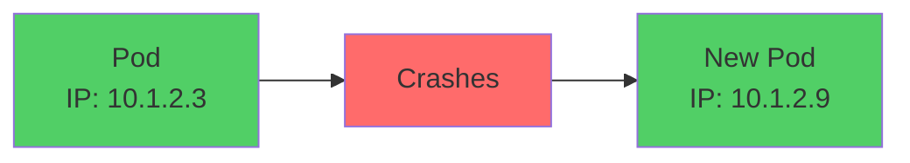
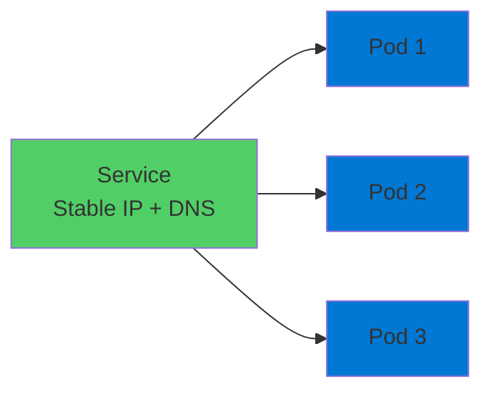
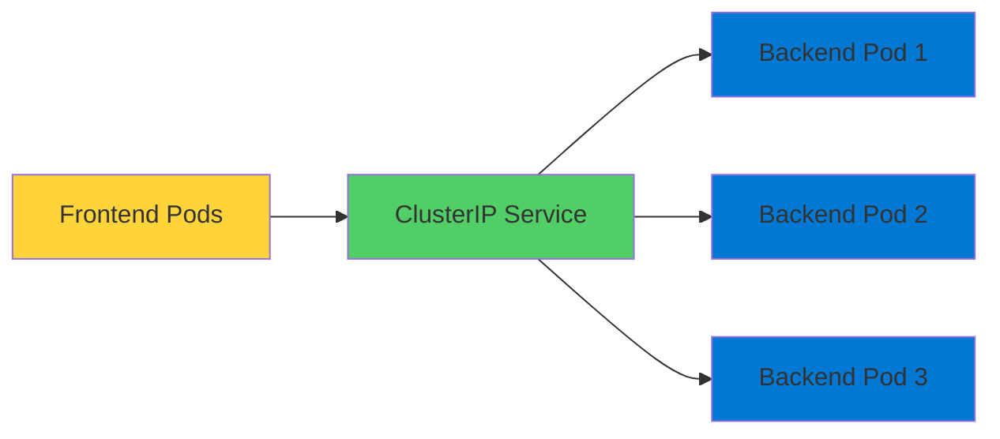
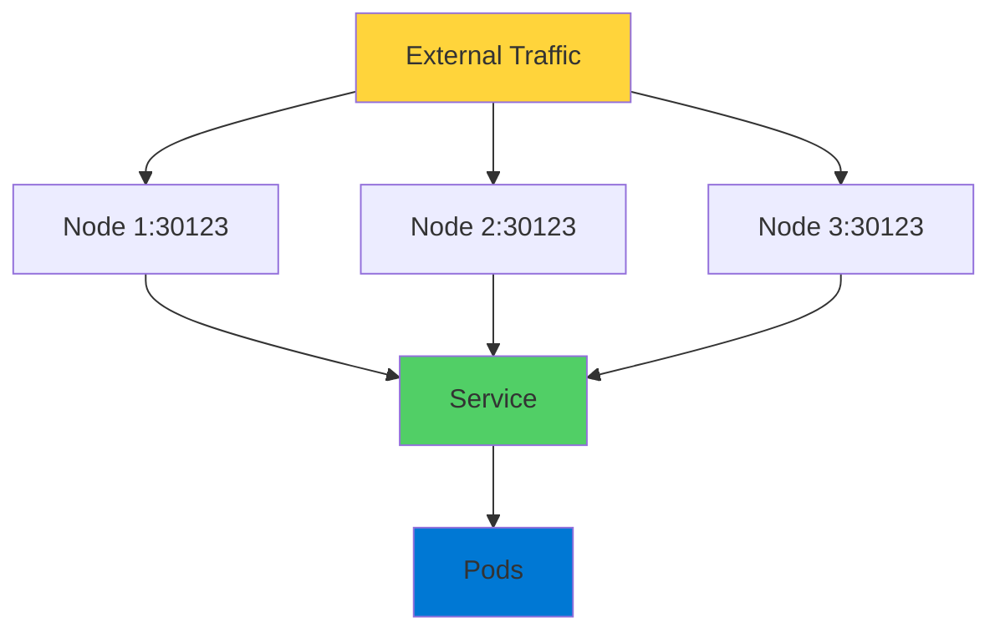
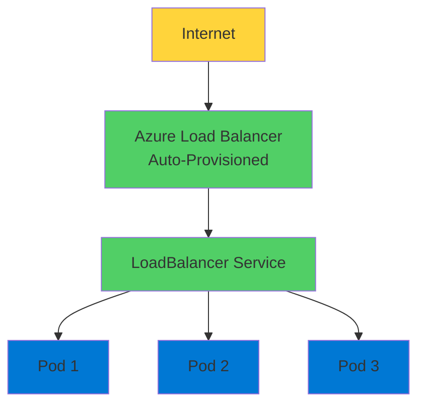
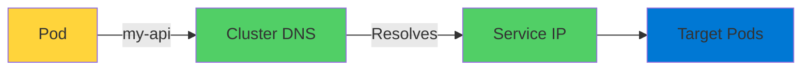

# Kubernetes Services

Networking Made Simple

  <carbon-network-3 class="text-8xl text-blue-400 opacity-80" />

---
layout: center
---

# Welcome

<v-click>

Explore Kubernetes Services Essential for networking and service discovery

</v-click>

---
layout: section
---

# The Problem - Pod IP Addresses

---

# Dynamic Addresses Challenge

<v-click>

  <carbon-warning class="text-6xl text-red-400" />

</v-click>

<v-click>

Every Pod gets its own IP address

</v-click>

<v-click>

Sounds great, right?

</v-click>

<v-click>

But... IP only exists for Pod lifetime

</v-click>

<v-click>

</v-click>

---

# Constantly Changing

<v-click>

Pod crashes and gets replaced

</v-click>

<v-click>

Application scales up or down

</v-click>

<v-click>

IP addresses change

</v-click>

<v-click>

How do other parts reliably communicate?

</v-click>

---
layout: section
---

# What is a Kubernetes Service?

---

# Networking Abstraction

<v-click>

  <carbon-network-3 class="text-6xl text-green-400" />

</v-click>

<v-click>

Stable IP address and DNS name

</v-click>

<v-click>

For accessing a group of Pods

</v-click>

<v-click>

</v-click>

---

# Load Balancer with Service Discovery

<v-click>

  

    <carbon-network-overlay class="text-6xl text-blue-400" />
    
Load Balancing

  

  

    <carbon-search class="text-6xl text-green-400" />
    
Service Discovery

  

</v-click>

<v-click>

Uses label selectors to find target Pods

</v-click>

<v-click>

Loose coupling

</v-click>

<v-click>

Replace, scale, or update Pods without breaking connectivity

</v-click>

---
layout: section
---

# Service Type - ClusterIP

---

# Internal Communication

<v-click>

  <carbon-network-3 class="text-6xl text-blue-400" />

</v-click>

<v-click>

ClusterIP: Default service type

</v-click>

<v-click>

IP address only accessible within cluster

</v-click>

<v-click>

</v-click>

---

# Perfect for Microservices

<v-click>

Frontend communicates with backend API

</v-click>

<v-click>

Regardless of how many backend Pods

</v-click>

<v-click>

Or when they get replaced

</v-click>

<v-click>

  

    <carbon-checkmark-outline class="text-6xl text-green-400" />
    
Reliable

  

  

    <carbon-renew class="text-6xl text-blue-400" />
    
Resilient

  

</v-click>

---
layout: section
---

# Service Type - NodePort

---

# Static Port on Nodes

<v-click>

  <carbon-server class="text-6xl text-purple-400" />

</v-click>

<v-click>

Exposes application on static port on each node

</v-click>

<v-click>

Typically port range 30000-32767

</v-click>

<v-click>

</v-click>

---

# Use Cases

<v-click>

  

    <carbon-development class="text-6xl text-blue-400" />
    
Development

  

  

    <carbon-test-tool class="text-6xl text-green-400" />
    
Testing

  

</v-click>

<v-click>

Direct access without cloud load balancer

</v-click>

<v-click>

Traffic to any node routes to Pods

</v-click>

---
layout: section
---

# Service Type - LoadBalancer

---

# Production External Access

<v-click>

  <carbon-cloud-services class="text-6xl text-green-400" />

</v-click>

<v-click>

What you'll typically use in production on AKS

</v-click>

<v-click>

</v-click>

---

# Azure Integration

<v-click>

Azure automatically provisions Azure Load Balancer

</v-click>

<v-click>

Public IP address

</v-click>

<v-click>

Distributes traffic across your Pods

</v-click>

<v-click>

Most straightforward way to expose to internet

</v-click>

---
layout: section
---

# Service Discovery with DNS

---

# Automatic DNS Entries

<v-click>

  <carbon-earth class="text-6xl text-blue-400" />

</v-click>

<v-click>

Every Service gets DNS entry automatically

</v-click>

<v-click>

In cluster's internal DNS server

</v-click>

<v-click>

</v-click>

---

# Friendly Names

<v-click>

Communicate using DNS names, not IP addresses

</v-click>

<v-click>

Service named "my-api"

</v-click>

<v-click>

Any Pod in same namespace can reach it using that name

</v-click>

<v-click>

Kubernetes handles all DNS resolution and routing

</v-click>

<v-click>

  

    <carbon-checkmark-outline class="text-6xl text-green-400" />
    
Simple

  

  

    <carbon-rocket class="text-6xl text-blue-400" />
    
Powerful

  

</v-click>

---
layout: section
---

# AZ-204 Exam Relevance

---

# Key Exam Topics

<v-click>

  <carbon-network-3 class="text-4xl text-blue-400" />
  Configure networking for containerized apps in AKS

</v-click>

<v-click>

  <carbon-decision-tree class="text-4xl text-green-400" />
  Differences between Service types

</v-click>

<v-click>

  <carbon-earth class="text-4xl text-purple-400" />
  Service discovery with DNS

</v-click>

<v-click>

  <carbon-cloud-services class="text-4xl text-orange-400" />
  Integration with Azure Load Balancer

</v-click>

<v-click>

  <carbon-tag class="text-4xl text-red-400" />
  Label selectors and traffic routing

</v-click>

---

# Exam Scenarios

<v-click>

Frequently appear in exam questions about

</v-click>

<v-click>

  

    <carbon-deployment-pattern class="text-6xl text-blue-400" />
    
Deploying

  

  

    <carbon-settings-adjust class="text-6xl text-green-400" />
    
Managing

  

  

    <carbon-container-software class="text-6xl text-purple-400" />
    
Containerized Solutions

  

</v-click>

---
layout: section
---

# What's Next

---

# Hands-On Lab

<v-click>

  <carbon-add class="text-4xl text-blue-400" />
  Create all three Service types

</v-click>

<v-click>

  <carbon-earth class="text-4xl text-green-400" />
  Explore DNS resolution

</v-click>

<v-click>

  <carbon-network-overlay class="text-4xl text-purple-400" />
  See traffic routing in real-time

</v-click>

<v-click>

  <carbon-warning class="text-4xl text-orange-400" />
  Test scenarios: Pod failures and scaling

</v-click>

<v-click>

Practical experience for real-world scenarios

</v-click>

---

# Summary

<v-click>

Services provide stable networking endpoints

</v-click>

<v-click>

  

    <carbon-network-3 class="text-5xl text-blue-400" />
    
ClusterIP

    
Internal

  

  

    <carbon-server class="text-5xl text-purple-400" />
    
NodePort

    
Direct access

  

  

    <carbon-cloud-services class="text-5xl text-green-400" />
    
LoadBalancer

    
Production

  

</v-click>

<v-click>

Automatic service discovery through DNS

</v-click>

<v-click>

Resilient and scalable applications

</v-click>

---
layout: center
class: text-center
---

<v-click>

<carbon-play-outline class="text-8xl text-green-400 inline-block" />

</v-click>

<v-click>

Let's Get Building!

</v-click>

<v-click>

Master Kubernetes networking

</v-click>

