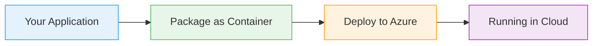

# Kubernetes Services

  <iconify-icon icon="logos:kubernetes" style="font-size: 4rem;" />

---

---
layout: center
---

# Kubernetes Services - Introduction Script

**Duration:** 2-3 minutes
**Target:** AZ-204 candidates learning Kubernetes networking

---

---
layout: center
---

# SLIDE 1: Title Slide

[On screen: "Kubernetes Services - Networking Made Simple"]

---

---
layout: center
---

# SLIDE 2: The Problem - Pod IP Addresses

[On screen: Diagram showing Pods with dynamic IP addresses being created and destroyed]

---

---
layout: center
---

# SLIDE 3: What is a Kubernetes Service?

[On screen: Service icon with stable IP and DNS name connected to multiple Pods]...

---

---
layout: center
---

# SLIDE 4: Service Type - ClusterIP

[On screen: Diagram showing ClusterIP Service with internal cluster communication]

---

---
layout: center
---

# SLIDE 5: Service Type - NodePort

[On screen: Diagram showing NodePort Service exposing port on all nodes]

---

---
layout: center
---

# SLIDE 6: Service Type - LoadBalancer

[On screen: Diagram showing LoadBalancer Service with cloud provider integration]

---

---
layout: center
---

# SLIDE 7: Service Discovery with DNS

[On screen: Diagram showing DNS resolution flow from Pod to Service]

---

---
layout: center
---

# SLIDE 8: AZ-204 Exam Relevance

[On screen: List of AZ-204 topics related to Kubernetes Services]

---

---
layout: center
---

# SLIDE 9: What's Next

[On screen: "Hands-On Lab - Let's Build Services Together"]

---

---
layout: center
---

# SLIDE 10: Summary

[On screen: Key takeaways bullet points]

