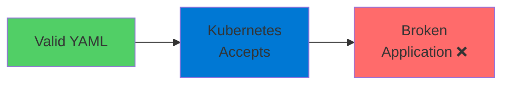
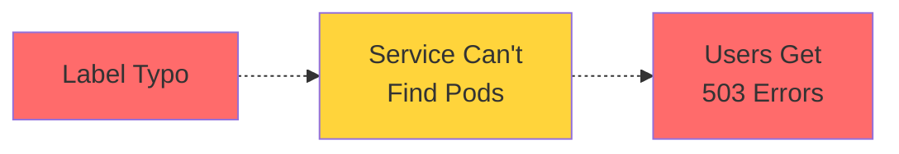
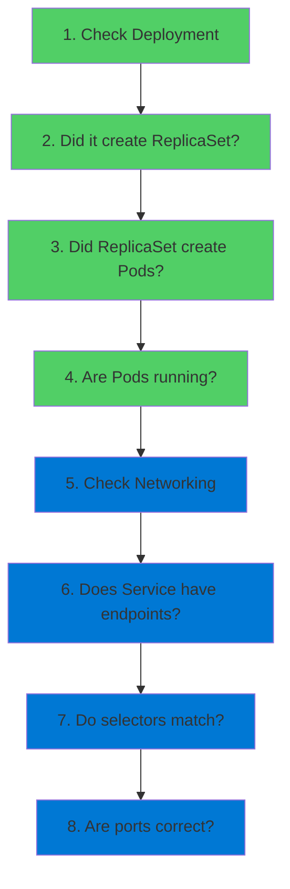

# Kubernetes Troubleshooting

Where Theory Meets Reality

  <carbon-debug class="text-8xl text-blue-400 opacity-80" />

---
layout: center
---

# Welcome

<!--
METADATA:
sentence: If you're preparing for the AZ-204 exam or working with Azure Kubernetes Service in production, this is where theory meets reality.
search_anchor: If you're preparing for the
-->
<v-click>

Master troubleshooting in Kubernetes Essential skill for AZ-204 and production

</v-click>

---
layout: section
---

# Why Troubleshooting Matters

---

# The Complexity Challenge

<v-click>

  <carbon-warning class="text-6xl text-orange-400" />

</v-click>

<!--
METADATA:
sentence: --- Slide 1: Why Troubleshooting Matters (30 seconds) Here's the thing about Kubernetes - it's incredibly powerful, but it's also complex.
search_anchor: --- Slide 1: Why Troubleshooting
-->
<v-click>

Kubernetes is incredibly powerful

</v-click>

<!--
METADATA:
sentence: --- Slide 1: Why Troubleshooting Matters (30 seconds) Here's the thing about Kubernetes - it's incredibly powerful, but it's also complex.
search_anchor: --- Slide 1: Why Troubleshooting
-->
<v-click>

But also complex

</v-click>

<!--
METADATA:
sentence: You can have perfectly valid specs that still produce a completely broken application.
search_anchor: You can have perfectly valid
-->
<v-click>

Valid YAML ≠ Working Application

</v-click>

---

# Spelling vs Meaning

<!--
METADATA:
sentence: When you deploy an application, Kubernetes validates that your YAML syntax is correct, but it doesn't guarantee your app will actually work.
search_anchor: When you deploy an application
-->
<v-click>

Kubernetes validates YAML syntax

</v-click>

<!--
METADATA:
sentence: Get any of these wrong, and your app becomes unreachable.
search_anchor: Get any of these wrong
-->
<v-click>

But not whether your app will work

</v-click>

<v-click>

</v-click>

<!--
METADATA:
sentence: Think of it like this: Kubernetes checks your spelling and grammar, but not whether your sentences make sense.
search_anchor: Think of it like this
-->
<v-click>

Checks spelling and grammar, not meaning

</v-click>

---

# Time Investment

<!--
METADATA:
sentence: And trust me, you'll spend a significant amount of your time tracking down these issues.
search_anchor: trust me, you'll spend a
-->
<v-click>

You'll spend significant time tracking down issues

</v-click>

<!--
METADATA:
sentence: Your mission: diagnose the problems and fix them until the app runs successfully.
search_anchor: Your mission: diagnose the problems
-->
<v-click>

  

    <carbon-debug class="text-6xl text-blue-400" />
    
Diagnose

  

  

    <carbon-tools-alt class="text-6xl text-green-400" />
    
Fix

  

  

    <carbon-checkmark-outline class="text-6xl text-purple-400" />
    
Verify

  

</v-click>

---
layout: section
---

# Common Points of Failure

---

# Where Things Go Wrong

<!--
METADATA:
sentence: Do the selectors match?
search_anchor: Do the selectors match
-->
<v-click>

  
1

  

    <carbon-deployment-pattern class="text-3xl inline-block" />
    Deployment → ReplicaSet → Pods
    
Label selectors must match

    
Mismatched labels = no Pods created

  

</v-click>

<!--
METADATA:
sentence: Services route traffic based on selectors and port configurations.
search_anchor: Services route traffic based on
-->
<v-click>

  
2

  

    <carbon-network-3 class="text-3xl inline-block" />
    Service → Pods
    
Selectors and port configuration

    
Wrong values = app unreachable

  

</v-click>

<!--
METADATA:
sentence: Third, container configuration - image names, commands, resource requests, and health probes.
search_anchor: Third, container configuration - image
-->
<v-click>

  
3

  

    <carbon-container-software class="text-3xl inline-block" />
    Container Configuration
    
Image names, commands, resources, probes

    
Can fail silently

  

</v-click>

---

# Loose Coupling Problem

<!--
METADATA:
sentence: These components are loosely coupled.
search_anchor: These components are loosely coupled
-->
<v-click>

Components are loosely coupled

</v-click>

<!--
METADATA:
sentence: A typo in one place can break everything, but Kubernetes won't tell you directly what's wrong.
search_anchor: typo in one place can
-->
<v-click>

Typo in one place can break everything

</v-click>

<!--
METADATA:
sentence: A typo in one place can break everything, but Kubernetes won't tell you directly what's wrong.
search_anchor: typo in one place can
-->
<v-click>

Kubernetes won't tell you directly what's wrong

</v-click>

<v-click>

</v-click>

---
layout: section
---

# Your Troubleshooting Toolkit

---

# Essential kubectl Commands

<!--
METADATA:
sentence: Let me walk you through the essentials: Start with "kubectl get" - this gives you the high-level status of your resources.
search_anchor: Let me walk you through
-->
<v-click>

  
1

  

    <carbon-view class="text-3xl inline-block" />
    kubectl get
    
High-level status of resources

    
Is Pod running? Pending? Crashing?

  

</v-click>

<!--
METADATA:
sentence: Next, "kubectl describe" - this is your diagnostic deep-dive.
search_anchor: Next, "kubectl describe" - this
-->
<v-click>

  
2

  

    <carbon-document-view class="text-3xl inline-block" />
    kubectl describe
    
Diagnostic deep-dive

    
Events, configuration, error messages

  

</v-click>

<!--
METADATA:
sentence: Don't forget "kubectl logs" - when your container actually starts but behaves incorrectly, the logs tell you what's happening inside.
search_anchor: Don't forget "kubectl logs" -
-->
<v-click>

  
3

  

    <carbon-document class="text-3xl inline-block" />
    kubectl logs
    
What's happening inside container

    
When container starts but behaves incorrectly

  

</v-click>

<!--
METADATA:
sentence: And finally, "kubectl port-forward" - this lets you bypass the Service layer and connect directly to a Pod, helping you isolate whether the problem is in the container or the networking configuration.
search_anchor: finally, "kubectl port-forward" - this
-->
<v-click>

  
4

  

    <carbon-network-3 class="text-3xl inline-block" />
    kubectl port-forward
    
Bypass Service layer, connect directly to Pod

    
Isolate: container problem or networking?

  

</v-click>

---
layout: section
---

# The Systematic Approach

---

# Top-Down Methodology

<v-click>

</v-click>

---

# Start from Top

<!--
METADATA:
sentence: Check your Deployment first - did it create a ReplicaSet?
search_anchor: Check your Deployment first -
-->
<v-click>

Check Deployment first

</v-click>

<!--
METADATA:
sentence: Did that ReplicaSet create Pods?
search_anchor: Did that ReplicaSet create Pods
-->
<v-click>

Did it create a ReplicaSet?

</v-click>

<!--
METADATA:
sentence: Did that ReplicaSet create Pods?
search_anchor: Did that ReplicaSet create Pods
-->
<v-click>

Did ReplicaSet create Pods?

</v-click>

<!--
METADATA:
sentence: Are those Pods actually running?
search_anchor: Are those Pods actually running
-->
<v-click>

Are Pods actually running?

</v-click>

<!--
METADATA:
sentence: Then move to networking.
search_anchor: Then move to networking
-->
<v-click>

Then move to networking

</v-click>

---

# Avoid Jumping to Conclusions

<!--
METADATA:
sentence: This systematic approach keeps you from jumping to conclusions and missing the actual root cause.
search_anchor: This systematic approach keeps you
-->
<v-click>

Systematic approach keeps you from missing root cause

</v-click>

<!--
METADATA:
sentence: Did that ReplicaSet create Pods?
search_anchor: Did that ReplicaSet create Pods
-->
<v-click>

  

    <carbon-checkmark-outline class="text-6xl text-green-400" />
    
Methodical

  

  

    <carbon-data-view-alt class="text-6xl text-blue-400" />
    
Thorough

  

  

    <carbon-rule class="text-6xl text-purple-400" />
    
Repeatable

  

</v-click>

---
layout: section
---

# AZ-204 Exam Relevance

---

# What Microsoft Expects

<!--
METADATA:
sentence: Then move to networking.
search_anchor: Then move to networking
-->
<v-click>

  <carbon-data-view-alt class="text-4xl text-blue-400" />
  Container monitoring

</v-click>

<!--
METADATA:
sentence: Did that ReplicaSet create Pods?
search_anchor: Did that ReplicaSet create Pods
-->
<v-click>

  <carbon-debug class="text-4xl text-green-400" />
  Diagnostics strategies

</v-click>

<!--
METADATA:
sentence: --- Slide 3: Your Troubleshooting Toolkit (45 seconds) So how do we diagnose these problems?
search_anchor: --- Slide 3: Your Troubleshooting
-->
<v-click>

  <carbon-tools-alt class="text-4xl text-purple-400" />
  Troubleshooting approaches

</v-click>

<!--
METADATA:
sentence: You won't just be writing manifests - you'll be debugging them.
search_anchor: You won't just be writing
-->
<v-click>

Not just writing manifests - debugging them

</v-click>

---

# Practical Skills

<!--
METADATA:
sentence: This lab gives you hands-on practice with the exact scenarios the exam tests.
search_anchor: This lab gives you hands-on
-->
<v-click>

This lab gives hands-on practice

</v-click>

<!--
METADATA:
sentence: This lab gives you hands-on practice with the exact scenarios the exam tests.
search_anchor: This lab gives you hands-on
-->
<v-click>

With exact scenarios the exam tests

</v-click>

<!--
METADATA:
sentence: Your mission: diagnose the problems and fix them until the app runs successfully.
search_anchor: Your mission: diagnose the problems
-->
<v-click>

  

    <carbon-test-tool class="text-6xl text-blue-400" />
    
Diagnose

  

  

    <carbon-tools-alt class="text-6xl text-green-400" />
    
Fix

  

  

    <carbon-checkmark-outline class="text-6xl text-purple-400" />
    
Verify

  

</v-click>

---
layout: section
---

# The Challenge

---

# Broken Application

<!--
METADATA:
sentence: In this lab, you'll encounter a broken application with multiple issues.
search_anchor: this lab, you'll encounter a
-->
<v-click>

Application with multiple issues

</v-click>

<!--
METADATA:
sentence: Your mission: diagnose the problems and fix them until the app runs successfully.
search_anchor: Your mission: diagnose the problems
-->
<v-click>

Your mission: diagnose and fix

</v-click>

<!--
METADATA:
sentence: Your mission: diagnose the problems and fix them until the app runs successfully.
search_anchor: Your mission: diagnose the problems
-->
<v-click>

Until app runs successfully

</v-click>

<!--
METADATA:
sentence: --- Closing (10 seconds) Alright, let's put this into practice.
search_anchor: --- Closing (10 seconds) Alright
-->
<v-click>

  

    <carbon-search class="text-6xl text-blue-400" />
    
Find Issues

  

  

    <carbon-tools-alt class="text-6xl text-green-400" />
    
Apply Fixes

  

  

    <carbon-checkmark-outline class="text-6xl text-purple-400" />
    
Test Success

  

</v-click>

---
layout: center
class: text-center
---

<v-click>

<carbon-play-outline class="text-8xl text-green-400 inline-block" />

</v-click>

<!--
METADATA:
sentence: Then move to networking.
search_anchor: Then move to networking
-->
<v-click>

Ready to Troubleshoot!

</v-click>

<!--
METADATA:
sentence: Next, "kubectl describe" - this is your diagnostic deep-dive.
search_anchor: Next, "kubectl describe" - this
-->
<v-click>

Put your diagnostic skills to the test

</v-click>

