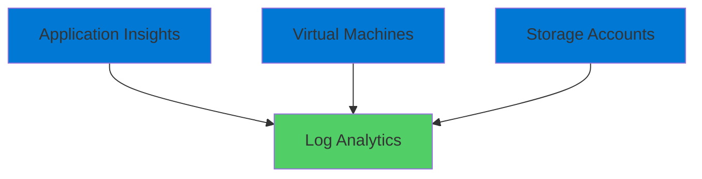
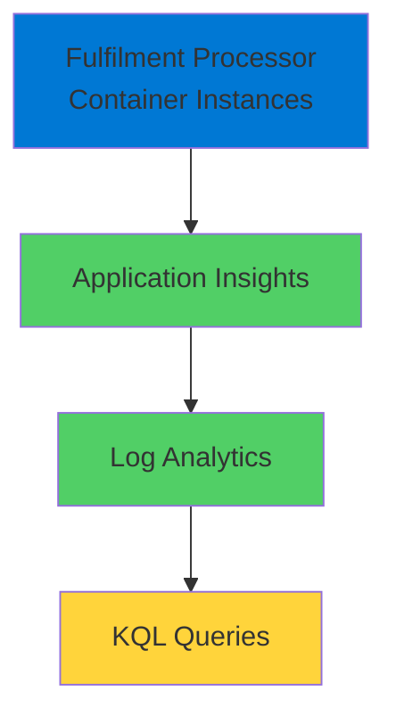

# Azure Log Analytics

Powerful Monitoring and Analytics with KQL

<div class="abs-bottom-10 left-10">
  <carbon-data-view class="text-8xl text-blue-400 opacity-80" />
</div>

---
layout: center
---

# Welcome

<v-click>

<div class="text-xl mt-8">
Explore Azure Log Analytics<br/>Query and visualize application data with KQL
</div>

</v-click>

---
layout: section
---

# What is Log Analytics?

---

# Centralized Data Store

<v-click>

<div class="mt-4">
  <carbon-data-base class="text-6xl text-blue-400" />
</div>

</v-click>

<v-click>

<div class="mt-8 text-xl text-center text-green-400">
The backbone of Azure's monitoring infrastructure
</div>

</v-click>

<v-click>

<div class="mt-12">



</div>

</v-click>

<v-click>

<div class="mt-12 text-center text-xl">
Centralized store for all log collection
</div>

</v-click>

---

# The Query Interface

<v-click>

<div class="mt-4">
  <carbon-search class="text-6xl text-purple-400" />
</div>

</v-click>

<v-click>

<div class="mt-8 text-xl text-center">
Rich UI for querying data
</div>

</v-click>

<v-click>

<div class="mt-12 text-center text-2xl text-green-400">
Using Kusto Query Language (KQL)
</div>

</v-click>

<v-click>

<div class="mt-12 flex justify-center gap-12">
  <div class="text-center">
    <carbon-dashboard class="text-6xl text-blue-400" />
    <div class="text-sm mt-3">Dashboards</div>
  </div>
  <div class="text-center">
    <carbon-warning class="text-6xl text-orange-400" />
    <div class="text-sm mt-3">Alerts</div>
  </div>
  <div class="text-center">
    <carbon-chart-line class="text-6xl text-green-400" />
    <div class="text-sm mt-3">Visualizations</div>
  </div>
</div>

</v-click>

---
layout: section
---

# Why KQL Matters

---

# Beyond Interactive Queries

<v-click>

<div class="mt-8 text-center text-xl">
KQL powers your entire monitoring strategy
</div>

</v-click>

<v-click>

<div class="mt-12 flex items-center gap-4">
  <carbon-dashboard class="text-4xl text-blue-400" />
  <span class="text-lg">Power dashboards with custom visualizations</span>
</div>

</v-click>

<v-click>

<div class="mt-6 flex items-center gap-4">
  <carbon-warning class="text-4xl text-orange-400" />
  <span class="text-lg">Create intelligent alerts with complex conditions</span>
</div>

</v-click>

<v-click>

<div class="mt-6 flex items-center gap-4">
  <carbon-test-tool class="text-4xl text-green-400" />
  <span class="text-lg">Test and refine queries before production</span>
</div>

</v-click>

<v-click>

<div class="mt-6 flex items-center gap-4">
  <carbon-debug class="text-4xl text-purple-400" />
  <span class="text-lg">Analyze performance and troubleshoot issues</span>
</div>

</v-click>

<v-click>

<div class="mt-12 text-center text-xl text-green-400">
Your testing ground for Azure Monitor
</div>

</v-click>

---
layout: section
---

# What We'll Cover

---

# Lab Objectives

<v-click>

<div class="mt-6 flex items-center gap-4">
  <carbon-settings class="text-4xl text-blue-400" />
  <span class="text-lg">Set up Log Analytics with Application Insights</span>
</div>

</v-click>

<v-click>

<div class="mt-6 flex items-center gap-4">
  <carbon-code class="text-4xl text-green-400" />
  <span class="text-lg">Write and execute KQL queries</span>
</div>

</v-click>

<v-click>

<div class="mt-6 flex items-center gap-4">
  <carbon-analytics class="text-4xl text-purple-400" />
  <span class="text-lg">Aggregate metrics and create summaries</span>
</div>

</v-click>

<v-click>

<div class="mt-6 flex items-center gap-4">
  <carbon-chart-line class="text-4xl text-orange-400" />
  <span class="text-lg">Build visualizations for application behavior</span>
</div>

</v-click>

<v-click>

<div class="mt-6 flex items-center gap-4">
  <carbon-document class="text-4xl text-red-400" />
  <span class="text-lg">Create comprehensive Workbook for monitoring</span>
</div>

</v-click>

---
layout: section
---

# Sample Application

---

# Fulfilment Processor

<v-click>

<div class="mt-8 text-center text-xl">
Runs in Azure Container Instances
</div>

</v-click>

<v-click>

<div class="mt-12">



</div>

</v-click>

<v-click>

<div class="mt-12 text-center text-xl">
Generates logs and metrics
</div>

</v-click>

<v-click>

<div class="mt-4 text-center text-lg opacity-70">
Real-world scenario with multiple instances
</div>

</v-click>

---

# Data Flow

<v-click>

<div class="mt-12 flex justify-center gap-12">
  <div class="text-center">
    <carbon-application class="text-6xl text-blue-400" />
    <div class="text-sm mt-3">Application</div>
  </div>
  <div class="text-center">
    <carbon-arrow-right class="text-6xl text-gray-400" />
  </div>
  <div class="text-center">
    <carbon-data-view-alt class="text-6xl text-green-400" />
    <div class="text-sm mt-3">App Insights</div>
  </div>
  <div class="text-center">
    <carbon-arrow-right class="text-6xl text-gray-400" />
  </div>
  <div class="text-center">
    <carbon-data-base class="text-6xl text-purple-400" />
    <div class="text-sm mt-3">Log Analytics</div>
  </div>
</div>

</v-click>

<v-click>

<div class="mt-12 text-center text-xl text-green-400">
Telemetry flows through to Log Analytics
</div>

</v-click>

---
layout: section
---

# KQL Basics

---

# Query Structure

<v-click>

<div class="mt-8">

```kql
requests
| where timestamp > ago(1h)
| summarize count() by resultCode
| order by count_ desc
```

</div>

</v-click>

<v-click>

<div class="mt-12 flex items-start gap-4">
  <div class="text-3xl text-blue-400 mt-1">1</div>
  <div>
    <span class="text-lg font-bold">Table</span>
    <div class="text-sm mt-2 opacity-70">Start with data source</div>
  </div>
</div>

</v-click>

<v-click>

<div class="mt-6 flex items-start gap-4">
  <div class="text-3xl text-green-400 mt-1">2</div>
  <div>
    <span class="text-lg font-bold">Filter</span>
    <div class="text-sm mt-2 opacity-70">Narrow down results</div>
  </div>
</div>

</v-click>

<v-click>

<div class="mt-6 flex items-start gap-4">
  <div class="text-3xl text-purple-400 mt-1">3</div>
  <div>
    <span class="text-lg font-bold">Aggregate</span>
    <div class="text-sm mt-2 opacity-70">Summarize data</div>
  </div>
</div>

</v-click>

<v-click>

<div class="mt-6 flex items-start gap-4">
  <div class="text-3xl text-orange-400 mt-1">4</div>
  <div>
    <span class="text-lg font-bold">Order</span>
    <div class="text-sm mt-2 opacity-70">Sort results</div>
  </div>
</div>

</v-click>

---

# Common Operations

<v-click>

<div class="mt-8 grid grid-cols-2 gap-8">
  <div>
    <carbon-filter class="text-4xl text-blue-400" />
    <div class="text-sm mt-3 font-bold">where</div>
    <div class="text-xs opacity-70">Filter rows</div>
  </div>
  <div>
    <carbon-chart-bar class="text-4xl text-green-400" />
    <div class="text-sm mt-3 font-bold">summarize</div>
    <div class="text-xs opacity-70">Aggregate data</div>
  </div>
  <div>
    <carbon-columns class="text-4xl text-purple-400" />
    <div class="text-sm mt-3 font-bold">project</div>
    <div class="text-xs opacity-70">Select columns</div>
  </div>
  <div>
    <carbon-sort-ascending class="text-4xl text-orange-400" />
    <div class="text-sm mt-3 font-bold">order by</div>
    <div class="text-xs opacity-70">Sort results</div>
  </div>
  <div>
    <carbon-join class="text-4xl text-red-400" />
    <div class="text-sm mt-3 font-bold">join</div>
    <div class="text-xs opacity-70">Combine tables</div>
  </div>
  <div>
    <carbon-chart-line class="text-4xl text-blue-500" />
    <div class="text-sm mt-3 font-bold">render</div>
    <div class="text-xs opacity-70">Visualize data</div>
  </div>
</div>

</v-click>

---
layout: section
---

# Prerequisites

---

# What You Need

<v-click>

<div class="mt-8 flex items-center gap-4">
  <carbon-cloud-services class="text-4xl text-blue-400" />
  <span class="text-lg">Active Azure subscription</span>
</div>

</v-click>

<v-click>

<div class="mt-6 flex items-center gap-4">
  <carbon-command-line class="text-4xl text-green-400" />
  <span class="text-lg">Azure CLI installed and configured</span>
</div>

</v-click>

<v-click>

<div class="mt-6 flex items-center gap-4">
  <carbon-data-view-alt class="text-4xl text-purple-400" />
  <span class="text-lg">Basic understanding of Azure Monitor</span>
</div>

</v-click>

<v-click>

<div class="mt-6 flex items-center gap-4">
  <carbon-screen class="text-4xl text-orange-400" />
  <span class="text-lg">Familiarity with Azure Portal</span>
</div>

</v-click>

<v-click>

<div class="mt-12 text-center text-lg opacity-70">
Can reuse Application Insights lab resources
</div>

</v-click>

---

# What You'll Learn

<v-click>

<div class="mt-12 flex justify-center gap-12">
  <div class="text-center">
    <carbon-code class="text-6xl text-blue-400" />
    <div class="text-sm mt-3">Write KQL</div>
  </div>
  <div class="text-center">
    <carbon-search class="text-6xl text-green-400" />
    <div class="text-sm mt-3">Extract Insights</div>
  </div>
  <div class="text-center">
    <carbon-document class="text-6xl text-purple-400" />
    <div class="text-sm mt-3">Build Workbooks</div>
  </div>
</div>

</v-click>

<v-click>

<div class="mt-12 text-center text-xl text-green-400">
Comfortable with Log Analytics interface
</div>

</v-click>

---
layout: center
class: text-center
---

<div>

<v-click>

<carbon-play-outline class="text-8xl text-green-400 inline-block" />

</v-click>

<v-click>

<div class="text-4xl mt-8 font-bold">
Let's Get Started!
</div>

</v-click>

<v-click>

<div class="text-xl mt-6 opacity-70">
Explore the power of Azure Log Analytics
</div>

</v-click>

</div>
