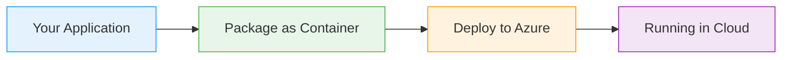

# Log Analytics

  <iconify-icon icon="carbon:chart-line" style="font-size: 4rem;" />

---

---
layout: center
class: text-center
---

# Welcome

Welcome to this lab on Azure Log Analytics

  <iconify-icon icon="carbon:rocket" style="font-size: 3rem; color: #0078d4;" />

---

---
layout: center
---

# What is Log Analytics?

Log Analytics is the centralized data store for all sorts of log collection in Azure. It serves as the backbone for Azure's monitoring infrastructure....

---

---
layout: center
---

# Why KQL Matters

KQL is not just for interactive queries. You'll use it to:
- Power dashboards with custom visualizations
- Create intelligent alerts based on complex conditions
- Test and refine queries before using 

---

---
layout: center
---

# What We'll Cover

<iconify-icon icon="mdi:check-circle" class="text-blue-500" /> on experience with:

---

---
layout: center
---

# The Sample Application

We'll work with a Fulfilment Processor application that runs in Azure Container Instances. This application generates logs and metrics that flow through Application Insights into Log Analytics.

---

---
layout: center
class: text-center
---

# Prerequisites

<iconify-icon icon="mdi:checkbox-marked-circle" class="text-blue-500" /> An active Azure subscription

<iconify-icon icon="mdi:checkbox-marked-circle" class="text-blue-500" /> Azure CLI installed and configured

<iconify-icon icon="mdi:checkbox-marked-circle" class="text-blue-500" /> Basic understanding of Azure Monitor concepts

<iconify-icon icon="mdi:checkbox-marked-circle" class="text-blue-500" /> Familiarity with the Azure Portal

  <iconify-icon icon="carbon:rocket" style="font-size: 3rem; color: #0078d4;" />

---

---
layout: center
---

# Let's Get Started

By the end of this lab, you'll be comfortable writing KQL queries to extract insights from your application data. You'll understand how to navigate the Log Analytics interface, and you'll have created

