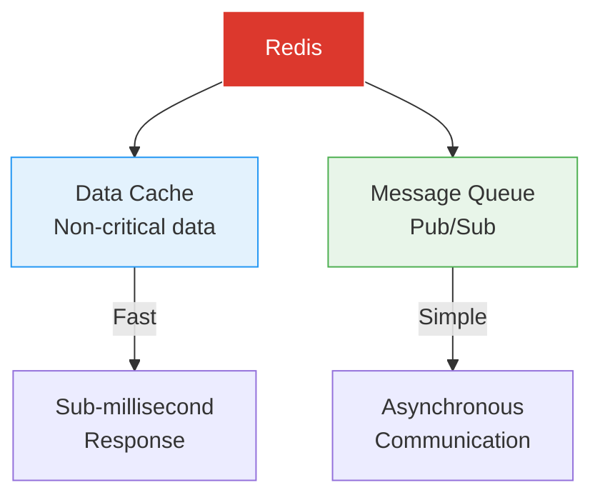

# What is Redis?

```mermaid
graph TB
    Redis[Redis] --> Cache[Data Cache<br/>Non-critical data]
    Redis --> Queue[Message Queue<br/>Pub/Sub]

    Cache -->|Fast| Retrieve[Sub-millisecond<br/>Response]
    Queue -->|Simple| Async[Asynchronous<br/>Communication]

    style Redis fill:#dc382d,stroke:#fff,color:#fff
    style Cache fill:#e3f2fd,stroke:#2196f3
    style Queue fill:#e8f5e9,stroke:#4caf50
```

  
Lightweight, in-memory, blazing fast

