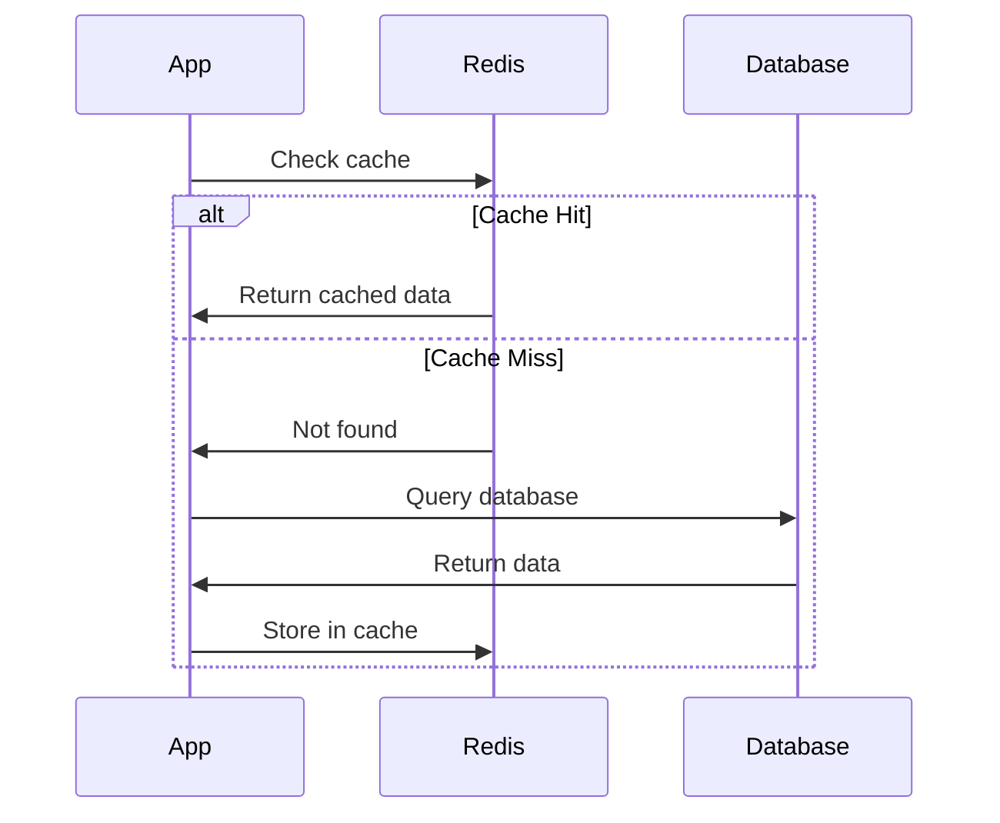

# Caching Pattern

```mermaid
sequenceDiagram
    participant App
    participant Redis
    participant DB as Database

    App->>Redis: Check cache
    alt Cache Hit
        Redis->>App: Return cached data
    else Cache Miss
        Redis->>App: Not found
        App->>DB: Query database
        DB->>App: Return data
        App->>Redis: Store in cache
    end
```

Expensive operations cached

Dramatically improved performance

