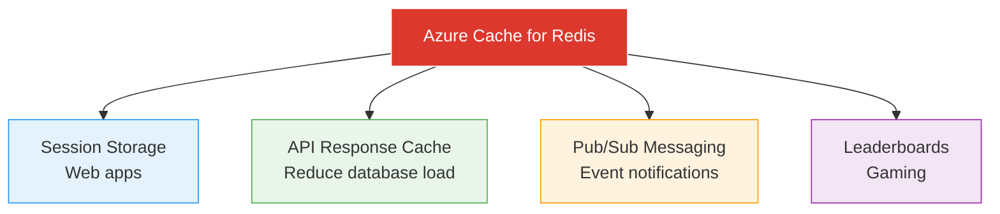

# Use Cases

```mermaid
graph TB
    Redis[Azure Cache for Redis]

    Redis --> UC1[Session Storage<br/>Web apps]
    Redis --> UC2[API Response Cache<br/>Reduce database load]
    Redis --> UC3[Pub/Sub Messaging<br/>Event notifications]
    Redis --> UC4[Leaderboards<br/>Gaming]

    style Redis fill:#dc382d,stroke:#fff,color:#fff
    style UC1 fill:#e3f2fd,stroke:#2196f3
    style UC2 fill:#e8f5e9,stroke:#4caf50
    style UC3 fill:#fff3e0,stroke:#ff9800
    style UC4 fill:#f3e5f5,stroke:#9c27b0
```
