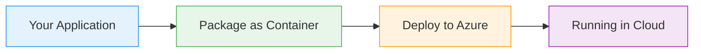

# Azure Cache for Redis

  <iconify-icon icon="logos:redis" style="font-size: 4rem;" />

---

---
layout: center
---

# What is Redis?

Welcome to this lab on Azure Cache for Redis. Let's start by understanding what Redis is and why it's valuable in cloud applications....

---

---
layout: center
---

# Common Use Cases

---

---
layout: center
---

# Azure Cache for Redis

Azure Cache for Redis is a fully managed service that implements the Redis API. It's essentially a drop-in replacement for running your own Redis cluster, but without the operational overhead.

---

---
layout: center
---

# What We'll Cover

<iconify-icon icon="mdi:check-circle" class="text-blue-500" /> Using it as a data cache to improve application performance

<iconify-icon icon="mdi:check-circle" class="text-blue-500" /> Using it as a message queue for publishing and subscribing to events

---

---
layout: two-cols
---

# Key Benefits

<iconify-icon icon="mdi:check-circle" class="text-green-500" /> Performance: In-memory data storage provides sub-millisecond response times

<iconify-icon icon="mdi:check-circle" class="text-green-500" /> Simplicity: Straightforward API with simple commands

<iconify-icon icon="mdi:check-circle" class="text-green-500" /> Flexibility: Can be used for caching, messaging, or both

<iconify-icon icon="mdi:check-circle" class="text-green-500" /> Managed Service: Azure handles infrastructure, patching, and availability

<iconify-icon icon="mdi:check-circle" class="text-green-500" /> Cost-Effective: Basic tiers provide excellent value for non-critical workloads

::right::

  <iconify-icon icon="carbon:chart-line-smooth" style="font-size: 8rem; color: #4caf50;" />

