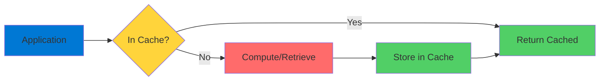
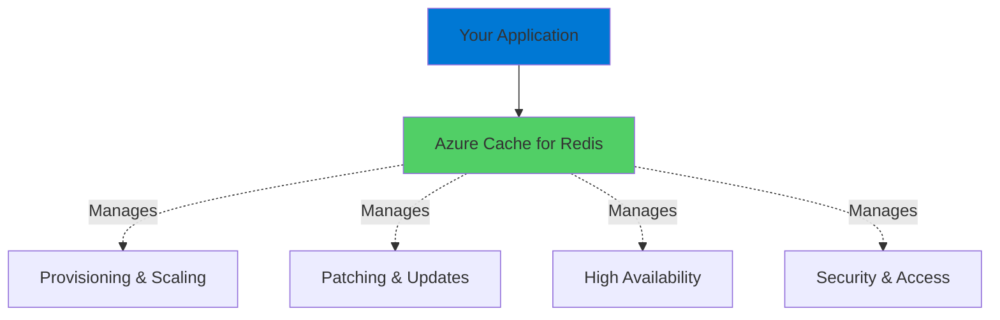
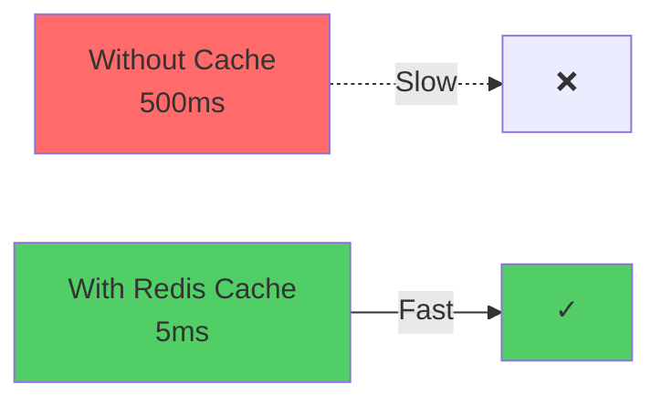

# Azure Cache for Redis

Performance Through Caching and Messaging

  <carbon-flash class="text-8xl text-blue-400 opacity-80" />

---
layout: center
---

# Welcome

<!--
METADATA:
sentence: Azure Cache for Redis - Introduction What is Redis?
search_anchor: Azure Cache for Redis -
-->
<v-click>

Explore Azure Cache for Redis Boost performance with caching and messaging

</v-click>

---
layout: section
---

# What is Redis?

---

# Popular Open-Source Technology

<v-click>

  <carbon-data-base class="text-6xl text-green-400" />

</v-click>

<!--
METADATA:
sentence: Redis is a popular open-source technology that combines the functionality of a message queue and a data store.
search_anchor: Redis is a popular open-source
-->
<v-click>

Combines message queue and data store

</v-click>

<!--
METADATA:
sentence: It's incredibly lightweight and has a straightforward programming interface, making it a go-to choice for developers worldwide.
search_anchor: It's incredibly lightweight and has
-->
<v-click>

  

    <carbon-flash class="text-6xl text-blue-400" />
    
Lightweight

  

  

    <carbon-code class="text-6xl text-green-400" />
    
Simple API

  

  

    <carbon-earth class="text-6xl text-purple-400" />
    
Worldwide

  

</v-click>

<!--
METADATA:
sentence: It's incredibly lightweight and has a straightforward programming interface, making it a go-to choice for developers worldwide.
search_anchor: It's incredibly lightweight and has
-->
<v-click>

Go-to choice for developers

</v-click>

---
layout: section
---

# Common Use Cases

---

# Two Key Scenarios

<!--
METADATA:
sentence: Think of scenarios where you have data that's expensive to compute or retrieve, but doesn't change frequently.
search_anchor: Think of scenarios where you
-->
<v-click>

  
1

  

    <carbon-data-backup class="text-3xl inline-block" />
    Cache for Non-Critical Data
    
Expensive to compute or retrieve

    
Doesn't change frequently

    
Dramatically improve performance

  

</v-click>

<!--
METADATA:
sentence: Second, for asynchronous communication where reliable messaging isn't required.
search_anchor: Second, for asynchronous communication where
-->
<v-click>

  
2

  

    <carbon-send class="text-3xl inline-block" />
    Asynchronous Communication
    
Simple pub-sub messaging

    
Speed matters more than guaranteed delivery

    
Reliable messaging not required

  

</v-click>

---

# The Caching Pattern

<v-click>

</v-click>

<!--
METADATA:
sentence: Welcome to this lab on Azure Cache for Redis.
search_anchor: Welcome to this lab on
-->
<v-click>

Fast retrieval on cache hits

</v-click>

---
layout: section
---

# Azure Cache for Redis

---

# Fully Managed Service

<v-click>

  <carbon-cloud-services class="text-6xl text-blue-400" />

</v-click>

<!--
METADATA:
sentence: It's essentially a drop-in replacement for running your own Redis cluster, but without the operational overhead.
search_anchor: It's essentially a drop-in replacement
-->
<v-click>

Drop-in replacement for Redis cluster

</v-click>

<!--
METADATA:
sentence: It's essentially a drop-in replacement for running your own Redis cluster, but without the operational overhead.
search_anchor: It's essentially a drop-in replacement
-->
<v-click>

Without operational overhead

</v-click>

<v-click>

</v-click>

---

# What Microsoft Handles

<!--
METADATA:
sentence: Let's start by understanding what Redis is and why it's valuable in cloud applications.
search_anchor: Let's start by understanding what
-->
<v-click>

  <carbon-settings class="text-4xl text-blue-400" />
  Provisioning and scaling

</v-click>

<!--
METADATA:
sentence: Let's start by understanding what Redis is and why it's valuable in cloud applications.
search_anchor: Let's start by understanding what
-->
<v-click>

  <carbon-upgrade class="text-4xl text-green-400" />
  Patching and updates

</v-click>

<!--
METADATA:
sentence: Let's start by understanding what Redis is and why it's valuable in cloud applications.
search_anchor: Let's start by understanding what
-->
<v-click>

  <carbon-availability class="text-4xl text-purple-400" />
  High availability configurations

</v-click>

<!--
METADATA:
sentence: Let's start by understanding what Redis is and why it's valuable in cloud applications.
search_anchor: Let's start by understanding what
-->
<v-click>

  <carbon-locked class="text-4xl text-orange-400" />
  Security and access control

</v-click>

<!--
METADATA:
sentence: A cache can dramatically improve your application's performance by storing these results for quick retrieval.
search_anchor: cache can dramatically improve your
-->
<v-click>

Focus on your application, not infrastructure

</v-click>

---
layout: section
---

# What We'll Cover

---

# Lab Objectives

<!--
METADATA:
sentence: A cache can dramatically improve your application's performance by storing these results for quick retrieval.
search_anchor: cache can dramatically improve your
-->
<v-click>

  
1

  

    <carbon-data-backup class="text-3xl inline-block" />
    Use Redis as data cache
    
Improve application performance

  

</v-click>

<!--
METADATA:
sentence: Redis is a popular open-source technology that combines the functionality of a message queue and a data store.
search_anchor: Redis is a popular open-source
-->
<v-click>

  
2

  

    <carbon-send class="text-3xl inline-block" />
    Use Redis as message queue
    
Publish and subscribe to events

  

</v-click>

<!--
METADATA:
sentence: Let's start by understanding what Redis is and why it's valuable in cloud applications.
search_anchor: Let's start by understanding what
-->
<v-click>

Work with real application

</v-click>

<!--
METADATA:
sentence: Azure Cache for Redis - Introduction What is Redis?
search_anchor: Azure Cache for Redis -
-->
<v-click>

See capabilities firsthand

</v-click>

---
layout: section
---

# Key Benefits

---

# Why Choose Redis?

<!--
METADATA:
sentence: A cache can dramatically improve your application's performance by storing these results for quick retrieval.
search_anchor: cache can dramatically improve your
-->
<v-click>

  
1

  

    <carbon-flash class="text-3xl inline-block" />
    Performance
    
In-memory storage

    
Sub-millisecond response times

  

</v-click>

<!--
METADATA:
sentence: It's incredibly lightweight and has a straightforward programming interface, making it a go-to choice for developers worldwide.
search_anchor: It's incredibly lightweight and has
-->
<v-click>

  
2

  

    <carbon-clean class="text-3xl inline-block" />
    Simplicity
    
Straightforward API

    
Simple commands

  

</v-click>

<!--
METADATA:
sentence: Second, for asynchronous communication where reliable messaging isn't required.
search_anchor: Second, for asynchronous communication where
-->
<v-click>

  
3

  

    <carbon-grid class="text-3xl inline-block" />
    Flexibility
    
Caching, messaging, or both

  

</v-click>

<!--
METADATA:
sentence: Azure Cache for Redis Azure Cache for Redis is a fully managed service that implements the Redis API.
search_anchor: Azure Cache for Redis Azure
-->
<v-click>

  
4

  

    <carbon-cloud-services class="text-3xl inline-block" />
    Managed Service
    
Azure handles infrastructure

  

</v-click>

<!--
METADATA:
sentence: Think of scenarios where you have data that's expensive to compute or retrieve, but doesn't change frequently.
search_anchor: Think of scenarios where you
-->
<v-click>

  
5

  

    <carbon-money class="text-3xl inline-block" />
    Cost-Effective
    
Basic tiers provide excellent value

  

</v-click>

---

# Performance Impact

<v-click>

</v-click>

<!--
METADATA:
sentence: Azure Cache for Redis - Introduction What is Redis?
search_anchor: Azure Cache for Redis -
-->
<v-click>

100x faster response times

</v-click>

<!--
METADATA:
sentence: Welcome to this lab on Azure Cache for Redis.
search_anchor: Welcome to this lab on
-->
<v-click>

Typical improvement with in-memory caching

</v-click>

---
layout: center
class: text-center
---

<v-click>

<carbon-play-outline class="text-8xl text-green-400 inline-block" />

</v-click>

<!--
METADATA:
sentence: Welcome to this lab on Azure Cache for Redis.
search_anchor: Welcome to this lab on
-->
<v-click>

Let's Get Started!

</v-click>

<!--
METADATA:
sentence: Azure Cache for Redis - Introduction What is Redis?
search_anchor: Azure Cache for Redis -
-->
<v-click>

See Azure Cache for Redis in action

</v-click>

