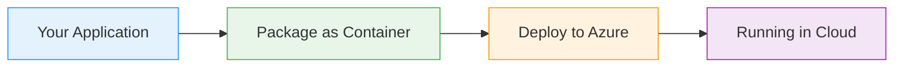

# Resource Groups

  <iconify-icon icon="vscode-icons:file-type-azure" style="font-size: 4rem;" />

---

---
layout: center
class: text-center
---

# Welcome

Welcome to this tutorial on Azure Resource Groups

  <iconify-icon icon="carbon:rocket" style="font-size: 3rem; color: #0078d4;" />

---

---
layout: center
---

# What are Resource Groups?

Resource Groups, or RGs, are containers for all other Azure resources. Think of them as organizational folders that hold everything your application n...

---

---
layout: two-cols
---

# Key Benefits

<iconify-icon icon="mdi:check-circle" class="text-green-500" /> There are several important benefits to using Resource Groups:

<iconify-icon icon="mdi:check-circle" class="text-green-500" /> First, management permissions can be applied at the Resource Group level

<iconify-icon icon="mdi:check-circle" class="text-green-500" /> Second, Resource Groups make cleanup incredibly easy

<iconify-icon icon="mdi:check-circle" class="text-green-500" /> Third, they provide a way to organize your resources logically, which becomes increasingly important as your Azure footprint grows

::right::

  <iconify-icon icon="carbon:chart-line-smooth" style="font-size: 8rem; color: #4caf50;" />

---

---
layout: center
---

# Regions and Location

One important concept to understand is that Resource Groups themselves have a location - a specific Azure region. This region determines where the metadata about your Resource Group is stored.

---

---
layout: center
---

# Tags

Tags are simple key-value pairs that you can attach to Resource Groups and other resources. They're incredibly useful for organizing and managing resources at scale. For example, you might use an "env

---

---
layout: center
---

# What's Next

In this lab, we'll explore Resource Groups hands-on. We'll create them using both the Azure Portal and the Azure CLI, learn how to query and filter them, and practice managing them. By the end, you'll

