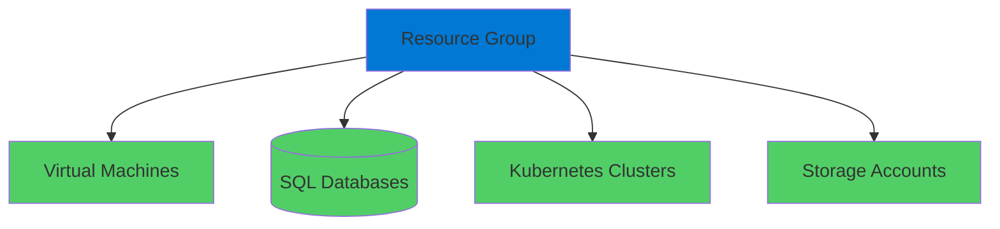
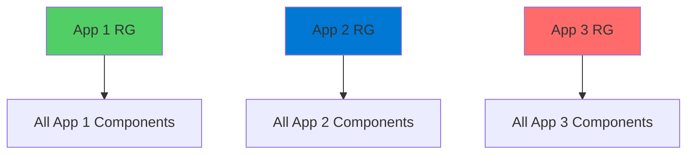
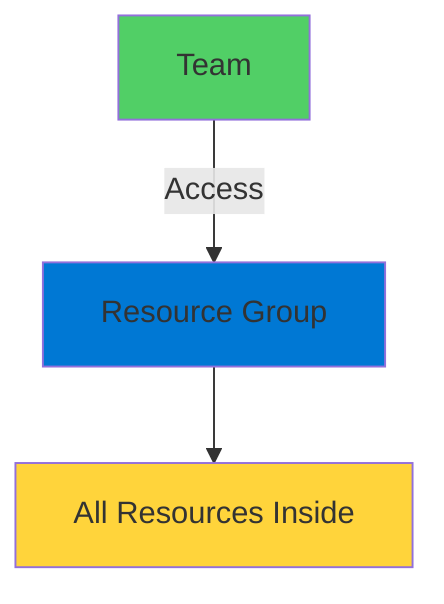
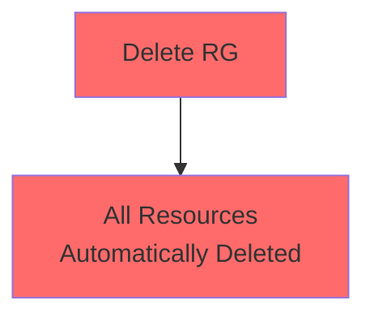
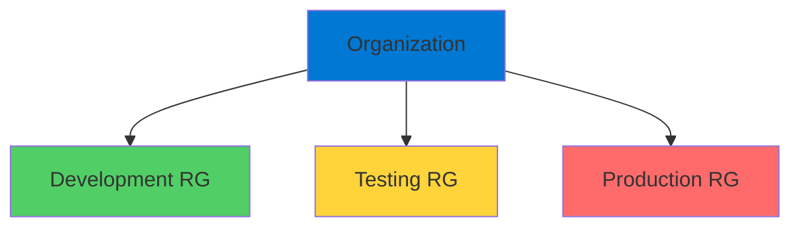
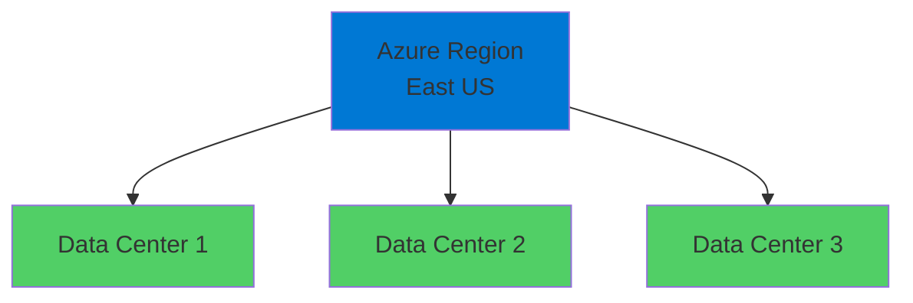
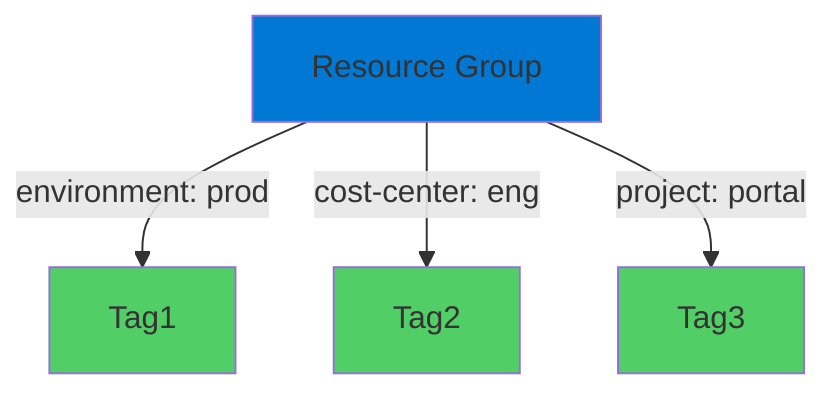

# Azure Resource Groups

Organizational Containers for Azure Resources

<div class="abs-bottom-10 left-10">
  <carbon-folder class="text-8xl text-blue-400 opacity-80" />
</div>

---
layout: center
---

# Welcome

<!--
METADATA:
sentence: What are Resource Groups?
search_anchor: What are Resource Groups
-->
<v-click>

<div class="text-xl mt-8">
Explore Azure Resource Groups<br/>Fundamental building blocks of Azure
</div>

</v-click>

---
layout: section
---

# What are Resource Groups?

---

# Containers for Resources

<v-click>

<div class="mt-4">
  <carbon-folder class="text-6xl text-blue-400" />
</div>

</v-click>

<!--
METADATA:
sentence: Resource Groups, or RGs, are containers for all other Azure resources.
search_anchor: Resource Groups, or RGs, are
-->
<v-click>

<div class="mt-8 text-xl text-center">
Organizational folders for Azure resources
</div>

</v-click>

<v-click>

<div class="mt-12">



</div>

</v-click>

<!--
METADATA:
sentence: Think of them as organizational folders that hold everything your application needs - virtual machines, SQL databases, Kubernetes clusters, storage accounts - they all live inside a Resource Group.
search_anchor: Think of them as organizational
-->
<v-click>

<div class="mt-8 text-center text-lg opacity-70">
Everything your application needs lives inside
</div>

</v-click>

---

# Logical Grouping

<!--
METADATA:
sentence: You typically create one Resource Group for each application, containing all the components that app requires.
search_anchor: You typically create one Resource
-->
<v-click>

<div class="mt-12 text-center text-xl">
Typically: One Resource Group per Application
</div>

</v-click>

<v-click>

<div class="mt-12">



</div>

</v-click>

<!--
METADATA:
sentence: This logical grouping makes it much easier to manage your Azure resources as a cohesive unit.
search_anchor: This logical grouping makes it
-->
<v-click>

<div class="mt-8 text-center text-lg text-green-400">
Easier to manage resources as cohesive unit
</div>

</v-click>

---
layout: section
---

# Key Benefits

---

# Benefit 1: Management Permissions

<v-click>

<div class="mt-4">
  <carbon-user-access class="text-6xl text-green-400" />
</div>

</v-click>

<!--
METADATA:
sentence: What are Resource Groups?
search_anchor: What are Resource Groups
-->
<v-click>

<div class="mt-8 text-xl text-center">
Apply permissions at Resource Group level
</div>

</v-click>

<v-click>

<div class="mt-12">



</div>

</v-click>

<!--
METADATA:
sentence: This means you can grant a team access to everything they need for their application in one go, without having to set permissions on individual resources.
search_anchor: This means you can grant
-->
<v-click>

<div class="mt-8 text-center text-lg">
Grant access to everything in one go
</div>

</v-click>

<!--
METADATA:
sentence: This means you can grant a team access to everything they need for their application in one go, without having to set permissions on individual resources.
search_anchor: This means you can grant
-->
<v-click>

<div class="mt-4 text-center text-sm opacity-70">
No need to set permissions on individual resources
</div>

</v-click>

---

# Benefit 2: Easy Cleanup

<v-click>

<div class="mt-4">
  <carbon-delete class="text-6xl text-red-400" />
</div>

</v-click>

<!--
METADATA:
sentence: What are Resource Groups?
search_anchor: What are Resource Groups
-->
<v-click>

<div class="mt-8 text-xl text-center">
Delete Resource Group = Delete everything inside
</div>

</v-click>

<v-click>

<div class="mt-12">



</div>

</v-click>

<!--
METADATA:
sentence: This is perfect for development and testing scenarios where you want to quickly tear down an entire environment.
search_anchor: This is perfect for development
-->
<v-click>

<div class="mt-12 text-center text-xl text-green-400">
Perfect for dev/test environments
</div>

</v-click>

<!--
METADATA:
sentence: This is perfect for development and testing scenarios where you want to quickly tear down an entire environment.
search_anchor: This is perfect for development
-->
<v-click>

<div class="mt-6 text-center text-lg opacity-70">
Quickly tear down entire environment
</div>

</v-click>

---

# Benefit 3: Logical Organization

<v-click>

<div class="mt-4">
  <carbon-catalog class="text-6xl text-purple-400" />
</div>

</v-click>

<!--
METADATA:
sentence: Third, they provide a way to organize your resources logically, which becomes increasingly important as your Azure footprint grows.
search_anchor: Third, they provide a way
-->
<v-click>

<div class="mt-8 text-center text-xl">
Organize resources logically
</div>

</v-click>

<v-click>

<div class="mt-12">



</div>

</v-click>

<!--
METADATA:
sentence: Third, they provide a way to organize your resources logically, which becomes increasingly important as your Azure footprint grows.
search_anchor: Third, they provide a way
-->
<v-click>

<div class="mt-8 text-center text-lg">
Increasingly important as footprint grows
</div>

</v-click>

---
layout: section
---

# Regions and Location

---

# Resource Groups Have Locations

<v-click>

<div class="mt-4">
  <carbon-location class="text-6xl text-blue-400" />
</div>

</v-click>

<!--
METADATA:
sentence: What are Resource Groups?
search_anchor: What are Resource Groups
-->
<v-click>

<div class="mt-8 text-xl text-center">
Resource Groups exist in specific Azure regions
</div>

</v-click>

<!--
METADATA:
sentence: This region determines where the metadata about your Resource Group is stored.
search_anchor: This region determines where the
-->
<v-click>

<div class="mt-12 text-lg text-center">
Determines where metadata is stored
</div>

</v-click>

---

# What is a Region?

<!--
METADATA:
sentence: Each region is a collection of nearby data centers.
search_anchor: Each region is a collection
-->
<v-click>

<div class="mt-8 text-center text-xl">
Collection of nearby data centers
</div>

</v-click>

<v-click>

<div class="mt-12">



</div>

</v-click>

---

# Placement Strategy

<!--
METADATA:
sentence: What are Resource Groups?
search_anchor: What are Resource Groups
-->
<v-click>

<div class="mt-8 text-center text-xl">
Typical approach:
</div>

</v-click>

<!--
METADATA:
sentence: Typically, you'll put all the components for an application into the same region to minimize network latency between services.
search_anchor: Typically, you'll put all the
-->
<v-click>

<div class="mt-12 flex justify-center gap-12">
  <div class="text-center">
    <carbon-location class="text-6xl text-green-400" />
    <div class="text-sm mt-3">Same Region</div>
    <div class="text-xs mt-2 opacity-70">Minimize network latency</div>
  </div>
</div>

</v-click>

<!--
METADATA:
sentence: However, you might create additional deployments in other regions for high availability or to serve users in different geographic locations.
search_anchor: However, you might create additional
-->
<v-click>

<div class="mt-12 text-center text-xl">
But you might use multiple regions for:
</div>

</v-click>

<!--
METADATA:
sentence: However, you might create additional deployments in other regions for high availability or to serve users in different geographic locations.
search_anchor: However, you might create additional
-->
<v-click>

<div class="mt-8 grid grid-cols-2 gap-8">
  <div class="text-center">
    <carbon-availability class="text-4xl text-blue-400" />
    <div class="text-sm mt-2">High Availability</div>
  </div>
  <div class="text-center">
    <carbon-earth class="text-4xl text-purple-400" />
    <div class="text-sm mt-2">Geographic Distribution</div>
  </div>
</div>

</v-click>

---
layout: section
---

# Tags

---

# Key-Value Pairs

<v-click>

<div class="mt-4">
  <carbon-tag class="text-6xl text-green-400" />
</div>

</v-click>

<!--
METADATA:
sentence: Tags Tags are simple key-value pairs that you can attach to Resource Groups and other resources.
search_anchor: Tags Tags are simple key-value
-->
<v-click>

<div class="mt-8 text-xl text-center">
Simple metadata attached to resources
</div>

</v-click>

<v-click>

<div class="mt-12">

```yaml
environment: production
cost-center: engineering
project: customer-portal
owner: platform-team
```

</div>

</v-click>

<!--
METADATA:
sentence: They're incredibly useful for organizing and managing resources at scale.
search_anchor: They're incredibly useful for organizing
-->
<v-click>

<div class="mt-8 text-center text-lg text-green-400">
Incredibly useful for organization at scale
</div>

</v-click>

---

# Tag Use Cases

<!--
METADATA:
sentence: For example, you might use an "environment" tag to identify resources in development, testing, or production environments, or a "cost-center" tag for billing purposes.
search_anchor: example, you might use an
-->
<v-click>

<div class="mt-8 flex items-center gap-4">
  <carbon-data-class class="text-4xl text-blue-400" />
  <div>
    <div class="text-lg font-bold">Environment Classification</div>
    <div class="text-sm opacity-70">dev, test, production</div>
  </div>
</div>

</v-click>

<!--
METADATA:
sentence: For example, you might use an "environment" tag to identify resources in development, testing, or production environments, or a "cost-center" tag for billing purposes.
search_anchor: example, you might use an
-->
<v-click>

<div class="mt-6 flex items-center gap-4">
  <carbon-currency-dollar class="text-4xl text-green-400" />
  <div>
    <div class="text-lg font-bold">Cost Tracking</div>
    <div class="text-sm opacity-70">Billing by cost-center or project</div>
  </div>
</div>

</v-click>

<!--
METADATA:
sentence: They're incredibly useful for organizing and managing resources at scale.
search_anchor: They're incredibly useful for organizing
-->
<v-click>

<div class="mt-6 flex items-center gap-4">
  <carbon-user-multiple class="text-4xl text-purple-400" />
  <div>
    <div class="text-lg font-bold">Ownership</div>
    <div class="text-sm opacity-70">Track team responsible for resources</div>
  </div>
</div>

</v-click>

<!--
METADATA:
sentence: Each region is a collection of nearby data centers.
search_anchor: Each region is a collection
-->
<v-click>

<div class="mt-6 flex items-center gap-4">
  <carbon-classify class="text-4xl text-orange-400" />
  <div>
    <div class="text-lg font-bold">Compliance</div>
    <div class="text-sm opacity-70">Data classification, compliance requirements</div>
  </div>
</div>

</v-click>

---

# Tag Example

<v-click>

<div class="mt-8">



</div>

</v-click>

<!--
METADATA:
sentence: What are Resource Groups?
search_anchor: What are Resource Groups
-->
<v-click>

<div class="mt-12 text-center text-xl">
Filter and search by tags
</div>

</v-click>

<!--
METADATA:
sentence: Resource Groups, or RGs, are containers for all other Azure resources.
search_anchor: Resource Groups, or RGs, are
-->
<v-click>

<div class="mt-6 text-center text-lg opacity-70">
Essential for large-scale Azure management
</div>

</v-click>

---
layout: section
---

# What's Next

---

# Lab Objectives

<!--
METADATA:
sentence: What are Resource Groups?
search_anchor: What are Resource Groups
-->
<v-click>

<div class="mt-6 flex items-center gap-4">
  <carbon-add class="text-4xl text-blue-400" />
  <span class="text-lg">Create Resource Groups via Portal and CLI</span>
</div>

</v-click>

<!--
METADATA:
sentence: What are Resource Groups?
search_anchor: What are Resource Groups
-->
<v-click>

<div class="mt-6 flex items-center gap-4">
  <carbon-search class="text-4xl text-green-400" />
  <span class="text-lg">Query and filter Resource Groups</span>
</div>

</v-click>

<!--
METADATA:
sentence: They're incredibly useful for organizing and managing resources at scale.
search_anchor: They're incredibly useful for organizing
-->
<v-click>

<div class="mt-6 flex items-center gap-4">
  <carbon-tag class="text-4xl text-purple-400" />
  <span class="text-lg">Apply tags for organization</span>
</div>

</v-click>

<!--
METADATA:
sentence: What are Resource Groups?
search_anchor: What are Resource Groups
-->
<v-click>

<div class="mt-6 flex items-center gap-4">
  <carbon-settings-adjust class="text-4xl text-orange-400" />
  <span class="text-lg">Manage Resource Groups</span>
</div>

</v-click>

---
layout: center
class: text-center
---

<div>

<v-click>

<carbon-play-outline class="text-8xl text-green-400 inline-block" />

</v-click>

<!--
METADATA:
sentence: Each region is a collection of nearby data centers.
search_anchor: Each region is a collection
-->
<v-click>

<div class="text-4xl mt-8 font-bold">
Let's Get Started!
</div>

</v-click>

<!--
METADATA:
sentence: What are Resource Groups?
search_anchor: What are Resource Groups
-->
<v-click>

<div class="text-xl mt-6 opacity-70">
Master Azure Resource Groups
</div>

</v-click>

</div>
