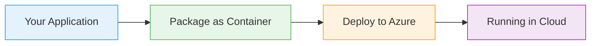

# Service Bus Publish-Subscribe

  <iconify-icon icon="mdi:bus" style="font-size: 4rem;" />

---

---
layout: center
class: text-center
---

# Welcome

Welcome to this lab on Azure Service Bus Publish-Subscribe messaging

  <iconify-icon icon="carbon:rocket" style="font-size: 3rem; color: #0078d4;" />

---

---
layout: center
---

# What is Publish-Subscribe?

The publish-subscribe pattern is a messaging pattern where the component sending messages is called the publisher, and there can be zero or many compo...

---

---
layout: center
---

# Service Bus Topics

In Azure Service Bus, we implement the pub-sub pattern using topics. You might remember from a previous lab that we used Service Bus queues for point-to-point messaging. Topics are different - they're

---

---
layout: center
---

# Real-World Example

Let me give you a practical example. Imagine you're building an e-commerce application. When a customer places an order, you publish an "order-created" message to a topic. You might have multiple subs

---

---
layout: center
---

# Lab Objectives

In this lab, we'll:

