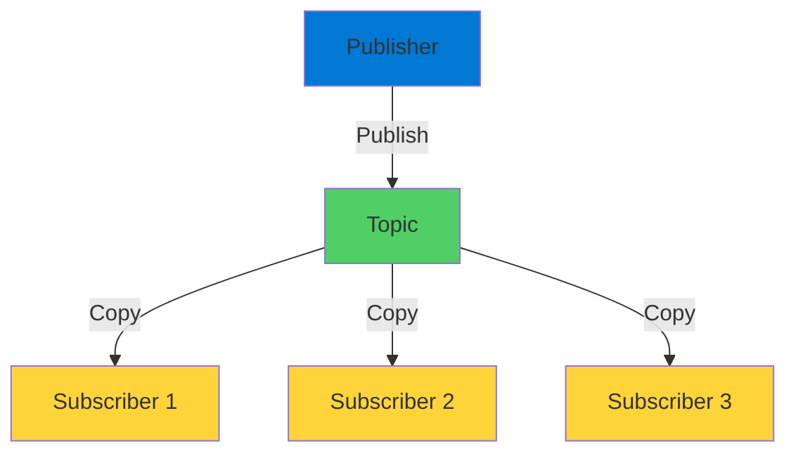
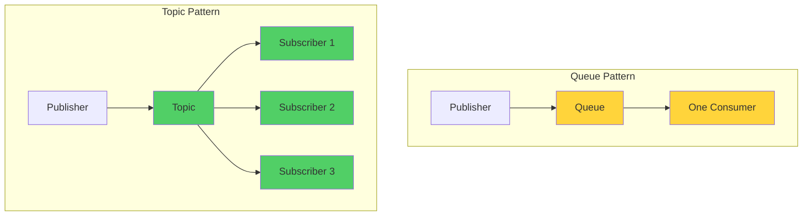
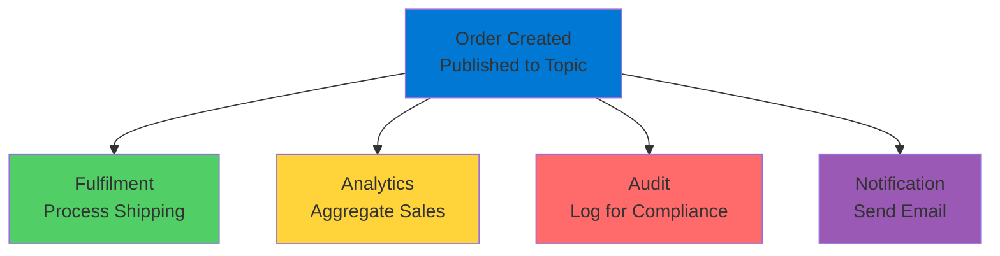
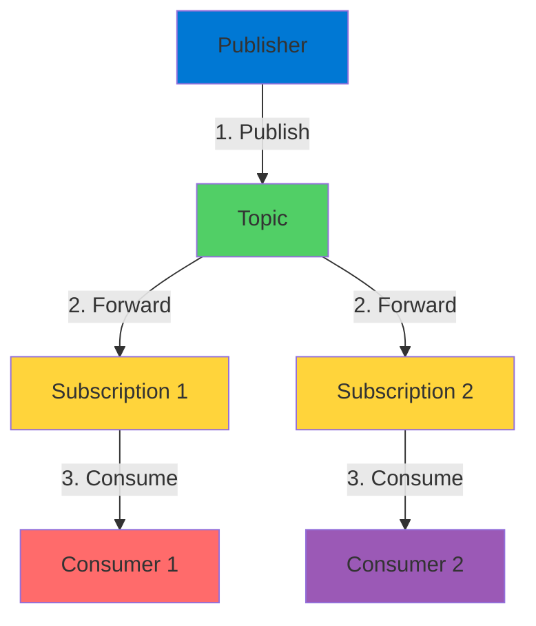

# Service Bus Publish-Subscribe

The Pub-Sub Messaging Pattern

  <carbon-network-overlay class="text-8xl text-blue-400 opacity-80" />

---
layout: center
---

# Welcome

<v-click>

Explore publish-subscribe with Service Bus Build extensible, decoupled architectures

</v-click>

---
layout: section
---

# What is Publish-Subscribe?

---

# The Pattern

<v-click>

  <carbon-send-alt class="text-6xl text-green-400" />

</v-click>

<v-click>

Publisher sends messages

</v-click>

<v-click>

Zero or many subscribers receive them

</v-click>

<v-click>

</v-click>

<v-click>

Every subscriber gets a copy

</v-click>

---

# Key Characteristic

<v-click>

Add new subscribers anytime

</v-click>

<v-click>

Without changing existing components

</v-click>

<v-click>

  

    <carbon-add class="text-6xl text-blue-400" />
    
Extensible

  

  

    <carbon-subtract class="text-6xl text-green-400" />
    
Decoupled

  

  

    <carbon-network-3 class="text-6xl text-purple-400" />
    
Cloud-Native

  

</v-click>

---
layout: section
---

# Service Bus Topics

---

# Topics vs Queues

<v-click>

</v-click>

<v-click>

Queues: point-to-point

</v-click>

<v-click>

Topics: one-to-many

</v-click>

---

# How Topics Work

<v-click>

  <carbon-network-4 class="text-6xl text-blue-400" />

</v-click>

<v-click>

Message published to topic

</v-click>

<v-click>

Forwarded to all active subscriptions

</v-click>

<v-click>

Each subscription acts as independent queue

</v-click>

<v-click>

Receives copy of every message

</v-click>

---
layout: section
---

# Real-World Example

---

# E-Commerce Order Processing

<v-click>

Customer places order

</v-click>

<v-click>

</v-click>

<v-click>

Each component operates independently

</v-click>

---

# Independent Processing

<v-click>

  <carbon-time class="text-4xl text-blue-400" />
  Each processes at its own pace

</v-click>

<v-click>

  <carbon-add class="text-4xl text-green-400" />
  Add new subscriptions anytime

</v-click>

<v-click>

  <carbon-subtract class="text-4xl text-purple-400" />
  Remove without affecting others

</v-click>

<v-click>

True decoupling

</v-click>

---
layout: section
---

# Lab Objectives

---

# What We'll Do

<v-click>

  
1

  

    <carbon-add class="text-3xl inline-block" />
    Create Service Bus namespace (Standard tier)
  

</v-click>

<v-click>

  
2

  

    <carbon-document-tasks class="text-3xl inline-block" />
    Create topic with TTL and size configs
  

</v-click>

<v-click>

  
3

  

    <carbon-user-multiple class="text-3xl inline-block" />
    Add multiple subscriptions
  

</v-click>

<v-click>

  
4

  

    <carbon-send class="text-3xl inline-block" />
    Publish messages with .NET application
  

</v-click>

<v-click>

  
5

  

    <carbon-view class="text-3xl inline-block" />
    Consume from different subscriptions
  

</v-click>

---

# Standard Tier Required

<v-click>

  <carbon-warning class="text-6xl text-orange-400" />

</v-click>

<v-click>

Topics require Standard or Premium tier

</v-click>

<v-click>

  

    <carbon-close class="text-6xl text-red-400" />
    
Basic

    
Queues only

  

  

    <carbon-checkmark class="text-6xl text-green-400" />
    
Standard

    
Queues + Topics

  

  

    <carbon-checkmark class="text-6xl text-green-400" />
    
Premium

    
Dedicated resources

  

</v-click>

---
layout: section
---

# Message Flow

---

# Complete Flow

<v-click>

</v-click>

<v-click>

One message becomes many

</v-click>

<v-click>

Each subscription gets independent copy

</v-click>

---

# Scalable Architecture

<v-click>

  

    <carbon-network-overlay class="text-6xl text-blue-400" />
    
Decoupled

  

  

    <carbon-add class="text-6xl text-green-400" />
    
Extensible

  

  

    <carbon-scale class="text-6xl text-purple-400" />
    
Scalable

  

</v-click>

<v-click>

Design distributed systems that grow

</v-click>

---
layout: center
class: text-center
---

<v-click>

<carbon-play-outline class="text-8xl text-green-400 inline-block" />

</v-click>

<v-click>

Let's Get Started!

</v-click>

<v-click>

Build extensible pub-sub architectures

</v-click>

