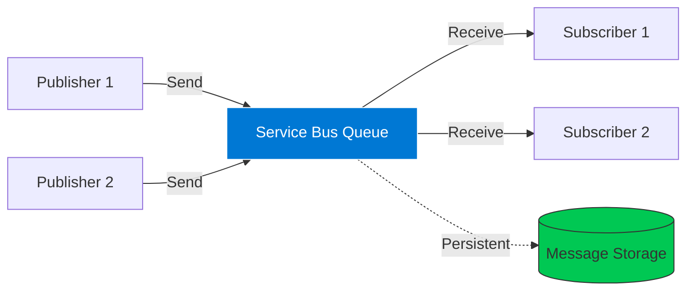

# What is Service Bus?

```mermaid
graph LR
    Pub1[Publisher 1] -->|Send| Queue[Service Bus Queue]
    Pub2[Publisher 2] -->|Send| Queue

    Queue -->|Receive| Sub1[Subscriber 1]
    Queue -->|Receive| Sub2[Subscriber 2]

    Queue -.Persistent.-> Store[(Message Storage)]

    style Queue fill:#0078d4,stroke:#fff,color:#fff
    style Store fill:#00c853,stroke:#333
```

  
Reliable, high-throughput messaging

