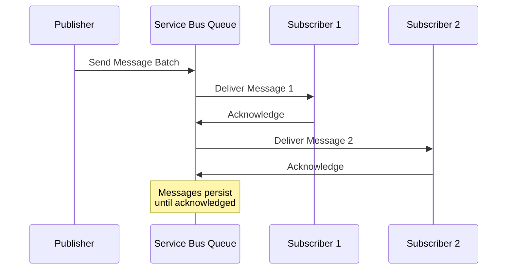

# Messaging Patterns

```mermaid
sequenceDiagram
    participant P as Publisher
    participant Q as Service Bus Queue
    participant S1 as Subscriber 1
    participant S2 as Subscriber 2

    P->>Q: Send Message Batch
    Q->>S1: Deliver Message 1
    S1->>Q: Acknowledge
    Q->>S2: Deliver Message 2
    S2->>Q: Acknowledge

    Note over Q: Messages persist<br/>until acknowledged
```

Fire-and-forget pattern

No message loss

Automatic retries

