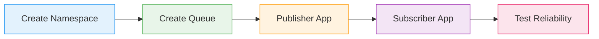

# What You'll Learn

```mermaid
graph LR
    A[Create Namespace] --> B[Create Queue]
    B --> C[Publisher App]
    C --> D[Subscriber App]
    D --> E[Test Reliability]

    style A fill:#e3f2fd,stroke:#2196f3
    style B fill:#e8f5e9,stroke:#4caf50
    style C fill:#fff3e0,stroke:#ff9800
    style D fill:#f3e5f5,stroke:#9c27b0
    style E fill:#fce4ec,stroke:#e91e63
```

Standard protocol (AMQP)

Scales horizontally

Enterprise-grade messaging

