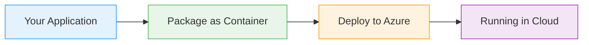

# Service Bus Messaging

  <iconify-icon icon="mdi:bus" style="font-size: 4rem;" />

---

---
layout: center
class: text-center
---

# Welcome

Welcome to this lab on Azure Service Bus messaging

  <iconify-icon icon="carbon:rocket" style="font-size: 3rem; color: #0078d4;" />

---

---
layout: center
---

# What is Service Bus?

Before we dive into the hands-on exercises, let's understand what Service Bus offers:...

---

---
layout: center
---

# Creating a Service Bus Namespace and Queue

Let's start by creating our Service Bus resources. First, understand that Service Bus uses a concept called a "namespace" - this is a grouping construct that can contain multiple queues, topics, and s

---

---
layout: center
---

# Running a .NET Subscriber

Now for the interesting part - let's run applications that use our queue. Subscribers listen on a queue in an infinite loop, processing messages as they arrive.

---

---
layout: center
---

# Running the Publisher

With our subscriber listening, let's send some messages. We have a publisher application that sends messages in batches.

---

---
layout: center
---

# Demonstrating Reliability

Service Bus's reliability features are what make it enterprise-grade. Let's test them.

---

---
layout: center
---

# Demonstrating Scalability

Service Bus also supports horizontal scaling. Let's see how multiple subscribers share the workload.

---

---
layout: center
---

# Lab Challenge

Now it's your turn to experiment. Here are two scenarios to explore:

---

---
layout: center
---

# Key Takeaways

Before we wrap up, let's review what we've learned:

---

---
layout: center
---

# Cleanup

When you're done experimenting, clean up your resources:

---

---
layout: center
---

# Next Steps

This lab covered the fundamentals of Service Bus queues. To continue learning:

