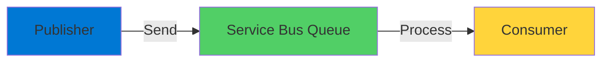
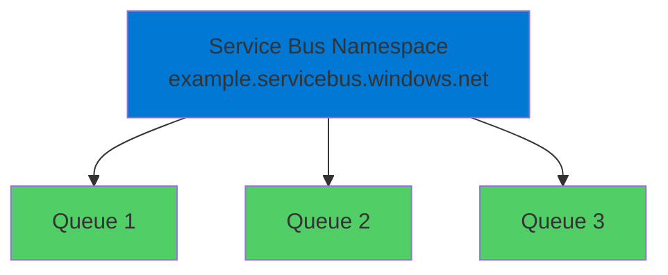
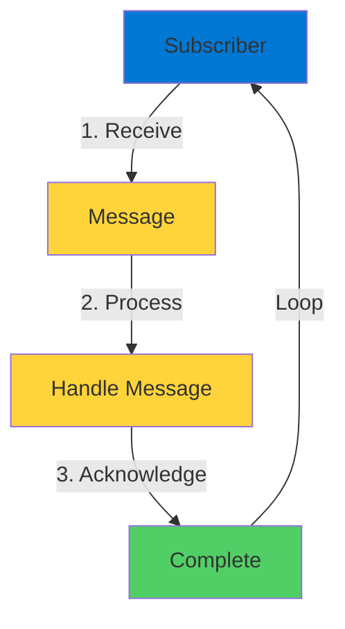
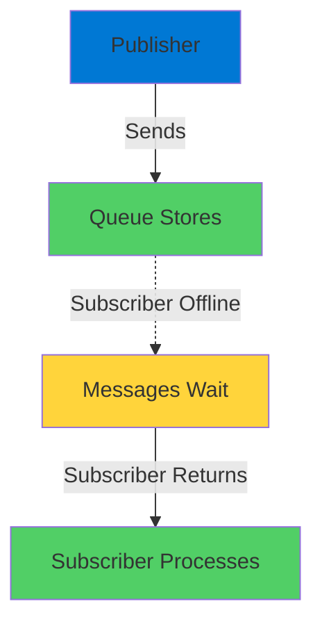
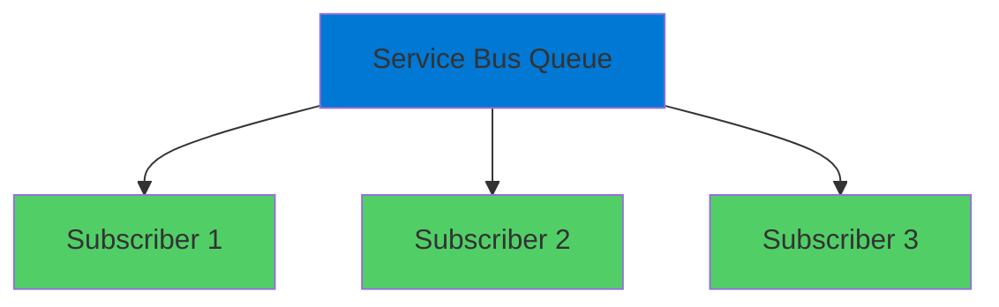

# Azure Service Bus Messaging

Enterprise-Grade Message Queuing

  <carbon-send class="text-8xl text-blue-400 opacity-80" />

---
layout: center
---

# Welcome

<v-click>

Explore Azure Service Bus Build decoupled, distributed applications

</v-click>

---
layout: section
---

# What is Service Bus?

---

# Powerful Messaging Service

<v-click>

  <carbon-send-alt class="text-6xl text-blue-400" />

</v-click>

<v-click>

High-throughput, reliable message queue

</v-click>

<v-click>

  <carbon-flash class="text-4xl text-blue-400" />
  Thousands of messages per second

</v-click>

<v-click>

  <carbon-data-backup class="text-4xl text-green-400" />
  Messages stored until processed

</v-click>

<v-click>

  <carbon-settings-adjust class="text-4xl text-purple-400" />
  Advanced features for enterprise needs

</v-click>

<v-click>

  <carbon-locked class="text-4xl text-orange-400" />
  AMQP protocol support

</v-click>

---

# Key Capabilities

<v-click>

  <carbon-warning class="text-4xl text-red-400 mt-1" />
  

    
Dead-Letter Queues

    
Handle messages that couldn't be processed

  

</v-click>

<v-click>

  <carbon-flow class="text-4xl text-blue-400 mt-1" />
  

    
Message Sessions

    
FIFO processing guarantees

  

</v-click>

<v-click>

  <carbon-checkmark-outline class="text-4xl text-green-400 mt-1" />
  

    
Duplicate Detection

    
Prevent duplicate message processing

  

</v-click>

---
layout: section
---

# Fire-and-Forget Pattern

---

# Asynchronous Communication

<v-click>

</v-click>

<v-click>

Publisher sends without expecting return

</v-click>

<v-click>

Doesn't know which component processes

</v-click>

<v-click>

Fundamental to scalable, loosely-coupled systems

</v-click>

---
layout: section
---

# Service Bus Concepts

---

# Namespace and Queues

<v-click>

</v-click>

<v-click>

Namespace: grouping construct

</v-click>

<v-click>

Contains multiple queues, topics, and subscriptions

</v-click>

---

# Pricing Tiers

<v-click>

  
1

  

    <carbon-pricing-traditional class="text-3xl inline-block" />
    Basic
    
Queues only, 256 KB messages

  

</v-click>

<v-click>

  
2

  

    <carbon-pricing-traditional class="text-3xl inline-block" />
    Standard
    
Adds topics and subscriptions

  

</v-click>

<v-click>

  
3

  

    <carbon-pricing-premium class="text-3xl inline-block" />
    Premium
    
Dedicated resources, 1 MB messages

  

</v-click>

---

# Access Control

<v-click>

  <carbon-security class="text-6xl text-purple-400" />

</v-click>

<v-click>

Shared access policies and tokens

</v-click>

<v-click>

  

    <carbon-send class="text-6xl text-blue-400" />
    
Send

  

  

    <carbon-view class="text-6xl text-green-400" />
    
Listen

  

  

    <carbon-settings class="text-6xl text-purple-400" />
    
Manage

  

</v-click>

<v-click>

Fine-grained permissions per policy

</v-click>

---
layout: section
---

# Subscriber Pattern

---

# How Subscribers Work

<v-click>

Listen on queue in infinite loop

</v-click>

<v-click>

</v-click>

<v-click>

Acknowledgement is crucial

</v-click>

<v-click>

Tells Service Bus message was handled

</v-click>

---

# Distributed Application

<v-click>

  <carbon-application class="text-4xl text-blue-400" />
  Multiple components subscribe to different queues

</v-click>

<v-click>

  <carbon-scale class="text-4xl text-green-400" />
  Multiple instances for scalability

</v-click>

<v-click>

  <carbon-network-3 class="text-4xl text-purple-400" />
  AMQP standard protocol support

</v-click>

<v-click>

Drop-in replacement for RabbitMQ

</v-click>

---
layout: section
---

# Demonstrating Reliability

---

# Message Persistence

<v-click>

</v-click>

<v-click>

No messages lost

</v-click>

<v-click>

Messages persist until acknowledged

</v-click>

---

# Key Insight

<v-click>

Service Bus stores messages until completion

</v-click>

<v-click>

  

    <carbon-checkmark-outline class="text-6xl text-green-400" />
    
Completed: Skip

  

  

    <carbon-time class="text-6xl text-orange-400" />
    
Uncompleted: Process

  

</v-click>

<v-click>

Ensures requests aren't lost or duplicated

</v-click>

---
layout: section
---

# Demonstrating Scalability

---

# Load Balancing

<v-click>

</v-click>

<v-click>

Subscribers take turns receiving messages

</v-click>

<v-click>

No message duplication

</v-click>

<v-click>

Each message processed by exactly one subscriber

</v-click>

---

# Horizontal Scaling

<v-click>

  

    <carbon-scale class="text-6xl text-blue-400" />
    
Add Instances

  

  

    <carbon-flash class="text-6xl text-green-400" />
    
Increase Throughput

  

  

    <carbon-checkmark-outline class="text-6xl text-purple-400" />
    
Automatic Distribution

  

</v-click>

<v-click>

Service Bus automatically distributes work

</v-click>

---
layout: section
---

# Key Takeaways

---

# What We Learned

<v-click>

  <carbon-checkmark class="text-4xl text-green-400" />
  Reliable, high-throughput messaging

</v-click>

<v-click>

  <carbon-checkmark class="text-4xl text-green-400" />
  Point-to-point with queues

</v-click>

<v-click>

  <carbon-checkmark class="text-4xl text-green-400" />
  Built-in horizontal scaling

</v-click>

<v-click>

  <carbon-checkmark class="text-4xl text-green-400" />
  Acknowledgement prevents loss/duplication

</v-click>

<v-click>

  <carbon-checkmark class="text-4xl text-green-400" />
  Industry-standard AMQP protocol

</v-click>

---
layout: center
class: text-center
---

<v-click>

<carbon-play-outline class="text-8xl text-green-400 inline-block" />

</v-click>

<v-click>

Let's Get Started!

</v-click>

<v-click>

Build distributed systems with Service Bus

</v-click>

