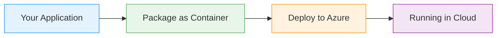
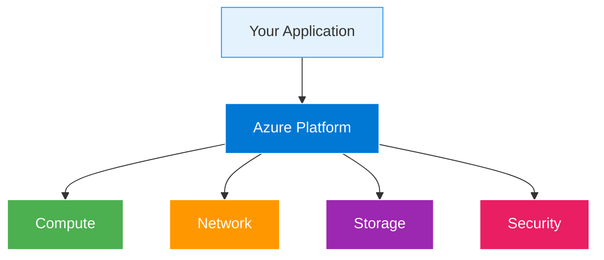

# Azure SignalR Service

  <iconify-icon icon="vscode-icons:file-type-azure" style="font-size: 4rem;" />

---

---
layout: center
---

# Azure SignalR Service - Introduction

Welcome to this module on Azure SignalR Service. In this session, we'll explore how Azure enables real-time, two-way communication between web applications and clients.

---

---
layout: center
---

# What is SignalR?

SignalR is a technology designed for two-way communication over the internet. It allows web applications to push updates to browsers in real-time, sup...

---

---
layout: center
---

# The Scaling Challenge

Here's the problem: imagine you're running a chat application with two web servers. User A connects to Server One, and User B connects to Server Two. When User A sends a message, Server One broadcasts

---

---
layout: center
---

# Azure SignalR Service

Azure SignalR Service moves SignalR functionality into its own managed component. Instead of your web application dealing with client connections directly, it simply sends update notifications to the 

---

---
layout: two-cols
---

# Service Architecture

::right::

<h3>Azure Manages</h3>
<ul>

</ul>

<h3>You Control</h3>
<ul>

</ul>

---

---
layout: center
---

# Authentication Options

Azure SignalR Service supports multiple authentication methods. You can use connection strings with access keys for quick setup and testing. For production scenarios, you'll want to use Managed Identi

---

---
layout: center
---

# Important Distinction

One critical thing to understand: SignalR Service is for real-time broadcasting, not data persistence. When clients disconnect and reconnect, previous messages are not automatically restored. If your 

---

---
layout: center
---

# Use Cases

<iconify-icon icon="mdi:web" /> Real-time chat applications

<iconify-icon icon="mdi:cog" /> Live dashboards and monitoring tools

<iconify-icon icon="mdi:code-braces" /> Collaborative applications

<iconify-icon icon="mdi:test-tube" /> Gaming platforms

<iconify-icon icon="mdi:lightning-bolt" /> IoT device telemetry displays

