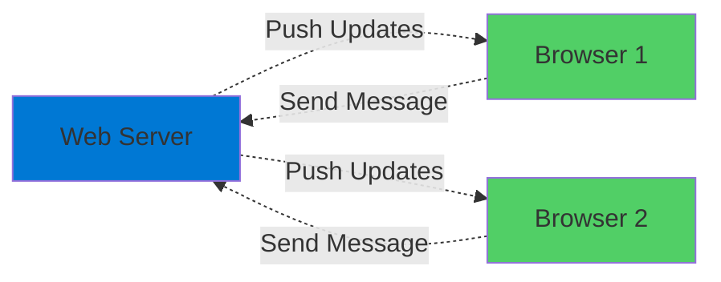
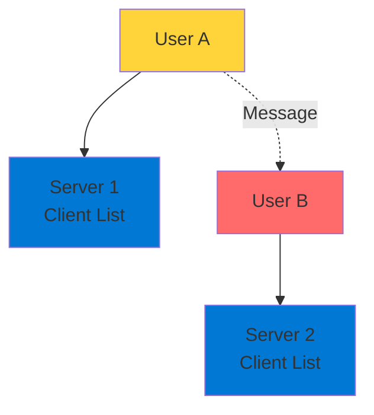
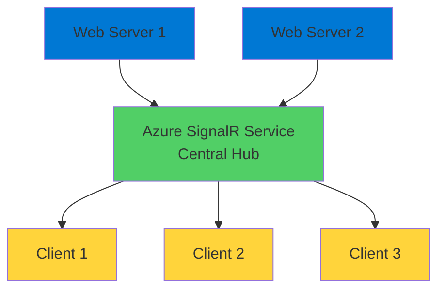

# Azure SignalR Service

Real-Time Two-Way Communication

  <carbon-chat class="text-8xl text-blue-400 opacity-80" />

---
layout: center
---

# Welcome

<!--
METADATA:
sentence: This is where Azure SignalR Service comes in.
search_anchor: This is where Azure SignalR
-->
<v-click>

Explore Azure SignalR Service Enable real-time communication in your apps

</v-click>

---
layout: section
---

# What is SignalR?

---

# Two-Way Communication

<v-click>

  <carbon-arrows-horizontal class="text-6xl text-green-400" />

</v-click>

<!--
METADATA:
sentence: SignalR is a technology designed for two-way communication over the internet.
search_anchor: SignalR is a technology designed
-->
<v-click>

Real-time, two-way communication over internet

</v-click>

<!--
METADATA:
sentence: It allows web applications to push updates to browsers in real-time, supporting asynchronous delivery to the front end.
search_anchor: It allows web applications to
-->
<v-click>

Push updates to browsers in real-time

</v-click>

<v-click>

</v-click>

---

# Use Cases

<!--
METADATA:
sentence: Think of scenarios like live chat applications, real-time dashboards, collaborative editing tools, or live notification systems - all of these benefit from SignalR's capabilities.
search_anchor: Think of scenarios like live
-->
<v-click>

  

    <carbon-chat class="text-5xl text-blue-400" />
    
Live Chat

  

  

    <carbon-dashboard class="text-5xl text-green-400" />
    
Real-Time Dashboards

  

  

    <carbon-collaborate class="text-5xl text-purple-400" />
    
Collaborative Editing

  

</v-click>

<!--
METADATA:
sentence: SignalR is Microsoft's customization of WebSockets for .NET.
search_anchor: SignalR is Microsoft's customization of
-->
<v-click>

  

    <carbon-notification class="text-5xl text-orange-400" />
    
Live Notifications

  

  

    <carbon-chart-line class="text-5xl text-red-400" />
    
Stock Tickers

  

  

    <carbon-game-wireless class="text-5xl text-blue-400" />
    
Gaming

  

</v-click>

---

# Microsoft's WebSockets for .NET

<!--
METADATA:
sentence: SignalR is Microsoft's customization of WebSockets for .NET.
search_anchor: SignalR is Microsoft's customization of
-->
<v-click>

SignalR is Microsoft's customization of WebSockets

</v-click>

<!--
METADATA:
sentence: SignalR is Microsoft's customization of WebSockets for .NET.
search_anchor: SignalR is Microsoft's customization of
-->
<v-click>

Optimized for .NET applications

</v-click>

---
layout: section
---

# The Scaling Challenge

---

# Self-Hosted Problem

<!--
METADATA:
sentence: When you run SignalR in your own application server, each server instance maintains its own list of connected clients.
search_anchor: When you run SignalR in
-->
<v-click>

Each server instance maintains own client list

</v-click>

<v-click>

</v-click>

<!--
METADATA:
sentence: User B never sees the message because they're connected to a different server instance.
search_anchor: User B never sees the
-->
<v-click>

User A's message doesn't reach User B

</v-click>

---

# The Disconnect

<!--
METADATA:
sentence: User A connects to Server One, and User B connects to Server Two.
search_anchor: User A connects to Server
-->
<v-click>

User A connects to Server One

</v-click>

<!--
METADATA:
sentence: User A connects to Server One, and User B connects to Server Two.
search_anchor: User A connects to Server
-->
<v-click>

User B connects to Server Two

</v-click>

<!--
METADATA:
sentence: When User A sends a message, Server One broadcasts it - but only to clients connected to Server One.
search_anchor: When User A sends a
-->
<v-click>

User A sends message

</v-click>

<!--
METADATA:
sentence: When User A sends a message, Server One broadcasts it - but only to clients connected to Server One.
search_anchor: When User A sends a
-->
<v-click>

Server One broadcasts to its clients only

</v-click>

<!--
METADATA:
sentence: User B never sees the message because they're connected to a different server instance.
search_anchor: User B never sees the
-->
<v-click>

User B never sees the message

</v-click>

---
layout: section
---

# Azure SignalR Service

---

# Centralized Hub

<v-click>

  <carbon-cloud-services class="text-6xl text-green-400" />

</v-click>

<!--
METADATA:
sentence: Azure SignalR Service Azure SignalR Service moves SignalR functionality into its own managed component.
search_anchor: Azure SignalR Service Azure SignalR
-->
<v-click>

Moves SignalR into managed component

</v-click>

<v-click>

</v-click>

---

# How It Works

<!--
METADATA:
sentence: The SignalR Service handles all client connections centrally.
search_anchor: SignalR Service handles all client
-->
<v-click>

App doesn't handle client connections directly

</v-click>

<!--
METADATA:
sentence: Instead of your web application dealing with client connections directly, it simply sends update notifications to the SignalR Service.
search_anchor: Instead of your web application
-->
<v-click>

Simply sends notifications to SignalR Service

</v-click>

<!--
METADATA:
sentence: The service then broadcasts that message to all connected clients, whether they're connected through the same server or different instances.
search_anchor: service then broadcasts that message
-->
<v-click>

Service broadcasts to all connected clients

</v-click>

<!--
METADATA:
sentence: The service acts as a central hub that broadcasts messages to all connected clients, regardless of which web server they originally connected through.
search_anchor: service acts as a central
-->
<v-click>

Regardless of which web server they connected through

</v-click>

---

# Three Key Benefits

<!--
METADATA:
sentence: This architecture provides several key benefits: First, scalability - you can run as many web server instances as needed without worrying about connection management.
search_anchor: This architecture provides several key
-->
<v-click>

  
1

  

    <carbon-scale class="text-3xl inline-block" />
    Scalability
    
Run as many web servers as needed

    
No connection management worries

  

</v-click>

<!--
METADATA:
sentence: Second, simplified infrastructure - you don't need to maintain additional backend infrastructure for managing client state across servers.
search_anchor: Second, simplified infrastructure - you
-->
<v-click>

  
2

  

    <carbon-clean class="text-3xl inline-block" />
    Simplified Infrastructure
    
No additional backend for client state

  

</v-click>

<!--
METADATA:
sentence: Third, Azure-managed reliability - the service is fully managed by Azure, providing high availability and automatic scaling.
search_anchor: Third, Azure-managed reliability - the
-->
<v-click>

  
3

  

    <carbon-checkmark-outline class="text-3xl inline-block" />
    Azure-Managed Reliability
    
High availability and automatic scaling

  

</v-click>

---
layout: section
---

# Authentication Options

---

# Two Approaches

<!--
METADATA:
sentence: You can use connection strings with access keys for quick setup and testing.
search_anchor: You can use connection strings
-->
<v-click>

  <carbon-password class="text-4xl text-blue-400 mt-1" />
  

    
Connection Strings with Access Keys

    
Quick setup and testing

  

</v-click>

<!--
METADATA:
sentence: For production scenarios, you'll want to use Managed Identities, which eliminate the need to store sensitive credentials in your application configuration.
search_anchor: production scenarios, you'll want to
-->
<v-click>

  <carbon-id-management class="text-4xl text-green-400 mt-1" />
  

    
Managed Identities

    
Production best practice

    
No credentials in app configuration

  

</v-click>

<!--
METADATA:
sentence: For production scenarios, you'll want to use Managed Identities, which eliminate the need to store sensitive credentials in your application configuration.
search_anchor: production scenarios, you'll want to
-->
<v-click>

Managed Identities for production

</v-click>

---
layout: section
---

# Important Distinction

---

# Broadcasting, Not Persistence

<!--
METADATA:
sentence: Important Distinction One critical thing to understand: SignalR Service is for real-time broadcasting, not data persistence.
search_anchor: Important Distinction One critical thing
-->
<v-click>

SignalR Service is for real-time broadcasting

</v-click>

<!--
METADATA:
sentence: Important Distinction One critical thing to understand: SignalR Service is for real-time broadcasting, not data persistence.
search_anchor: Important Distinction One critical thing
-->
<v-click>

NOT data persistence

</v-click>

<!--
METADATA:
sentence: When clients disconnect and reconnect, previous messages are not automatically restored.
search_anchor: When clients disconnect and reconnect
-->
<v-click>

Clients disconnect and reconnect

</v-click>

<!--
METADATA:
sentence: When clients disconnect and reconnect, previous messages are not automatically restored.
search_anchor: When clients disconnect and reconnect
-->
<v-click>

Previous messages not automatically restored

</v-click>

<!--
METADATA:
sentence: If your application needs to maintain state - like preserving chat history - you'll need to implement that separately using a database or other storage solution.
search_anchor: If your application needs to
-->
<v-click>

Need state? Use database separately

</v-click>

---
layout: section
---

# What We'll Build

---

# Hands-On Lab

<!--
METADATA:
sentence: The Scaling Challenge Here's the problem: imagine you're running a chat application with two web servers.
search_anchor: Scaling Challenge Here's the problem
-->
<v-click>

  <carbon-development class="text-4xl text-blue-400" />
  Run chat app locally

</v-click>

<!--
METADATA:
sentence: The Scaling Challenge Here's the problem: imagine you're running a chat application with two web servers.
search_anchor: Scaling Challenge Here's the problem
-->
<v-click>

  <carbon-warning class="text-4xl text-orange-400" />
  Observe scaling challenges

</v-click>

<!--
METADATA:
sentence: This is where Azure SignalR Service comes in.
search_anchor: This is where Azure SignalR
-->
<v-click>

  <carbon-cloud-services class="text-4xl text-green-400" />
  Integrate with Azure SignalR Service

</v-click>

<!--
METADATA:
sentence: We'll deploy the application to Azure App Service and configure secure authentication using Managed Identities.
search_anchor: We'll deploy the application to
-->
<v-click>

  <carbon-deployment-pattern class="text-4xl text-purple-400" />
  Deploy to Azure App Service

</v-click>

<!--
METADATA:
sentence: We'll deploy the application to Azure App Service and configure secure authentication using Managed Identities.
search_anchor: We'll deploy the application to
-->
<v-click>

  <carbon-id-management class="text-4xl text-red-400" />
  Configure Managed Identities

</v-click>

---
layout: center
class: text-center
---

<v-click>

<carbon-play-outline class="text-8xl text-green-400 inline-block" />

</v-click>

<!--
METADATA:
sentence: Let's get started with the practical exercises.
search_anchor: Let's get started with the
-->
<v-click>

Let's Get Started!

</v-click>

<!--
METADATA:
sentence: In this session, we'll explore how Azure enables real-time, two-way communication between web applications and clients.
search_anchor: this session, we'll explore how
-->
<v-click>

Build real-time communication into your apps

</v-click>

