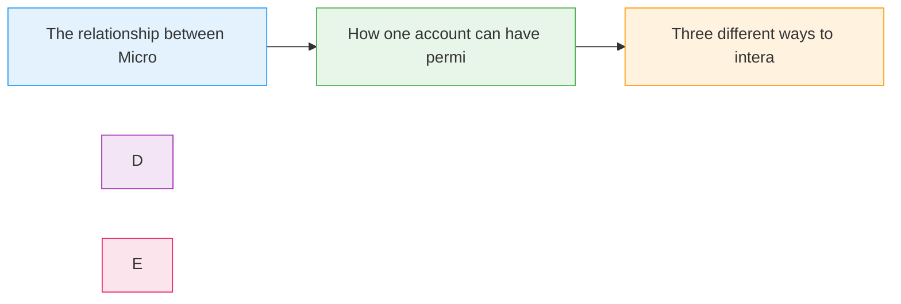

# Azure Signin

  <iconify-icon icon="vscode-icons:file-type-azure" style="font-size: 4rem;" />

---

---
layout: center
---

# Azure Signin - Introduction

Welcome to this module on Azure authentication and sign-in. In this lesson, we'll explore how to access Azure using different methods and understand the fundamental concepts of Azure accounts and subs

---

---
layout: center
---

# What You'll Learn

---

---
layout: center
---

# Azure Accounts and Subscriptions

Think of your Microsoft account as your identity in Azure. This single account can have access to one or more Azure Subscriptions. Each Subscription is a logical container for your Azure resources and

---

---
layout: center
---

# Three Ways to Access Azure

There are three primary ways to interact with Azure:

---

---
layout: center
---

# Why Learn Multiple Access Methods?

Each method has its strengths:
- The Portal is ideal for discovery and visual exploration
- The CLI is best for automation and repeatable deployments
- The Cloud Shell provides quick access without lo

