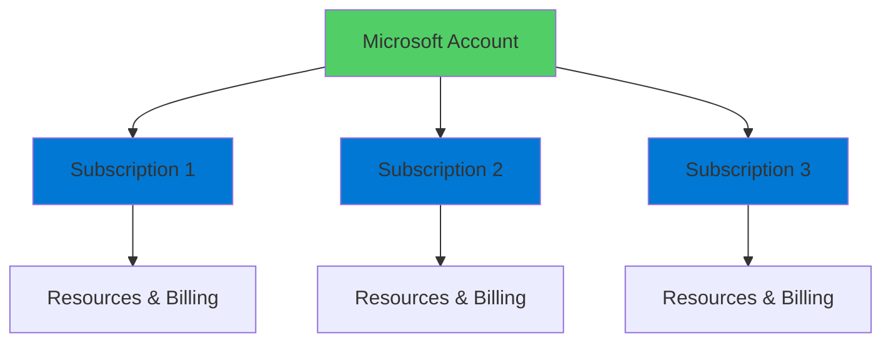

# Azure Sign-In

Foundation of Working with Azure

  <carbon-login class="text-8xl text-blue-400 opacity-80" />

---
layout: center
---

# Welcome

<!--
METADATA:
sentence: What You'll Learn Azure uses Microsoft accounts for authentication and authorization.
search_anchor: What You'll Learn Azure uses
-->
<v-click>

Explore Azure authentication Essential foundation for all Azure work

</v-click>

---
layout: section
---

# Azure Accounts and Subscriptions

---

# Your Identity

<v-click>

  <carbon-user class="text-6xl text-blue-400" />

</v-click>

<!--
METADATA:
sentence: In a corporate environment, your account would be managed by your organization's Azure Active Directory.
search_anchor: corporate environment, your account would
-->
<v-click>

Microsoft account = your identity in Azure

</v-click>

<!--
METADATA:
sentence: This single account can have access to one or more Azure Subscriptions.
search_anchor: This single account can have
-->
<v-click>

Single account can access multiple Subscriptions

</v-click>

<v-click>

</v-click>

---

# Subscriptions

<!--
METADATA:
sentence: Each Subscription is a logical container for your Azure resources and has its own billing and access management.
search_anchor: Each Subscription is a logical
-->
<v-click>

Logical container for Azure resources

</v-click>

<!--
METADATA:
sentence: Why Learn Multiple Access Methods?
search_anchor: Why Learn Multiple Access Methods
-->
<v-click>

  

    <carbon-receipt class="text-6xl text-green-400" />
    
Own Billing

  

  

    <carbon-user-access class="text-6xl text-blue-400" />
    
Access Management

  

</v-click>

---

# Account Types

<!--
METADATA:
sentence: In a corporate environment, your account would be managed by your organization's Azure Active Directory.
search_anchor: corporate environment, your account would
-->
<v-click>

  <carbon-enterprise class="text-4xl text-blue-400 mt-1" />
  

    
Corporate Environment

    
Managed by organization's Azure Active Directory

  

</v-click>

<!--
METADATA:
sentence: For learning and personal projects, you can create your own Microsoft account and Azure Subscription.
search_anchor: learning and personal projects, you
-->
<v-click>

  <carbon-user class="text-4xl text-green-400 mt-1" />
  

    
Personal / Learning

    
Create own Microsoft account and Subscription

  

</v-click>

---
layout: section
---

# Three Ways to Access Azure

---

# Access Methods

<!--
METADATA:
sentence: It's great for exploration and visual management, but it's not easily automated.
search_anchor: It's great for exploration and
-->
<v-click>

  
1

  

    <carbon-browser class="text-3xl inline-block" />
    Azure Portal
    
Web-based graphical interface

    
Great for exploration and visual management

    
Not easily automated

  

</v-click>

<!--
METADATA:
sentence: The Azure CLI - A cross-platform command-line tool that provides a scriptable, repeatable way to manage Azure resources.
search_anchor: Azure CLI - A cross-platform
-->
<v-click>

  
2

  

    <carbon-terminal class="text-3xl inline-block" />
    Azure CLI
    
Cross-platform command-line tool

    
Scriptable and repeatable

    
Recommended for developers

  

</v-click>

<!--
METADATA:
sentence: The Azure Cloud Shell - A browser-based shell environment that comes with Azure tools pre-installed and configured.
search_anchor: Azure Cloud Shell - A
-->
<v-click>

  
3

  

    <carbon-cloud-app class="text-3xl inline-block" />
    Azure Cloud Shell
    
Browser-based shell environment

    
Azure tools pre-installed

    
No local installation needed

  

</v-click>

---
layout: section
---

# Azure Portal

---

# Web-Based Interface

<v-click>

  <carbon-browser class="text-6xl text-blue-400" />

</v-click>

<!--
METADATA:
sentence: Three Ways to Access Azure There are three primary ways to interact with Azure: The Azure Portal - A web-based graphical interface where you can browse services, create resources, and manage your Azure environment.
search_anchor: Three Ways to Access Azure
-->
<v-click>

Browse services, create resources, manage environment

</v-click>

<!--
METADATA:
sentence: It's great for exploration and visual management, but it's not easily automated.
search_anchor: It's great for exploration and
-->
<v-click>

  

    <carbon-checkmark-outline class="text-6xl text-green-400" />
    
Visual exploration

  

  

    <carbon-checkmark-outline class="text-6xl text-green-400" />
    
Easy discovery

  

</v-click>

<!--
METADATA:
sentence: It's great for exploration and visual management, but it's not easily automated.
search_anchor: It's great for exploration and
-->
<v-click>

Not easily automated

</v-click>

---
layout: section
---

# Azure CLI

---

# Command-Line Power

<v-click>

  <carbon-terminal class="text-6xl text-green-400" />

</v-click>

<!--
METADATA:
sentence: The Azure CLI - A cross-platform command-line tool that provides a scriptable, repeatable way to manage Azure resources.
search_anchor: Azure CLI - A cross-platform
-->
<v-click>

Cross-platform command-line tool

</v-click>

<!--
METADATA:
sentence: The Azure CLI - A cross-platform command-line tool that provides a scriptable, repeatable way to manage Azure resources.
search_anchor: Azure CLI - A cross-platform
-->
<v-click>

  

    <carbon-document-tasks class="text-6xl text-blue-400" />
    
Scriptable

  

  

    <carbon-renew class="text-6xl text-green-400" />
    
Repeatable

  

  

    <carbon-deployment-pattern class="text-6xl text-purple-400" />
    
Automate

  

</v-click>

<!--
METADATA:
sentence: This is the recommended approach for developers and anyone who needs to automate Azure operations.
search_anchor: This is the recommended approach
-->
<v-click>

Recommended for developers

</v-click>

---
layout: section
---

# Azure Cloud Shell

---

# Browser-Based Shell

<v-click>

  <carbon-cloud-app class="text-6xl text-purple-400" />

</v-click>

<!--
METADATA:
sentence: The Azure Cloud Shell - A browser-based shell environment that comes with Azure tools pre-installed and configured.
search_anchor: Azure Cloud Shell - A
-->
<v-click>

Azure tools pre-installed and configured

</v-click>

<!--
METADATA:
sentence: Perfect for when you can't install the CLI locally but need command-line access to Azure.
search_anchor: Perfect for when you can't
-->
<v-click>

  <carbon-checkmark class="text-4xl text-green-400" />
  No local installation required

</v-click>

<!--
METADATA:
sentence: Why Learn Multiple Access Methods?
search_anchor: Why Learn Multiple Access Methods
-->
<v-click>

  <carbon-checkmark class="text-4xl text-green-400" />
  Access from any browser

</v-click>

<!--
METADATA:
sentence: What You'll Learn Azure uses Microsoft accounts for authentication and authorization.
search_anchor: What You'll Learn Azure uses
-->
<v-click>

  <carbon-checkmark class="text-4xl text-green-400" />
  Already authenticated

</v-click>

---
layout: section
---

# Why Learn Multiple Methods?

---

# Different Strengths

<!--
METADATA:
sentence: It's great for exploration and visual management, but it's not easily automated.
search_anchor: It's great for exploration and
-->
<v-click>

  <carbon-browser class="text-4xl text-blue-400 mt-1" />
  

    
Portal

    
Discovery and visual exploration

  

</v-click>

<!--
METADATA:
sentence: The Azure CLI - A cross-platform command-line tool that provides a scriptable, repeatable way to manage Azure resources.
search_anchor: Azure CLI - A cross-platform
-->
<v-click>

  <carbon-terminal class="text-4xl text-green-400 mt-1" />
  

    
CLI

    
Automation and repeatable deployments

  

</v-click>

<!--
METADATA:
sentence: The Azure Cloud Shell - A browser-based shell environment that comes with Azure tools pre-installed and configured.
search_anchor: Azure Cloud Shell - A
-->
<v-click>

  <carbon-cloud-app class="text-4xl text-purple-400 mt-1" />
  

    
Cloud Shell

    
Quick access without local installation

  

</v-click>

<!--
METADATA:
sentence: Let's begin by exploring the Azure Portal.
search_anchor: Let's begin by exploring the
-->
<v-click>

Use all three depending on the task

</v-click>

---

# Important Skill

<!--
METADATA:
sentence: Understanding when to use each approach is an important skill.
search_anchor: Understanding when to use each
-->
<v-click>

Understanding when to use each approach

</v-click>

<!--
METADATA:
sentence: The Azure CLI - A cross-platform command-line tool that provides a scriptable, repeatable way to manage Azure resources.
search_anchor: Azure CLI - A cross-platform
-->
<v-click>

  

    <carbon-decision-tree class="text-6xl text-blue-400" />
    
Right Tool

  

  

    <carbon-time class="text-6xl text-green-400" />
    
Right Time

  

  

    <carbon-checkmark-outline class="text-6xl text-purple-400" />
    
Right Task

  

</v-click>

---
layout: section
---

# What's Next

---

# Explore the Portal

<!--
METADATA:
sentence: Let's begin by exploring the Azure Portal.
search_anchor: Let's begin by exploring the
-->
<v-click>

  

    <carbon-browser class="text-6xl text-blue-400" />
    
Navigate Azure Portal

  

  

    <carbon-cloud-services class="text-6xl text-green-400" />
    
Discover Services

  

  

    <carbon-document-view class="text-6xl text-purple-400" />
    
Understand Layout

  

</v-click>

<!--
METADATA:
sentence: Let's begin by exploring the Azure Portal.
search_anchor: Let's begin by exploring the
-->
<v-click>

Foundation for all Azure development

</v-click>

---
layout: center
class: text-center
---

<v-click>

<carbon-play-outline class="text-8xl text-green-400 inline-block" />

</v-click>

<!--
METADATA:
sentence: Let's begin by exploring the Azure Portal.
search_anchor: Let's begin by exploring the
-->
<v-click>

Let's Begin!

</v-click>

<!--
METADATA:
sentence: Let's begin by exploring the Azure Portal.
search_anchor: Let's begin by exploring the
-->
<v-click>

Start your Azure journey

</v-click>

