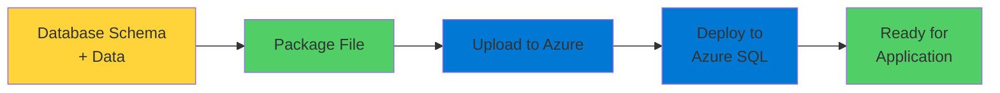

# Deploying Database Schemas

Working with Existing Database Structures

  <carbon-data-base class="text-8xl text-blue-400 opacity-80" />

---
layout: center
---

# Welcome

<!--
METADATA:
sentence: In this session, we'll explore how to work with existing database schemas and deploy them to Azure using Microsoft's data tier application packages.
search_anchor: this session, we'll explore how
-->
<v-click>

Deploy existing database schemas to Azure Using Microsoft's data tier application packages

</v-click>

---
layout: section
---

# The Problem

---

# Empty Database Challenge

<v-click>

  <carbon-warning class="text-6xl text-orange-400" />

</v-click>

<!--
METADATA:
sentence: The Problem When you're working with Azure SQL Database, you often start with an empty database.
search_anchor: Problem When you're working with
-->
<v-click>

Azure SQL Database starts empty

</v-click>

<!--
METADATA:
sentence: That's fine if your application uses an ORM like Entity Framework that can create its own schema automatically.
search_anchor: That's fine if your application
-->
<v-click>

Fine if using ORM like Entity Framework

</v-click>

<!--
METADATA:
sentence: That's fine if your application uses an ORM like Entity Framework that can create its own schema automatically.
search_anchor: That's fine if your application
-->
<v-click>

Creates its own schema automatically

</v-click>

<!--
METADATA:
sentence: But what if you're working with an existing database?
search_anchor: But what if you're working
-->
<v-click>

But what about existing databases?

</v-click>

---

# Real-World Scenarios

<!--
METADATA:
sentence: This makes it ready for your application to use immediately.
search_anchor: This makes it ready for
-->
<v-click>

  <carbon-enterprise class="text-4xl text-blue-400" />
  Legacy applications

</v-click>

<!--
METADATA:
sentence: What if you have a legacy application, or a database that was designed and developed outside of your application code?
search_anchor: What if you have a
-->
<v-click>

  <carbon-data-base class="text-4xl text-green-400" />
  Database designed outside application code

</v-click>

<!--
METADATA:
sentence: You might be migrating from an on-premises SQL Server, or you might be deploying a packaged application that comes with its own database structure.
search_anchor: You might be migrating from
-->
<v-click>

  <carbon-cloud-upload class="text-4xl text-purple-400" />
  Migrating from on-premises SQL Server

</v-click>

<!--
METADATA:
sentence: But what if you're working with an existing database?
search_anchor: But what if you're working
-->
<v-click>

  <carbon-package class="text-4xl text-orange-400" />
  Packaged application with own database

</v-click>

<!--
METADATA:
sentence: Many real-world scenarios require you to deploy a pre-existing database schema to Azure.
search_anchor: Many real-world scenarios require you
-->
<v-click>

Need to deploy pre-existing schema

</v-click>

---
layout: section
---

# The Solution

---

# Package and Deploy

<v-click>

  <carbon-package class="text-6xl text-green-400" />

</v-click>

<!--
METADATA:
sentence: The Solution Microsoft provides a packaging format specifically for this purpose.
search_anchor: Solution Microsoft provides a packaging
-->
<v-click>

Microsoft provides packaging format

</v-click>

<v-click>

</v-click>

---
layout: section
---

# Key Concepts

---

# Two File Formats

<!--
METADATA:
sentence: Think of this as a complete backup of your database - structure and content together.
search_anchor: Think of this as a
-->
<v-click>

  
1

  

    <carbon-document-multiple class="text-3xl inline-block" />
    Bacpac Files
    
Schema AND data together

    
Complete backup - structure + content

    
Export and import entire database

  

</v-click>

<!--
METADATA:
sentence: Dacpac files contain only the database schema - the table definitions, stored procedures, views, and other database objects - but no data.
search_anchor: Dacpac files contain only the
-->
<v-click>

  
2

  

    <carbon-document-blank class="text-3xl inline-block" />
    Dacpac Files
    
Schema only - no data

    
Tables, procedures, views, objects

    
Deploy structure, app populates data

  

</v-click>

---

# Choose the Right Format

<!--
METADATA:
sentence: Dacpac files contain only the database schema - the table definitions, stored procedures, views, and other database objects - but no data.
search_anchor: Dacpac files contain only the
-->
<v-click>

  

    <carbon-document-multiple class="text-6xl text-blue-400" />
    
Bacpac

    
Schema + Data

    
Complete migration

  

  

    <carbon-document-blank class="text-6xl text-green-400" />
    
Dacpac

    
Schema Only

    
Fresh deployment

  

</v-click>

---
layout: section
---

# What We'll Build

---

# Lab Scenario

<!--
METADATA:
sentence: What We'll Build In this lab, we'll take an existing Bacpac file and deploy it to Azure SQL Database.
search_anchor: What We'll Build In this
-->
<v-click>

Deploy existing Bacpac file to Azure SQL Database

</v-click>

<!--
METADATA:
sentence: The file contains a simple assets management database with tables for locations, asset types, and assets.
search_anchor: file contains a simple assets
-->
<v-click>

Simple assets management database

</v-click>

<!--
METADATA:
sentence: The file contains a simple assets management database with tables for locations, asset types, and assets.
search_anchor: file contains a simple assets
-->
<v-click>

  

    <carbon-location class="text-5xl text-blue-400" />
    
Locations

  

  

    <carbon-category class="text-5xl text-green-400" />
    
Asset Types

  

  

    <carbon-document class="text-5xl text-purple-400" />
    
Assets

  

</v-click>

---

# Lab Steps

<!--
METADATA:
sentence: The Problem When you're working with Azure SQL Database, you often start with an empty database.
search_anchor: Problem When you're working with
-->
<v-click>

  <carbon-server class="text-4xl text-blue-400" />
  Create Azure SQL Server

</v-click>

<!--
METADATA:
sentence: What We'll Build In this lab, we'll take an existing Bacpac file and deploy it to Azure SQL Database.
search_anchor: What We'll Build In this
-->
<v-click>

  <carbon-cloud-upload class="text-4xl text-green-400" />
  Upload Bacpac to Azure Storage

</v-click>

<!--
METADATA:
sentence: Many real-world scenarios require you to deploy a pre-existing database schema to Azure.
search_anchor: Many real-world scenarios require you
-->
<v-click>

  <carbon-deployment-pattern class="text-4xl text-purple-400" />
  Import schema and data to new database

</v-click>

<!--
METADATA:
sentence: These are useful when you want to deploy just the structure and let your application populate the data.
search_anchor: These are useful when you
-->
<v-click>

  <carbon-checkmark-outline class="text-4xl text-orange-400" />
  Verify deployment by querying data

</v-click>

---
layout: section
---

# Why This Matters

---

# Critical Skill

<!--
METADATA:
sentence: Many real-world scenarios require you to deploy a pre-existing database schema to Azure.
search_anchor: Many real-world scenarios require you
-->
<v-click>

Migrating existing databases to Azure

</v-click>

<!--
METADATA:
sentence: The file contains a simple assets management database with tables for locations, asset types, and assets.
search_anchor: file contains a simple assets
-->
<v-click>

  

    <carbon-enterprise class="text-6xl text-blue-400" />
    
Legacy Systems

  

  

    <carbon-package class="text-6xl text-green-400" />
    
Packaged Apps

  

  

    <carbon-cloud-upload class="text-6xl text-purple-400" />
    
Cloud Migration

  

</v-click>

<!--
METADATA:
sentence: This makes it ready for your application to use immediately.
search_anchor: This makes it ready for
-->
<v-click>

Essential for cloud developers

</v-click>

---
layout: center
class: text-center
---

<v-click>

<carbon-play-outline class="text-8xl text-green-400 inline-block" />

</v-click>

<!--
METADATA:
sentence: The Problem When you're working with Azure SQL Database, you often start with an empty database.
search_anchor: Problem When you're working with
-->
<v-click>

Let's Get Started!

</v-click>

<!--
METADATA:
sentence: Many real-world scenarios require you to deploy a pre-existing database schema to Azure.
search_anchor: Many real-world scenarios require you
-->
<v-click>

Deploy existing databases to Azure

</v-click>

