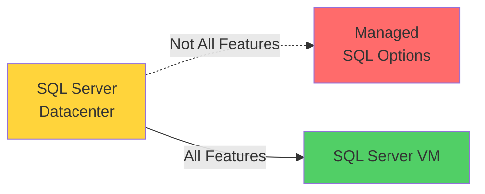
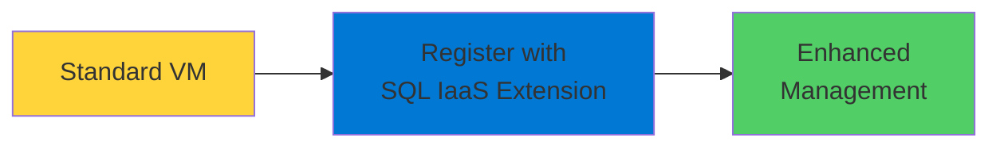

# SQL Server Virtual Machines

Complete Control in Azure

  <carbon-virtual-machine class="text-8xl text-blue-400 opacity-80" />

---
layout: center
---

# Welcome

<!--
METADATA:
sentence: That's where Azure SQL Server VMs come in.
search_anchor: That's where Azure SQL Server
-->
<v-click>

Explore SQL Server VMs When you need full SQL Server features

</v-click>

---
layout: section
---

# Why SQL Server VMs?

---

# Feature Gaps

<!--
METADATA:
sentence: That's where Azure SQL Server VMs come in.
search_anchor: That's where Azure SQL Server
-->
<v-click>

Managed SQL options should be preferred

</v-click>

<!--
METADATA:
sentence: That's where Azure SQL Server VMs come in.
search_anchor: That's where Azure SQL Server
-->
<v-click>

Azure SQL Database and SQL Managed Instance

</v-click>

<!--
METADATA:
sentence: That's where Azure SQL Server VMs come in.
search_anchor: That's where Azure SQL Server
-->
<v-click>

But they don't support 100% of SQL Server features

</v-click>

<v-click>

</v-click>

---

# When You Need Features

<!--
METADATA:
sentence: There will be occasions where you need a feature that isn't available in the managed options.
search_anchor: There will be occasions where
-->
<v-click>

Occasions where you need a feature

</v-click>

<!--
METADATA:
sentence: There will be occasions where you need a feature that isn't available in the managed options.
search_anchor: There will be occasions where
-->
<v-click>

Not available in managed options

</v-click>

<!--
METADATA:
sentence: That's where Azure SQL Server VMs come in.
search_anchor: That's where Azure SQL Server
-->
<v-click>

That's where SQL VMs come in

</v-click>

---
layout: section
---

# Complete Control

---

# Set Up Your Way

<!--
METADATA:
sentence: That's where Azure SQL Server VMs come in.
search_anchor: That's where Azure SQL Server
-->
<v-click>

SQL VM service provides complete control

</v-click>

<!--
METADATA:
sentence: The SQL VM service lets you set up the underlying operating system and SQL Server deployment exactly how you need to, giving you complete control and access to all SQL Server features.
search_anchor: SQL VM service lets you
-->
<v-click>

  <carbon-settings class="text-4xl text-blue-400" />
  Configure operating system exactly as needed

</v-click>

<!--
METADATA:
sentence: That's where Azure SQL Server VMs come in.
search_anchor: That's where Azure SQL Server
-->
<v-click>

  <carbon-data-base class="text-4xl text-green-400" />
  Deploy SQL Server your way

</v-click>

<!--
METADATA:
sentence: That's where Azure SQL Server VMs come in.
search_anchor: That's where Azure SQL Server
-->
<v-click>

  <carbon-checkmark class="text-4xl text-purple-400" />
  Access to all SQL Server features

</v-click>

---
layout: section
---

# What We'll Cover

---

# Lab Topics

<!--
METADATA:
sentence: What We'll Cover In this lab, we'll work through several key topics: First, we'll explore Azure SQL options in the Portal to understand the different choices available, including SQL Virtual Machines with Linux and Windows variants, different SQL Server versions, and various SKUs.
search_anchor: What We'll Cover In this
-->
<v-click>

  
1

  

    <carbon-browser class="text-3xl inline-block" />
    Explore Azure SQL Options
    
Linux and Windows variants

    
Different SQL Server versions and SKUs

  

</v-click>

<!--
METADATA:
sentence: We'll start by finding the right VM image - SQL Server 2019 Standard on Windows Server 2022 - and create our virtual machine.
search_anchor: We'll start by finding the
-->
<v-click>

  
2

  

    <carbon-terminal class="text-3xl inline-block" />
    Create VM with Azure CLI
    
Find right VM image

    
SQL Server 2019 Standard on Windows Server 2022

  

</v-click>

<!--
METADATA:
sentence: Then, we'll register the VM with the SQL Server IaaS extension.
search_anchor: Then, we'll register the VM
-->
<v-click>

  
3

  

    <carbon-deployment-pattern class="text-3xl inline-block" />
    Register with SQL IaaS Extension
    
Transform to managed-like service

    
Enhanced management capabilities

  

</v-click>

---

# More Lab Topics

<!--
METADATA:
sentence: We'll configure public access to the database and set up SQL authentication with a username and password.
search_anchor: We'll configure public access to
-->
<v-click>

  
4

  

    <carbon-network-3 class="text-3xl inline-block" />
    Configure Public Access
    
Set up SQL authentication

    
Username and password

  

</v-click>

<!--
METADATA:
sentence: Finally, we'll demonstrate a real-world use case: creating a custom User-Defined Function that calls .NET code.
search_anchor: Finally, we'll demonstrate a real-world
-->
<v-click>

  
5

  

    <carbon-code class="text-3xl inline-block" />
    Real-World Use Case
    
User-Defined Function calling .NET code

    
Not available in managed options

  

</v-click>

---
layout: section
---

# SQL IaaS Extension

---

# Enhanced Management

<!--
METADATA:
sentence: Then, we'll register the VM with the SQL Server IaaS extension.
search_anchor: Then, we'll register the VM
-->
<v-click>

Register VM with SQL Server IaaS extension

</v-click>

<v-click>

</v-click>

<!--
METADATA:
sentence: This effectively transforms your standard VM into something more like a managed database service, giving you enhanced management capabilities.
search_anchor: This effectively transforms your standard
-->
<v-click>

Transforms VM into managed-like service

</v-click>

---
layout: section
---

# Feature Example

---

# User-Defined Functions

<!--
METADATA:
sentence: Finally, we'll demonstrate a real-world use case: creating a custom User-Defined Function that calls .NET code.
search_anchor: Finally, we'll demonstrate a real-world
-->
<v-click>

Create UDF that calls .NET code

</v-click>

<!--
METADATA:
sentence: This is a feature that isn't available with managed database options because you need direct access to the file system and elevated SQL Server permissions.
search_anchor: This is a feature that
-->
<v-click>

Requires direct file system access

</v-click>

<!--
METADATA:
sentence: That's where Azure SQL Server VMs come in.
search_anchor: That's where Azure SQL Server
-->
<v-click>

Requires elevated SQL Server permissions

</v-click>

<!--
METADATA:
sentence: There will be occasions where you need a feature that isn't available in the managed options.
search_anchor: There will be occasions where
-->
<v-click>

Not available with managed database options

</v-click>

<!--
METADATA:
sentence: In this session, we'll explore when and why you might choose SQL Server VMs over managed database options.
search_anchor: this session, we'll explore when
-->
<v-click>

Perfect example of why you might need SQL VMs

</v-click>

---
layout: section
---

# Trade-offs

---

# Managed vs VMs

<!--
METADATA:
sentence: That's where Azure SQL Server VMs come in.
search_anchor: That's where Azure SQL Server
-->
<v-click>

  

    <carbon-cloud-services class="text-6xl text-green-400" />
    
Managed SQL

    
Automatic maintenance

    
High availability built-in

    
Some features missing

  

  

    <carbon-virtual-machine class="text-6xl text-blue-400" />
    
SQL VMs

    
All SQL Server features

    
Complete control

    
You manage OS/patches

  

</v-click>

<!--
METADATA:
sentence: In this session, we'll explore when and why you might choose SQL Server VMs over managed database options.
search_anchor: this session, we'll explore when
-->
<v-click>

Choose managed when possible

</v-click>

<!--
METADATA:
sentence: There will be occasions where you need a feature that isn't available in the managed options.
search_anchor: There will be occasions where
-->
<v-click>

Use VMs when you need specific features

</v-click>

---
layout: center
class: text-center
---

<v-click>

<carbon-play-outline class="text-8xl text-green-400 inline-block" />

</v-click>

<!--
METADATA:
sentence: That's where Azure SQL Server VMs come in.
search_anchor: That's where Azure SQL Server
-->
<v-click>

Let's Get Started!

</v-click>

<!--
METADATA:
sentence: That's where Azure SQL Server VMs come in.
search_anchor: That's where Azure SQL Server
-->
<v-click>

Explore SQL Server VMs in Azure

</v-click>

