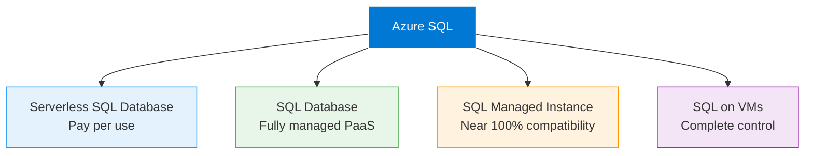

# Azure SQL Options

```mermaid
graph TB
    AzureSQL[Azure SQL] --> Serverless[Serverless SQL Database<br/>Pay per use]
    AzureSQL --> Managed[SQL Database<br/>Fully managed PaaS]
    AzureSQL --> MI[SQL Managed Instance<br/>Near 100% compatibility]
    AzureSQL --> VM[SQL on VMs<br/>Complete control]

    style AzureSQL fill:#0078d4,stroke:#fff,color:#fff
    style Serverless fill:#e3f2fd,stroke:#2196f3
    style Managed fill:#e8f5e9,stroke:#4caf50
    style MI fill:#fff3e0,stroke:#ff9800
    style VM fill:#f3e5f5,stroke:#9c27b0
```
