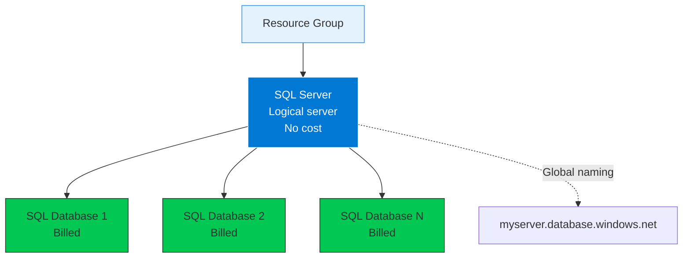

# SQL Hierarchy

```mermaid
graph TB
    RG[Resource Group] --> Server[SQL Server<br/>Logical server<br/>No cost]
    Server --> DB1[SQL Database 1<br/>Billed]
    Server --> DB2[SQL Database 2<br/>Billed]
    Server --> DB3[SQL Database N<br/>Billed]

    Server -.Global naming.-> DNS[myserver.database.windows.net]

    style RG fill:#e3f2fd,stroke:#2196f3
    style Server fill:#0078d4,stroke:#fff,color:#fff
    style DB1 fill:#00c853,stroke:#333
    style DB2 fill:#00c853,stroke:#333
    style DB3 fill:#00c853,stroke:#333
```

  
Server = free container | Databases = billed resources

