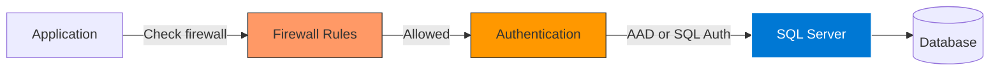

# Security & Access

```mermaid
graph LR
    App[Application] -->|Check firewall| FW[Firewall Rules]
    FW -->|Allowed| Auth[Authentication]
    Auth -->|AAD or SQL Auth| Server[SQL Server]
    Server --> DB[(Database)]

    style FW fill:#f96,stroke:#333
    style Auth fill:#ff9800,stroke:#333
    style Server fill:#0078d4,stroke:#fff,color:#fff
```

- Firewall rules required
- Azure AD authentication
- SQL authentication
- Globally unique server names

