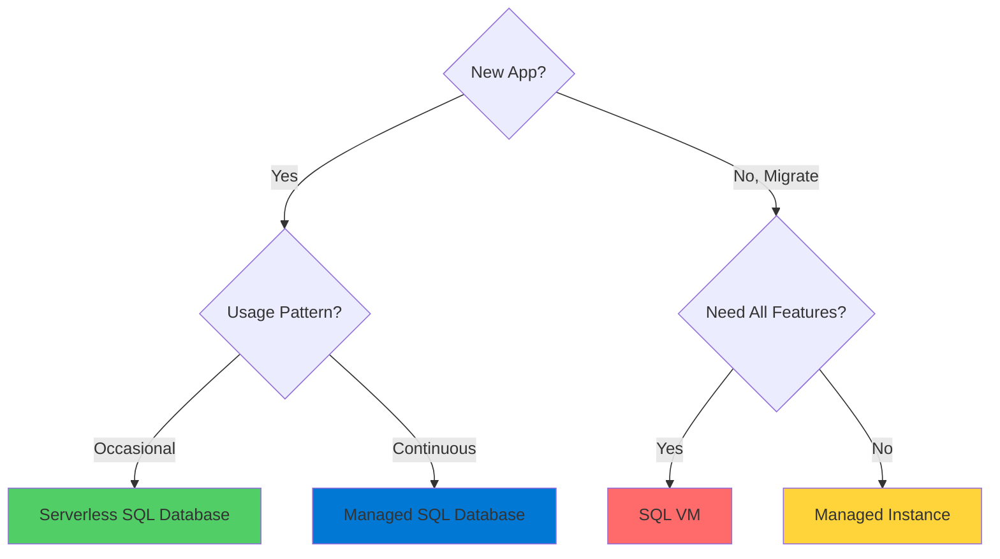
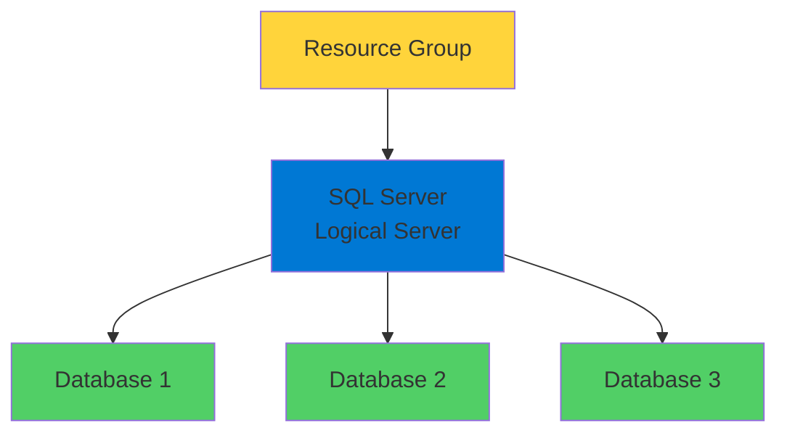
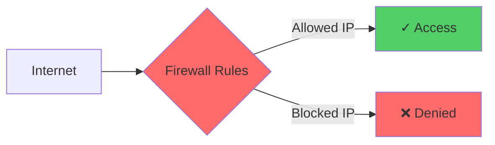

# Azure SQL

Managed SQL Server in the Cloud

<div class="abs-bottom-10 left-10">
  <carbon-data-base class="text-8xl text-blue-400 opacity-80" />
</div>

---
layout: center
---

# Welcome

<v-click>

<div class="text-xl mt-8">
Explore Azure SQL options<br/>Learn when and how to use each service
</div>

</v-click>

---
layout: section
---

# What is Azure SQL?

---

# Multiple SQL Server Services

<v-click>

<div class="mt-8 grid grid-cols-2 gap-8">
  <div class="text-center">
    <carbon-cloud class="text-6xl text-blue-400" />
    <div class="text-lg mt-3">Serverless</div>
    <div class="text-xs mt-2 opacity-70">Pay only when in use</div>
  </div>
  <div class="text-center">
    <carbon-data-base class="text-6xl text-green-400" />
    <div class="text-lg mt-3">Managed Databases</div>
    <div class="text-xs mt-2 opacity-70">Fully managed DBaaS</div>
  </div>
  <div class="text-center">
    <carbon-enterprise class="text-6xl text-purple-400" />
    <div class="text-lg mt-3">Managed Instances</div>
    <div class="text-xs mt-2 opacity-70">Near 100% SQL compatibility</div>
  </div>
  <div class="text-center">
    <carbon-virtual-machine class="text-6xl text-orange-400" />
    <div class="text-lg mt-3">SQL VMs</div>
    <div class="text-xs mt-2 opacity-70">Complete feature parity</div>
  </div>
</div>

</v-click>

<v-click>

<div class="mt-12 text-center text-xl">
Flexibility to match your workload requirements
</div>

</v-click>

---
layout: section
---

# Which Option to Choose?

---

# Decision Tree

<v-click>

<div class="mt-8">



</div>

</v-click>

---

# Serverless SQL Database

<v-click>

<div class="mt-4">
  <carbon-cloud class="text-6xl text-blue-400" />
</div>

</v-click>

<v-click>

<div class="mt-8 text-xl text-center text-green-400">
Perfect for new apps with occasional usage
</div>

</v-click>

<v-click>

<div class="mt-12 flex justify-center gap-12">
  <div class="text-center">
    <carbon-sleep class="text-5xl text-purple-400" />
    <div class="text-sm mt-3">Auto-pauses when idle</div>
  </div>
  <div class="text-center">
    <carbon-play class="text-5xl text-green-400" />
    <div class="text-sm mt-3">Resumes on demand</div>
  </div>
</div>

</v-click>

<v-click>

<div class="mt-12 text-center text-lg">
Cost-effective for unpredictable workloads
</div>

</v-click>

---

# SQL Virtual Machine

<v-click>

<div class="mt-4">
  <carbon-virtual-machine class="text-6xl text-orange-400" />
</div>

</v-click>

<v-click>

<div class="mt-8 text-xl text-center">
When you need:
</div>

</v-click>

<v-click>

<div class="mt-10 flex items-center gap-4">
  <carbon-settings class="text-4xl text-blue-400" />
  <span class="text-lg">Complete control over SQL Server instance</span>
</div>

</v-click>

<v-click>

<div class="mt-6 flex items-center gap-4">
  <carbon-tools class="text-4xl text-green-400" />
  <span class="text-lg">Features unavailable in PaaS</span>
</div>

</v-click>

<v-click>

<div class="mt-6 flex items-center gap-4">
  <carbon-migrate class="text-4xl text-purple-400" />
  <span class="text-lg">Legacy apps with specific SQL configs</span>
</div>

</v-click>

<v-click>

<div class="mt-6 flex items-center gap-4">
  <carbon-task class="text-4xl text-orange-400" />
  <span class="text-lg">Custom SQL Server agent jobs</span>
</div>

</v-click>

---
layout: section
---

# Azure SQL Hierarchy

---

# Resource Structure

<v-click>

<div class="mt-8">



</div>

</v-click>

---

# Important: SQL Server Cost

<v-click>

<div class="mt-12 text-center text-2xl">
SQL Server instance itself:
</div>

</v-click>

<v-click>

<div class="mt-12 text-center text-4xl text-green-400">
NO COST
</div>

</v-click>

<v-click>

<div class="mt-12 text-center text-xl">
You only pay for the databases inside it
</div>

</v-click>

<v-click>

<div class="mt-8 text-center text-lg opacity-70">
Different from on-premises SQL Server
</div>

</v-click>

---
layout: section
---

# Key Concepts

---

# What We'll Cover

<v-click>

<div class="mt-6 flex items-center gap-4">
  <carbon-label class="text-4xl text-blue-400" />
  <span class="text-lg">Globally unique naming for SQL Server</span>
</div>

</v-click>

<v-click>

<div class="mt-6 flex items-center gap-4">
  <carbon-user-identification class="text-4xl text-green-400" />
  <span class="text-lg">Cloud authentication options</span>
</div>

</v-click>

<v-click>

<div class="mt-6 flex items-center gap-4">
  <carbon-data-base class="text-4xl text-purple-400" />
  <span class="text-lg">Creating and configuring SQL databases</span>
</div>

</v-click>

<v-click>

<div class="mt-6 flex items-center gap-4">
  <carbon-security class="text-4xl text-red-400" />
  <span class="text-lg">Managing firewall rules for secure access</span>
</div>

</v-click>

<v-click>

<div class="mt-6 flex items-center gap-4">
  <carbon-network-3 class="text-4xl text-orange-400" />
  <span class="text-lg">Connecting to and querying databases</span>
</div>

</v-click>

---

# SQL Server Naming

<v-click>

<div class="mt-8 text-center text-xl">
SQL Server name must be globally unique
</div>

</v-click>

<v-click>

<div class="mt-12">

```
myserver.database.windows.net
```

</div>

</v-click>

<v-click>

<div class="mt-12 flex justify-center gap-12">
  <div class="text-center">
    <carbon-globe class="text-6xl text-blue-400" />
    <div class="text-sm mt-3">Globally Unique</div>
  </div>
  <div class="text-center">
    <carbon-dns-services class="text-6xl text-green-400" />
    <div class="text-sm mt-3">DNS Name</div>
  </div>
</div>

</v-click>

---

# Authentication

<v-click>

<div class="mt-8 flex items-start gap-4">
  <carbon-password class="text-5xl text-blue-400 mt-1" />
  <div>
    <div class="text-xl font-bold">SQL Authentication</div>
    <div class="text-sm mt-2 opacity-70">Username and password</div>
  </div>
</div>

</v-click>

<v-click>

<div class="mt-10 flex items-start gap-4">
  <carbon-logo-microsoft-azure class="text-5xl text-green-400 mt-1" />
  <div>
    <div class="text-xl font-bold">Azure AD Authentication</div>
    <div class="text-sm mt-2 opacity-70">Centralized identity management</div>
    <div class="text-sm opacity-70">Recommended for cloud</div>
  </div>
</div>

</v-click>

---

# Firewall Rules

<v-click>

<div class="mt-4">
  <carbon-security class="text-6xl text-red-400" />
</div>

</v-click>

<v-click>

<div class="mt-8 text-xl text-center">
Control who can access your SQL Server
</div>

</v-click>

<v-click>

<div class="mt-12">



</div>

</v-click>

<v-click>

<div class="mt-8 text-center text-lg">
Configure IP ranges for secure access
</div>

</v-click>

---
layout: center
class: text-center
---

<div>

<v-click>

<carbon-play-outline class="text-8xl text-green-400 inline-block" />

</v-click>

<v-click>

<div class="text-4xl mt-8 font-bold">
Let's Get Started!
</div>

</v-click>

<v-click>

<div class="text-xl mt-6 opacity-70">
Explore Azure SQL in the Portal
</div>

</v-click>

</div>
