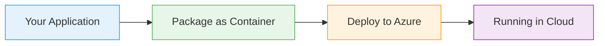

# Azure SQL

  <iconify-icon icon="vscode-icons:file-type-sql" style="font-size: 4rem;" />

---

---
layout: center
---

# Overview

Welcome to this module on Azure SQL. In this session, we'll explore the various SQL Server options available in Azure and learn how to work with them using both the Azure Portal and the Azure CLI.

---

---
layout: center
---

# What is Azure SQL?

Azure offers multiple services for SQL Server, providing flexibility to match your workload requirements:...

---

---
layout: center
---

# Which Option to Choose?

Understanding when to use each option is crucial for the AZ-204 exam:

---

---
layout: center
---

# Understanding the Azure SQL Hierarchy

When working with Azure SQL, it's important to understand the resource hierarchy:

---

---
layout: center
---

# Key Concepts for This Lab

