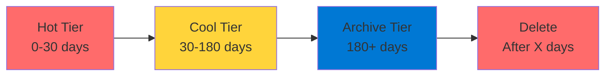

# Azure Blob Storage

Object Storage for the Cloud

  <carbon-data-storage class="text-8xl text-blue-400 opacity-80" />

---
layout: center
---

# Welcome

<!--
METADATA:
sentence: --- What is Azure Blob Storage?
search_anchor: --- What is Azure Blob
-->
<v-click>

Explore Azure Blob Storage Core topic for the AZ-204 exam

</v-click>

---
layout: section
---

# What is Azure Blob Storage?

---

# Object Storage Solution

<v-click>

  <carbon-data-storage class="text-6xl text-green-400" />

</v-click>

<!--
METADATA:
sentence: Think of it as a massively scalable cloud-based file storage system - similar to Dropbox, but designed specifically for applications.
search_anchor: Think of it as a
-->
<v-click>

Massively scalable cloud-based file storage

</v-click>

<!--
METADATA:
sentence: Think of it as a massively scalable cloud-based file storage system - similar to Dropbox, but designed specifically for applications.
search_anchor: Think of it as a
-->
<v-click>

Similar to Dropbox

</v-click>

<!--
METADATA:
sentence: Think of it as a massively scalable cloud-based file storage system - similar to Dropbox, but designed specifically for applications.
search_anchor: Think of it as a
-->
<v-click>

But designed specifically for applications

</v-click>

---

# Storage Backend for Apps

<!--
METADATA:
sentence: While you could use Blob Storage for personal file storage, its real power comes from being a storage backend for your applications.
search_anchor: While you could use Blob
-->
<v-click>

Could use for personal file storage

</v-click>

<!--
METADATA:
sentence: Third, application data and logs.
search_anchor: Third, application data and logs
-->
<v-click>

Real power: application storage backend

</v-click>

<!--
METADATA:
sentence: When your users need to upload files - whether that's images, documents, videos, or any other type of file - Blob Storage is the answer.
search_anchor: When your users need to
-->
<v-click>

  

    <carbon-image class="text-6xl text-blue-400" />
    
Images

  

  

    <carbon-document class="text-6xl text-green-400" />
    
Documents

  

  

    <carbon-video class="text-6xl text-purple-400" />
    
Videos

  

</v-click>

---
layout: section
---

# Why Not Use a Database?

---

# Database Limitations

<!--
METADATA:
sentence: Append blobs are optimized for append operations, making them perfect for logs.
search_anchor: Append blobs are optimized for
-->
<v-click>

Databases not optimized for large binary files

</v-click>

<!--
METADATA:
sentence: --- Why Not Use a Database?
search_anchor: --- Why Not Use a
-->
<v-click>

  <carbon-warning class="text-4xl text-red-400" />
  Bloat database size

</v-click>

<!--
METADATA:
sentence: Storing files in a relational database can quickly bloat your database size, slow down queries, and increase costs significantly.
search_anchor: Storing files in a relational
-->
<v-click>

  <carbon-warning class="text-4xl text-red-400" />
  Slow down queries

</v-click>

<!--
METADATA:
sentence: Storing files in a relational database can quickly bloat your database size, slow down queries, and increase costs significantly.
search_anchor: Storing files in a relational
-->
<v-click>

  <carbon-warning class="text-4xl text-red-400" />
  Increase costs significantly

</v-click>

<!--
METADATA:
sentence: --- What is Azure Blob Storage?
search_anchor: --- What is Azure Blob
-->
<v-click>

Blob Storage is purpose-built for files

</v-click>

---

# Optimized for Files

<!--
METADATA:
sentence: --- Why Not Use a Database?
search_anchor: --- Why Not Use a
-->
<v-click>

  

    <carbon-flash class="text-6xl text-blue-400" />
    
Efficient

  

  

    <carbon-piggy-bank class="text-6xl text-green-400" />
    
Cost-Effective

  

  

    <carbon-scale class="text-6xl text-purple-400" />
    
Scalable

  

</v-click>

---
layout: section
---

# Common Use Cases

---

# Real-World Applications

<!--
METADATA:
sentence: When users upload profile pictures, documents, or videos to your application, those files should go into Blob Storage.
search_anchor: When users upload profile pictures
-->
<v-click>

  
1

  

    <carbon-user class="text-3xl inline-block" />
    User-Generated Content
    
Profile pictures, documents, videos

  

</v-click>

<!--
METADATA:
sentence: Second, static website hosting.
search_anchor: Second, static website hosting
-->
<v-click>

  
2

  

    <carbon-browser class="text-3xl inline-block" />
    Static Website Hosting
    
HTML, CSS, JavaScript, images

  

</v-click>

<!--
METADATA:
sentence: Third, application data and logs.
search_anchor: Third, application data and logs
-->
<v-click>

  
3

  

    <carbon-document class="text-3xl inline-block" />
    Application Data and Logs
    
Logs, backups, JSON reference data

  

</v-click>

<!--
METADATA:
sentence: Serve video and audio files directly to browsers or media players.
search_anchor: Serve video and audio files
-->
<v-click>

  
4

  

    <carbon-video class="text-3xl inline-block" />
    Media Streaming
    
Serve video and audio to browsers

  

</v-click>

---
layout: section
---

# Key Concepts for AZ-204

---

# Blob Types

<!--
METADATA:
sentence: Block blobs are the most common - these are for text and binary data.
search_anchor: Block blobs are the most
-->
<v-click>

  <carbon-document class="text-4xl text-blue-400 mt-1" />
  

    
Block Blobs

    
Most common - text and binary data

  

</v-click>

<!--
METADATA:
sentence: Append blobs are optimized for append operations, making them perfect for logs.
search_anchor: Append blobs are optimized for
-->
<v-click>

  <carbon-add class="text-4xl text-green-400 mt-1" />
  

    
Append Blobs

    
Optimized for append operations - perfect for logs

  

</v-click>

<!--
METADATA:
sentence: Page blobs are designed for random read and write operations, which is why they're used for virtual hard disk files.
search_anchor: Page blobs are designed for
-->
<v-click>

  <carbon-data-storage class="text-4xl text-purple-400 mt-1" />
  

    
Page Blobs

    
Random read/write - used for virtual hard disks

  

</v-click>

---

# Access Tiers

<!--
METADATA:
sentence: The Hot tier is for frequently accessed data - it's fast but more expensive for storage.
search_anchor: Hot tier is for frequently
-->
<v-click>

  <carbon-flash class="text-4xl text-blue-400 mt-1" />
  

    
Hot Tier

    
Frequently accessed data

    
Fast but more expensive storage

  

</v-click>

<!--
METADATA:
sentence: The Cool tier is for data you access infrequently, stored for at least 30 days - it costs less to store but more to access.
search_anchor: Cool tier is for data
-->
<v-click>

  <carbon-temperature class="text-4xl text-green-400 mt-1" />
  

    
Cool Tier

    
Infrequently accessed, stored 30+ days

    
Less storage cost, more access cost

  

</v-click>

<!--
METADATA:
sentence: The Archive tier is for data you rarely access, stored for at least 180 days - this is the cheapest option, but accessing archived data can take hours.
search_anchor: Archive tier is for data
-->
<v-click>

  <carbon-archive class="text-4xl text-purple-400 mt-1" />
  

    
Archive Tier

    
Rarely accessed, stored 180+ days

    
Cheapest storage, hours to access

  

</v-click>

---

# Security and Access Control

<!--
METADATA:
sentence: You can use Shared Access Signatures, or SAS tokens, to provide time-limited access to specific blobs without sharing your storage account keys.
search_anchor: You can use Shared Access
-->
<v-click>

  <carbon-password class="text-4xl text-blue-400 mt-1" />
  

    
Shared Access Signatures (SAS)

    
Time-limited access to specific blobs

    
No need to share storage account keys

  

</v-click>

<!--
METADATA:
sentence: Stored access policies give you even more control by allowing you to revoke access tokens.
search_anchor: Stored access policies give you
-->
<v-click>

  <carbon-document-tasks class="text-4xl text-green-400 mt-1" />
  

    
Stored Access Policies

    
More control, can revoke access tokens

  

</v-click>

<!--
METADATA:
sentence: And Azure AD integration provides enterprise-grade identity-based access control.
search_anchor: Azure AD integration provides enterprise-grade
-->
<v-click>

  <carbon-id-management class="text-4xl text-purple-400 mt-1" />
  

    
Azure AD Integration

    
Enterprise-grade identity-based access

  

</v-click>

---

# Lifecycle Management

<!--
METADATA:
sentence: Third, application data and logs.
search_anchor: Third, application data and logs
-->
<v-click>

Automate tier transitions and deletions

</v-click>

<v-click>

</v-click>

<!--
METADATA:
sentence: This is crucial for cost optimization.
search_anchor: This is crucial for cost
-->
<v-click>

Crucial for cost optimization

</v-click>

---
layout: section
---

# What We'll Cover in Labs

---

# Hands-On Experience

<!--
METADATA:
sentence: Third, application data and logs.
search_anchor: Third, application data and logs
-->
<v-click>

  <carbon-add class="text-4xl text-blue-400" />
  Create storage accounts and containers

</v-click>

<!--
METADATA:
sentence: Serve video and audio files directly to browsers or media players.
search_anchor: Serve video and audio files
-->
<v-click>

  <carbon-cloud-upload class="text-4xl text-green-400" />
  Upload files in bulk

</v-click>

<!--
METADATA:
sentence: Third, application data and logs.
search_anchor: Third, application data and logs
-->
<v-click>

  <carbon-password class="text-4xl text-purple-400" />
  Generate and manage SAS tokens

</v-click>

<!--
METADATA:
sentence: Azure offers three access tiers.
search_anchor: Azure offers three access tiers
-->
<v-click>

  <carbon-document-tasks class="text-4xl text-orange-400" />
  Work with stored access policies

</v-click>

<!--
METADATA:
sentence: Azure offers three access tiers.
search_anchor: Azure offers three access tiers
-->
<v-click>

  <carbon-temperature class="text-4xl text-red-400" />
  Experiment with access tiers

</v-click>

---

# Advanced Topics

<!--
METADATA:
sentence: The exam-focused content will dive deeper into metadata management, lifecycle policies, blob versioning, and static website hosting - all topics that frequently appear on the AZ-204 exam.
search_anchor: exam-focused content will dive deeper
-->
<v-click>

  

    <carbon-data-view-alt class="text-5xl text-blue-400" />
    
Metadata Management

  

  

    <carbon-renew class="text-5xl text-green-400" />
    
Lifecycle Policies

  

</v-click>

<!--
METADATA:
sentence: Second, static website hosting.
search_anchor: Second, static website hosting
-->
<v-click>

  

    <carbon-version class="text-5xl text-purple-400" />
    
Blob Versioning

  

  

    <carbon-browser class="text-5xl text-orange-400" />
    
Static Website Hosting

  

</v-click>

---
layout: section
---

# Why This Matters for AZ-204

---

# Exam Weight

<!--
METADATA:
sentence: --- Why Not Use a Database?
search_anchor: --- Why Not Use a
-->
<v-click>

15-20% of total exam

</v-click>

<!--
METADATA:
sentence: --- What is Azure Blob Storage?
search_anchor: --- What is Azure Blob
-->
<v-click>

"Develop for Azure Storage" domain

</v-click>

<!--
METADATA:
sentence: Azure offers three access tiers.
search_anchor: Azure offers three access tiers
-->
<v-click>

Frequent exam questions about:

</v-click>

<!--
METADATA:
sentence: You'll see questions about when to use which blob type, how to implement lifecycle policies, how to secure blob access with SAS tokens, and how to optimize costs with access tiers.
search_anchor: You'll see questions about when
-->
<v-click>

  

    <carbon-decision-tree class="text-5xl text-blue-400" />
    
Blob Type Selection

  

  

    <carbon-document-tasks class="text-5xl text-green-400" />
    
Lifecycle Policies

  

  

    <carbon-security class="text-5xl text-purple-400" />
    
SAS Tokens

  

</v-click>

---

# Fundamental Skill

<!--
METADATA:
sentence: Almost every cloud application needs to handle file storage at some point, and Blob Storage is Azure's answer to that need.
search_anchor: Almost every cloud application needs
-->
<v-click>

Almost every cloud application needs file storage

</v-click>

<!--
METADATA:
sentence: --- What is Azure Blob Storage?
search_anchor: --- What is Azure Blob
-->
<v-click>

Blob Storage is Azure's answer

</v-click>

<!--
METADATA:
sentence: More importantly, understanding Blob Storage is fundamental to building real-world Azure solutions.
search_anchor: More importantly, understanding Blob Storage
-->
<v-click>

  

    <carbon-document class="text-6xl text-blue-400" />
    
Exam Success

  

  

    <carbon-checkmark-outline class="text-6xl text-green-400" />
    
Real-World Solutions

  

</v-click>

---
layout: center
class: text-center
---

<v-click>

<carbon-play-outline class="text-8xl text-green-400 inline-block" />

</v-click>

<!--
METADATA:
sentence: Let's get started with Azure Blob Storage!
search_anchor: Let's get started with Azure
-->
<v-click>

Let's Get Started!

</v-click>

<!--
METADATA:
sentence: --- What is Azure Blob Storage?
search_anchor: --- What is Azure Blob
-->
<v-click>

Master Azure Blob Storage

</v-click>

