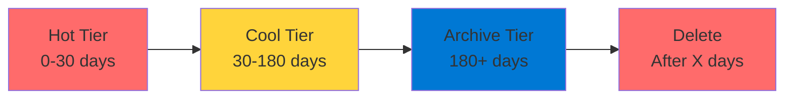

# Azure Blob Storage

Object Storage for the Cloud

  <carbon-data-storage class="text-8xl text-blue-400 opacity-80" />

---
layout: center
---

# Welcome

<v-click>

Explore Azure Blob Storage Core topic for the AZ-204 exam

</v-click>

---
layout: section
---

# What is Azure Blob Storage?

---

# Object Storage Solution

<v-click>

  <carbon-data-storage class="text-6xl text-green-400" />

</v-click>

<v-click>

Massively scalable cloud-based file storage

</v-click>

<v-click>

Similar to Dropbox

</v-click>

<v-click>

But designed specifically for applications

</v-click>

---

# Storage Backend for Apps

<v-click>

Could use for personal file storage

</v-click>

<v-click>

Real power: application storage backend

</v-click>

<v-click>

  

    <carbon-image class="text-6xl text-blue-400" />
    
Images

  

  

    <carbon-document class="text-6xl text-green-400" />
    
Documents

  

  

    <carbon-video class="text-6xl text-purple-400" />
    
Videos

  

</v-click>

---
layout: section
---

# Why Not Use a Database?

---

# Database Limitations

<v-click>

Databases not optimized for large binary files

</v-click>

<v-click>

  <carbon-warning class="text-4xl text-red-400" />
  Bloat database size

</v-click>

<v-click>

  <carbon-warning class="text-4xl text-red-400" />
  Slow down queries

</v-click>

<v-click>

  <carbon-warning class="text-4xl text-red-400" />
  Increase costs significantly

</v-click>

<v-click>

Blob Storage is purpose-built for files

</v-click>

---

# Optimized for Files

<v-click>

  

    <carbon-flash class="text-6xl text-blue-400" />
    
Efficient

  

  

    <carbon-piggy-bank class="text-6xl text-green-400" />
    
Cost-Effective

  

  

    <carbon-scale class="text-6xl text-purple-400" />
    
Scalable

  

</v-click>

---
layout: section
---

# Common Use Cases

---

# Real-World Applications

<v-click>

  
1

  

    <carbon-user class="text-3xl inline-block" />
    User-Generated Content
    
Profile pictures, documents, videos

  

</v-click>

<v-click>

  
2

  

    <carbon-browser class="text-3xl inline-block" />
    Static Website Hosting
    
HTML, CSS, JavaScript, images

  

</v-click>

<v-click>

  
3

  

    <carbon-document class="text-3xl inline-block" />
    Application Data and Logs
    
Logs, backups, JSON reference data

  

</v-click>

<v-click>

  
4

  

    <carbon-video class="text-3xl inline-block" />
    Media Streaming
    
Serve video and audio to browsers

  

</v-click>

---
layout: section
---

# Key Concepts for AZ-204

---

# Blob Types

<v-click>

  <carbon-document class="text-4xl text-blue-400 mt-1" />
  

    
Block Blobs

    
Most common - text and binary data

  

</v-click>

<v-click>

  <carbon-add class="text-4xl text-green-400 mt-1" />
  

    
Append Blobs

    
Optimized for append operations - perfect for logs

  

</v-click>

<v-click>

  <carbon-data-storage class="text-4xl text-purple-400 mt-1" />
  

    
Page Blobs

    
Random read/write - used for virtual hard disks

  

</v-click>

---

# Access Tiers

<v-click>

  <carbon-flash class="text-4xl text-blue-400 mt-1" />
  

    
Hot Tier

    
Frequently accessed data

    
Fast but more expensive storage

  

</v-click>

<v-click>

  <carbon-temperature class="text-4xl text-green-400 mt-1" />
  

    
Cool Tier

    
Infrequently accessed, stored 30+ days

    
Less storage cost, more access cost

  

</v-click>

<v-click>

  <carbon-archive class="text-4xl text-purple-400 mt-1" />
  

    
Archive Tier

    
Rarely accessed, stored 180+ days

    
Cheapest storage, hours to access

  

</v-click>

---

# Security and Access Control

<v-click>

  <carbon-password class="text-4xl text-blue-400 mt-1" />
  

    
Shared Access Signatures (SAS)

    
Time-limited access to specific blobs

    
No need to share storage account keys

  

</v-click>

<v-click>

  <carbon-document-tasks class="text-4xl text-green-400 mt-1" />
  

    
Stored Access Policies

    
More control, can revoke access tokens

  

</v-click>

<v-click>

  <carbon-id-management class="text-4xl text-purple-400 mt-1" />
  

    
Azure AD Integration

    
Enterprise-grade identity-based access

  

</v-click>

---

# Lifecycle Management

<v-click>

Automate tier transitions and deletions

</v-click>

<v-click>

</v-click>

<v-click>

Crucial for cost optimization

</v-click>

---
layout: section
---

# What We'll Cover in Labs

---

# Hands-On Experience

<v-click>

  <carbon-add class="text-4xl text-blue-400" />
  Create storage accounts and containers

</v-click>

<v-click>

  <carbon-cloud-upload class="text-4xl text-green-400" />
  Upload files in bulk

</v-click>

<v-click>

  <carbon-password class="text-4xl text-purple-400" />
  Generate and manage SAS tokens

</v-click>

<v-click>

  <carbon-document-tasks class="text-4xl text-orange-400" />
  Work with stored access policies

</v-click>

<v-click>

  <carbon-temperature class="text-4xl text-red-400" />
  Experiment with access tiers

</v-click>

---

# Advanced Topics

<v-click>

  

    <carbon-data-view-alt class="text-5xl text-blue-400" />
    
Metadata Management

  

  

    <carbon-renew class="text-5xl text-green-400" />
    
Lifecycle Policies

  

</v-click>

<v-click>

  

    <carbon-version class="text-5xl text-purple-400" />
    
Blob Versioning

  

  

    <carbon-browser class="text-5xl text-orange-400" />
    
Static Website Hosting

  

</v-click>

---
layout: section
---

# Why This Matters for AZ-204

---

# Exam Weight

<v-click>

15-20% of total exam

</v-click>

<v-click>

"Develop for Azure Storage" domain

</v-click>

<v-click>

Frequent exam questions about:

</v-click>

<v-click>

  

    <carbon-decision-tree class="text-5xl text-blue-400" />
    
Blob Type Selection

  

  

    <carbon-document-tasks class="text-5xl text-green-400" />
    
Lifecycle Policies

  

  

    <carbon-security class="text-5xl text-purple-400" />
    
SAS Tokens

  

</v-click>

---

# Fundamental Skill

<v-click>

Almost every cloud application needs file storage

</v-click>

<v-click>

Blob Storage is Azure's answer

</v-click>

<v-click>

  

    <carbon-document class="text-6xl text-blue-400" />
    
Exam Success

  

  

    <carbon-checkmark-outline class="text-6xl text-green-400" />
    
Real-World Solutions

  

</v-click>

---
layout: center
class: text-center
---

<v-click>

<carbon-play-outline class="text-8xl text-green-400 inline-block" />

</v-click>

<v-click>

Let's Get Started!

</v-click>

<v-click>

Master Azure Blob Storage

</v-click>

