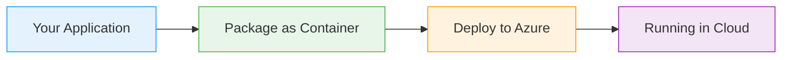
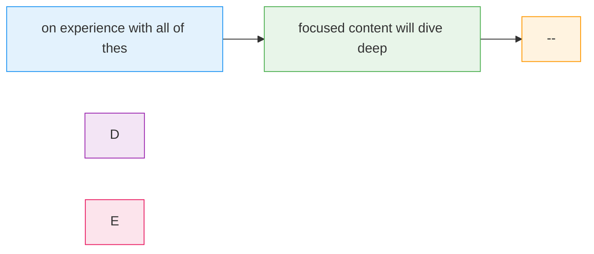

# Azure Blob Storage

  <iconify-icon icon="vscode-icons:file-type-azure" style="font-size: 4rem;" />

---

---
layout: center
---

# AZ-204 Exam Preparation

*Duration: 2-3 minutes*

---

---
layout: center
class: text-center
---

# Welcome

Welcome to this session on Azure Blob Storage, one of the core topics you'll encounter on the AZ-204 exam

  <iconify-icon icon="carbon:rocket" style="font-size: 3rem; color: #0078d4;" />

---

---
layout: center
---

# What is Azure Blob Storage?

Azure Blob Storage is Microsoft's object storage solution for the cloud. Think of it as a massively scalable cloud-based file storage system - similar...

---

---
layout: center
---

# Why Not Use a Database?

A common question developers ask is: "Why use Blob Storage instead of storing files in my database?" The answer is simple - databases aren't optimized for large binary files. Storing files in a relati

---

---
layout: center
---

# Common Use Cases

<iconify-icon icon="mdi:web" /> 

---

---
layout: center
---

# Key Concepts for AZ-204

<h3 class="text-xl font-bold">Blob Types</h3>

Azure supports three types of blobs. Block blobs are the most common - these are for text and binary

<h3 class="text-xl font-bold">Access Tiers</h3>

Not all data needs the same level of performance. Azure offers three access tiers. The Hot tier is f

<h3 class="text-xl font-bold">Security and Access Control</h3>

Blob Storage offers multiple security options. You can use Shared Access Signatures, or SAS tokens, 

<h3 class="text-xl font-bold">Lifecycle Management</h3>

Instead of manually managing when files move between tiers or get deleted, you can create policies t

---

---
layout: center
---

# What We'll Cover in the Labs

---

---
layout: center
---

# Why This Matters for AZ-204

Blob Storage accounts for a significant portion of the "Develop for Azure Storage" domain on the AZ-204 exam, which makes up 15 to 20 percent of the total exam. You'll see questions about when to use 

---

---
layout: center
---

# Closing

In the next video, we'll dive into the hands-on exercises where you'll work directly with Blob Storage using the Azure CLI. You'll create containers, upload files, work with SAS tokens, and see firsth

