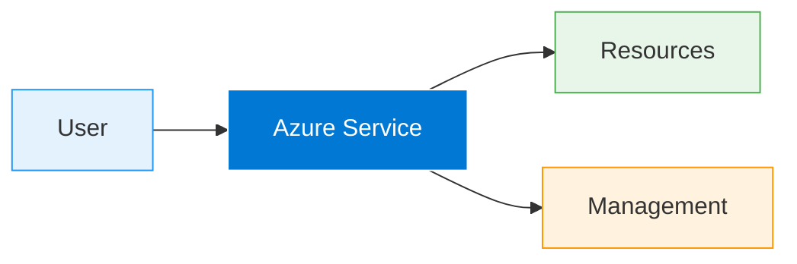

# How it Works

Azure Files is a feature of Azure Storage Accounts. When you create a storage account, you can create one or more file shares within it. Each share has a quota that defines its maximum capacity.

